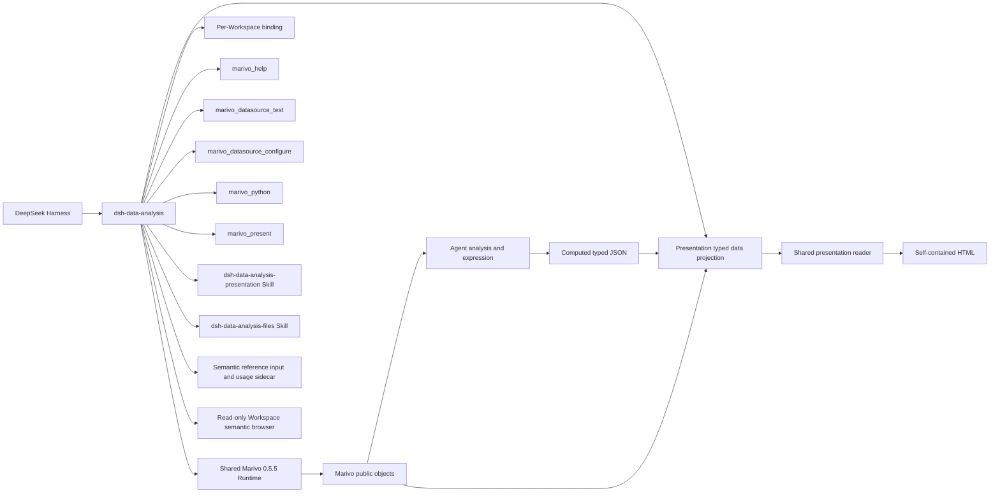

# DSH Data Analysis 总体架构

## 目标与边界

`dsh-data-analysis` 是 DeepSeek Harness 与 Marivo 的窄集成 seam。DSH 拥有 Agent、Session、Tool、Skill、
Credentials、profile 和通用文件/Web 生命周期；Marivo 拥有分析语义、Artifact、Evidence、Quality、
Lineage、revalidation 与 Session runtime；本项目只连接两者，不复制上游契约。

当前开发实现已接通一次 Python 执行准入、typed data projection、最小 Python helper、
[共享 reader 与离线构建](modules/presentation-reader.md)、稳定报告身份、阅读器在线呈现编辑和Agent 声明的可选全局筛选与动态 KPI，以及
[展示 Skill](modules/presentation-skill.md)与[文件分析 Skill](modules/file-analysis-skill.md)。旧 report-kit、报告 Skill、经典 JS 和 Evidence 协议已删除。
当前仍是未发布开发状态；阶段范围见[实施路线图](plan/marivo-analytics-presentation-roadmap.md)，
报告编辑、全图形筛选与原卡片重开的验证见[当前验收记录](plan/2026-09-07-presentation-editing-acceptance.md)；
真实 Agent 路由的历史证据见[S5 验收记录](plan/marivo-analytics-presentation-s5-acceptance.md)。



当前 DSH 基线为 `0.1.5-alpha.1`，兼容接缝与验证范围见[升级验收](dsh-alpha-compatibility-acceptance.md)。
[新版重构设计](dsh-alpha-refactor-design.md)的第一阶段已接入默认 client：数据源、语义层、报告目录及正文
使用原生右侧 Tab。页面状态由 Session/Tab occurrence 拥有，导航使用完整 Workspace 与资源身份；
当前 Session 的新交付独立观察公开 eventSource，卡片不触发自动打开。current 只提示新版本，刷新后切换；
固定 Build 阅读保持不变。报告编辑在所属 Tab 内进行，数据源新增、固定身份的配置编辑、凭证配置和连接测试也在所属 Tab 内进行。报告列表从 Workspace 头部入口访问，
左下角不再保留报告快捷入口；列表仅显示报告标题、生成对话和更新时间，输入即筛选，固定按最近更新排序。
列表标题右侧提供唯一刷新入口；报告正文标题右侧只显示短 Build 版本号和三点菜单，集中刷新、编辑、历史和下载。
当前版本的编辑能力依据实际 current 指针核验，不依据地址是否含 Build；保存后在原位置展示新版本，详情见[报告 Tab 优化验收](report-tab-editing-acceptance.md)。
实现边界与验收见[第一阶段记录](dsh-right-tabs-stage-one-acceptance.md)。第二阶段报告引用见 [2b 验收记录](dsh-context-stage-two-b-acceptance.md)，语义对象加入提问见 [2c 验收记录](dsh-context-stage-two-c-acceptance.md)；文件分析已接入 Skill 路由，原生上传与真实模型验收单独记录，见[文件分析](modules/file-analysis-skill.md)。

数据源 Tab 支持确认删除项目定义，并可显式选择删除对应共享凭证。Marivo 拥有定义删除契约，Harness
拥有凭证删除；插件串联两个操作并展示部分完成结果，不级联删除分析数据或语义定义，见[删除验收](datasource-removal-acceptance.md)。

## 分层

| 层 | 本项目职责 | 不属于本项目 |
| --- | --- | --- |
| Runtime/Workspace | 精确安装、marker、zero-init binding identity | Marivo 项目语义、Session 数据与按需写入 |
| Environment | checked runner、受限 argv、资源上限、overlay 脱敏 | Artifact/Evidence/Graph schema |
| Help | 当前 binding 的 live Help transport 与激活披露 | 静态 API registry |
| File analysis Skill | 附件可读路径与 Python 执行路由、文件结果接入报告 | 文件上传、格式解析器、SQL 引擎、语义建模 |
| Presentation Skill | 展示路由、内容组织、图形选择、来源声明与交付流程 | 分析语义、来源有效性判断、布局引擎 |
| Datasource | DSH Credentials 管理、调用续接、connection test、resolver 注入 | table/source inspection 语义 |
| Presentation delivery | present 与编辑完整提交、current 指针、durable receipt、RPC 与打开/下载 | 分析计算、长期版本管理、语义正确性 |
| Semantic reference input | Catalog 文本检索、显式引用 binding 准备、原子 ref 序列化、Workspace 热度 | composer 状态机、领域成员有效性与分析执行 |
| Semantic browser | Workspace 对象快照、只读详情与局部关系图 | observe、数据预览、对象编辑、连接配置与凭证读取 |
| Presentation reader | 五类 block、独立编辑草稿、预计算组合选择、共享静态正文、完整报告与当前视图 HTML | 分析计算、文件提交、receipt/RPC、长期版本管理 |
| Presentation data | 固定公开 Artifact 读取、typed JSON、声明来源快照与最小 Python writer | computed 转换审计、分析正确性、语义补齐、observe 或 revalidation |

语义浏览与引用以 Workspace ID 和 Runtime fingerprint 共同确定引用身份；同路径的新 Workspace 不能复用旧引用。
显式选择可建立当前归属，提交只验证已有 binding。详情与 `@` 共用原生可编辑状态，准备操作随输入提交开始取消。

模块文档：

- [Runtime 与 Workspace](modules/runtime-workspace.md)
- [Environment 执行边界](modules/environment-execution.md)
- [实时 Help 披露](modules/help-disclosure.md)
- [Datasource Credentials](modules/datasource-credentials.md)
- [展示交付](modules/presentation-delivery.md)
- [展示 Skill](modules/presentation-skill.md)
- [文件分析 Skill](modules/file-analysis-skill.md)
- [语义对象引用输入](modules/semantic-reference-input.md)
- [只读语义层对象浏览器](modules/semantic-browser.md)：统一使用原生 Tab，顶部横向分类，页内浏览共享 Catalog 快照；语义弹窗已移除。
- [展示数据投影](modules/presentation-projection.md)
- [展示 reader 与离线构建](modules/presentation-reader.md)
- [插件集成与交付](modules/plugin-integration-delivery.md)

## Runtime 与 identity

Compatibility manifest 声明 DSH peers 范围 `^0.1.5-alpha.1`，并精确固定 `marivo[duckdb,trino,clickhouse]==0.5.5`。
安装回滚、service owner、可等待卸载与范围验收见[第四阶段验收](dsh-wiring-stage-four-acceptance.md)。默认 Runtime 位于
`$DSH_HOME/dsh-data-analysis/runtimes/marivo/`。默认先验证本机 Python 3.10+，再使用标准库 `venv`
与环境内 `pip` 安装，不再依赖 uv 或下载 Python；安装包含 DuckDB extra，Runtime probe
验证其 Ibis 后端可导入。管理员也可提供绝对 Python。两种模式都必须让版本、
package path、解释器和 marker 一致；Runtime 通过 pip 安装已发布的 Marivo package。

每个 Workspace 独立解析 project root、最小目录与 doctor admission。`MarivoEnvironment` 冻结 binding
identity；各领域 bridge 通过同一 `MarivoCheckedRunner` 执行，并在同一子进程内先复核 import identity。

## Agent scope

Plugin 为每个 Agent 安装一个 controller，并共享同一 Environment 对应的 Help、Datasource 与 Presentation
bridge。可见 DSH Tool 只有：

```text
marivo_help
marivo_datasource_test
marivo_python
marivo_present
```

Plugin 挂载 Runtime 的 `marivo-analysis` / `marivo-semantic`，另用独立 filesystem provider 挂载插件自带的
`dsh-data-analysis-presentation` 和 `dsh-data-analysis-files`。常驻 prompt 只给出短路由：普通事实问答使用文字；
直接文件分析加载文件 Skill，使用 pandas 或原生 DuckDB；图表、表格、报告、看板和可读来源展示加载展示 Skill。
只有涉及 Marivo 分析语义或建模时才加载相应 Runtime Skill；使用 Marivo API 时查询相关 live Help。
两个插件 Skill 均不新增 Help target，也不触发两个 Runtime Skill 的根 Help 披露。
纯本地文件执行通过 `marivo_python(datasources: [])` 保留 Runtime/Workspace identity、取消与代码记录；
不需要 `md.raw_sql`，不自动获得 Artifact、Evidence、质量或 lineage 契约。
Plugin disposal 只移除自身 scope 的 Tool、prompt 与事件接线。

Runtime 安装 `dsh-data-analysis-presentation-kit==1.1.0`；公开 Python 函数
`dsh_data_analysis_presentation.write_dataset(frame, path)` 接受 pandas DataFrame，只写 computed typed JSON。

computed writer 可通过 `labels={列名: 展示名}` 显式设置列 `label`，未映射列沿用列名；
列 `id` 和 Draft 绑定保持原样。typed JSON 继续使用现有 schemaVersion 1，展示名不改变分析语义。
来源由 Draft 声明。固定 projection 在相同 bound Runtime 恢复 persisted Artifact 和可选 Finding，
不执行 `observe`、`revalidate` 或凭据读取；reader 只消费生成文档快照，来源展开不触发运行时调用。

## 原生分析读取

Agent 直接使用 Marivo：

- `artifact.show()` / `render()`、`contract()`、`quality_summary`、`lineage`；
- `artifact.findings(...)` / `finding(...)` 和 `session.revalidate(ref)`；
- `session.runs(...)`、`get_run(...)`、`artifact(ref)`、`graph(...)`；
- `mv.session.recent(...)`、`inspect(...)`、`resume(...)`；
- `catalog.readiness(refs=[...])` 与 `md.inspect(datasource_ref, source)`；
- 经实时 Help 确认 terminal boundary 后的 `artifact.to_pandas()`。

插件不注册对应的 inspection、quality、graph、resume、readiness、inspect 或 export wrapper。特别是
`SessionGraph` 的 Run/Artifact/edge、完整性、focus、truncation 和 boundary 字段全部由 Marivo 拥有。

## Datasource 与 Credentials

DSH Credentials 是凭证值权威，Marivo 的公开 description 与 resolver 是字段和使用契约。插件把原始引用
映射到专属 DSH 地址，通过 stdin snapshot 和 `md.credential_scope` 注入；普通 Shell 不获得凭证值。

`marivo_datasource_configure` 将新增/编辑请求绑定到原工具调用，并打开所属 Session 的右侧表单；
配置由用户提交，成功测试后返回数据源身份，Agent 重新核验目标表后继续分析。取消、原调用结束或绑定变化不自动恢复。
数据源配置页允许同页输入凭证并自动生成可确认、修改的引用名；配置 RPC 仅保存引用，值通过 Harness 凭证操作单独提交。请求说明折叠展示，新增与复用已有数据源采用显式切换，详见[数据源与凭证](modules/datasource-credentials.md)。
Harness 插件配置的可选 `datasourceDefaults` 按 backend 提供新建字段默认值。插件按当前 Runtime schema 校验后，
通过 authoring 的独立 `creationDefaults` 返回给表单，不修改 Runtime 默认值、fingerprint 或已有数据源；凭据流程保持独立。
配置编辑使用 Marivo 公开读取和 `md.register()`，保留 `ai_context` 与扩展字段，名称和引擎固定；
保存前校验版本并串行处理插件内写入，不保证与外部编辑器的原子并发写。
`marivo_datasource_test` 执行连接测试并同步管理页状态；`marivo_python` 在一次调用内等待全部 datasource
就绪，核验身份并取得 fresh snapshot，再通过 DSH Shell 前台执行服务启动一次代码。配置齐全不附加测试，
取消、轮换或 Workspace 变化终止旧准备，失败不重放。凭证不进入 Agent 参数、环境或 argv；输出在 Host
spill 前执行 exact-value 脱敏。access Tool 与跨调用 lease 已删除。

`marivo_python` 的前台预算可按插件配置和单次调用设置，经过插件上限及 Harness Shell 上限解析后披露实际值。
凭据等待发生在 Shell 计时之前；Harness 继续拥有外层 Code Mode 时限和取消。插件只反馈准备、交给 Shell、
保存代码记录三个阶段及已知终态，不推断查询进度、Artifact 保存状态或远端查询是否取消；代码记录失败不改变
Python 成功事实。字段与错误边界见[超时与执行反馈](modules/datasource-credentials.md#超时与执行反馈)。

“语义层”和“数据源”通过 `conversation.session.header.actions` 显示在会话标题旁，以所属会话的
`workspaceId` 打开原生右侧 Tab。数据源页将列表横排在上方，刷新图标与标题对齐，完整配置直接在 Tab 内完成。入口随 Harness 的会话标题显示，
无会话或空会话时不显示，侧栏底部不保留入口；管理与浏览均不要求 live Agent。

报告 reader 通过 Host 注入的导航回调将来源中的公开语义引用连接到同一 Workspace 的语义层面板，
按 `kind + path` 读取当前 Catalog 并定位；共享 reader 不持有语义层服务，portable 保留来源文本。
该入口不执行查询或更新报告，详见[报告阅读器](modules/presentation-reader.md#通用阅读层级)。

“数据源与凭证”管理页支持配置、替换、删除和测试。缺失配置时，Web 根 Agent 的原调用保持等待；
提交验证成功后继续，失败可修正或交还 Agent。刷新、丢失响应、取消和定义变更由 Host 操作状态处理，
不依赖历史 Tool Result 自动弹窗。管理页与语义层共用会话标题按钮样式；操作列表只显示进行中操作，完成后
在对应数据源展示最近测试和必要反馈，Host 仍保留有界的终态查询能力。
详见 [Datasource Credentials](modules/datasource-credentials.md)。

Source metadata inspection 由 Agent 直接调用 `md.inspect(...)`；connection test 不是 inspection 的前置。

## 一次展示交付

Agent 新建时调用 `marivo_present({ draft_path })`；更新时成对提供 `report_id` 与 `expected_build_id`。
Tool 从当前 Session 的 Harness Workspace 成员关系取得
身份，与 bound Runtime 的 project root 核对后读取 Draft、公开投影和构建，在临时目录写全 JSON/HTML，
以单次目录 rename 提交。更新沿用 report ID，每次生成独立 build ID；完整文件通过字节校验并原子发布 current 后才返回成功 receipt。

Native/both metadata 与 Code durable block 使用同一个带 Session/Turn 的 delivery envelope；文本包含
两个文件的精确路径、SHA-256 与字节数，headless 同样可用。Web 卡片打开共享 reader，并下载自包含 HTML。
报告使用公开 Conversation Definition 的独立 Chat 节点和 keyed renderer，每轮以首次成功回执的位置
展示有序卡片；执行中即时出现，正常完成后同一节点移至 Turn 结束位置，与最终回复相邻。
卡片不依赖最终文本存在，也不占用 `turnTail` chain；原生 ProducedFiles 继续由 Harness 自己展示。
文件 RPC 按当前 Session Workspace 推导固定 asset 路径，校验归属、真实路径、大小与 digest；来源展开只读保存快照。
稳定 report ID 下的 `current.json` 保存当前 receipt，Agent 完整 Draft 重建与 Host 受限呈现保存共用发布服务，
在跨进程锁内比较 expected build 并更新 current。冲突不覆盖现有保存，不回退新建；历史 Build 保持不可变。
原卡片重开解析 current，已打开 reader 与固定文件保持快照。详见[展示交付](modules/presentation-delivery.md)。

## 展示数据与内容组织

内部 `MarivoPresentationProjection` 把 Draft 变成纯数据 `PresentationDocument`。
独立 `dsh-data-analysis-presentation-lint` 复用草稿、computed TypedDataset 和文件边界校验，
仅提供静态预检；Runtime 来源读取与最终交付仍由 present 负责。单元格错误包含列名、类型与 JSON pointer。
Artifact dataset 必须恢复所需行和字段；computed dataset 从 Workspace 中有界读取 typed JSON；
source-only 保持 `datasets: []`。来源读取失败可以保存 unavailable，但不允许直接 Artifact dataset 假成功。

展示 Skill 指导 Agent 选择现有数据、写出 Draft、调用一次 `marivo_present` 并解释结果；schema、图形配置、
报告、看板及比较型展示在写草稿前读取 narrative；细则涵盖比较两侧、方向和分母、证据强度、数值核对，
以及 Agent 选取范围与 writer 截断的区别。示例按需读取。Agent 决定内容顺序和图形意图，reader 负责自适应布局，
没有 Agent 可配置的网格。来源来自 Marivo 的公开快照；computed 的来源声明不构成转换审计或正确性证明。
Host 预览与离线 HTML 共用流式宽度；正文跟随容器，KPI 限制单卡最大宽度，连续图表按容器宽度最多并排两列，
保持阅读顺序、分区、字号和行高；完整报告的无脚本及打印图表数据表保持单列；当前视图导出保留已绘制 SVG。
布局变化只影响阅读呈现，不修改报告 schema、保存快照或分析语义，详见[reader 模块](modules/presentation-reader.md#通用阅读层级)。

共享图形契约覆盖 18 类图形与 bar/line 变体；分箱、分位数、占比、排名和累计值先在分析阶段准备。
前端探索只选择现有列或显式 `preparedViews`，过滤和显隐不改变统计口径；当前视图用于来源预览与 cell 上下文，
保存文档、完整报告下载与既有打印仍使用作者快照。当前视图导出同步冻结阅读结果，保留筛选、SVG、排序后的全部已保存表格行及来源概要；
仅浏览器端下载，不生成新 Build、不改写数据或调用 RPC。详细规则见[reader 模块](modules/presentation-reader.md)。
Host 的 Ask DSH 通过 reader 回调向报告所属会话的草稿追加原生引用，显示 `# <cell名称>`；
引用 codec 在发送时核验 Session/Workspace 并展开点击时的完整上下文，复制和纯文本持久化也保留定位。
成功后对话框入口关闭报告，
原生 Tab 保持打开，失败时在 Tab 内显示错误并保留草稿；
Harness 继续拥有输入状态、引用、附件及提交行为。编辑模式禁用此操作，portable 保留复制上下文。
追问与复制携带正在显示的 `Workspace / Report ID / Build ID / Cell`；current 的新版本提示不改变
这组身份，只有刷新后的 document 才改变 Build。2b 提供共享存储规则生成的固定 Build 相对文件路径，
附带有效筛选、图表探索和表格排序；正文、数值及来源按需读取，不制作内容摘要。引用上限为 12 KiB，
包含包装和分隔符，超限明确失败并保留输入；在线与离线都在点击时生成并处理失败。规则与验收见 [reader 模块](modules/presentation-reader.md)。
数据源的代码页保存 Marivo 生产记录中的 SQL，以及 dataset 显式关联的 Python 执行快照。
插件在成功 `marivo_python` 后记录本次提交代码并返回 `codeRef`，报告构建核验其 Workspace 与文件摘要；
Harness 的原生执行与凭据生命周期保持原契约，代码记录失败不改变已有执行结果。
reader 只读报告内嵌原文，不重新执行；Python、SQL 自动格式化与语法高亮仅影响展示，保存及复制保持执行原文。
执行记录与 dataset 的关联仍由作者声明。详见[展示数据投影](modules/presentation-projection.md)和[reader 模块](modules/presentation-reader.md)。

## 验证

```bash
npm run check
npm run build
npm run verify:plugin-package
```

确定性测试守住 Runtime/helper identity、Tool 最小性、旧 surface 删除、Python/Node typed JSON、
Artifact/source identity、文件预算与包导出。真实 Artifact 恢复与 Chromium 数据读取见
[S2 验收记录](plan/marivo-analytics-presentation-s2-acceptance.md)；实际 Native/Code/headless、Web 卡片、下载和离线交付见
[S4 验收记录](plan/marivo-analytics-presentation-s4-acceptance.md)。当前安装包、Skill 路由与最终真实旅程状态见
[S5 验收记录](plan/marivo-analytics-presentation-s5-acceptance.md)。
独立 Chat 卡片、ProducedFiles 共存与通用质量修复见
[报告交付与质量验收](plan/2026-09-07-presentation-delivery-quality-acceptance.md)。


KPI 比较沿用 presentation `metric`，将主值、参考值、预计算变化绑定到同一行；插件仅验证和展示，
不承担同比／环比计算或业务好坏推断。详见 [KPI 比较卡片](modules/presentation-reader.md#kpi-比较卡片)。

### Workspace 报告索引与发布历史

报告列表和版本浏览属于插件的交付接缝，直接以 Harness Workspace 注册表授权读取，复用现有阅读器与文件校验。
`current.json` 原子发布同时提交当前 receipt 与成功版本记录；Marivo 分析和来源契约保持不变。
来源 Session 是可用时的追溯信息，报告读取不依赖它存活。参见[展示交付模块](modules/presentation-delivery.md#workspace-报告列表与历史查看)。

## 对象存储发布

插件的[报告 HTML 发布](modules/report-publishing.md)扩展既有保存快照与当前视图导出。Harness 单凭证服务管理发布 AK/SK/Token；插件配置控制开关、目标与路径，服务端完成上传。开启时在线报告的两项 HTML 下载均替换为发布，分析、证据与本地 Report current 的责任不变。
