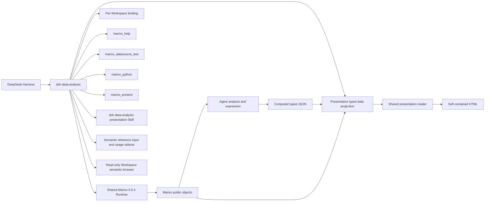

# DSH Data Analysis 总体架构

## 目标与边界

`dsh-data-analysis` 是 DeepSeek Harness 与 Marivo 的窄集成 seam。DSH 拥有 Agent、Session、Tool、Skill、
Credentials、profile 和通用文件/Web 生命周期；Marivo 拥有分析语义、Artifact、Evidence、Quality、
Lineage、revalidation 与 Session runtime；本项目只连接两者，不复制上游契约。

当前开发实现已接通一次 Python 执行准入、typed data projection、最小 Python helper、
[共享 reader 与离线构建](modules/presentation-reader.md)、稳定报告身份、阅读器在线呈现编辑和Agent 声明的可选全局筛选与动态 KPI，以及唯一
[展示 Skill](modules/presentation-skill.md)。旧 report-kit、报告 Skill、经典 JS 和 Evidence 协议已删除。
当前仍是未发布开发状态；阶段范围见[实施路线图](plan/marivo-analytics-presentation-roadmap.md)，
报告编辑、全图形筛选与原卡片重开的验证见[当前验收记录](plan/2026-09-07-presentation-editing-acceptance.md)；
真实 Agent 路由的历史证据见[S5 验收记录](plan/marivo-analytics-presentation-s5-acceptance.md)。



## 分层

| 层 | 本项目职责 | 不属于本项目 |
| --- | --- | --- |
| Runtime/Workspace | 精确安装、marker、zero-init binding identity | Marivo 项目语义、Session 数据与按需写入 |
| Environment | checked runner、受限 argv、资源上限、overlay 脱敏 | Artifact/Evidence/Graph schema |
| Help | 当前 binding 的 live Help transport 与激活披露 | 静态 API registry |
| Presentation Skill | 展示路由、内容组织、图形选择、来源声明与交付流程 | 分析语义、来源有效性判断、布局引擎 |
| Datasource | DSH Credentials 管理、调用续接、connection test、resolver 注入 | table/source inspection 语义 |
| Presentation delivery | present 与编辑完整提交、current 指针、durable receipt、RPC 与打开/下载 | 分析计算、长期版本管理、语义正确性 |
| Semantic reference input | Catalog 文本检索、原子 ref 序列化、Workspace 热度 | composer 状态机、领域成员有效性与分析执行 |
| Semantic browser | Workspace 对象快照、只读详情与局部关系图 | observe、数据预览、对象编辑、连接配置与凭证读取 |
| Presentation reader | 五类 block、独立编辑草稿、预计算组合选择、共享静态正文与离线 HTML | 分析计算、文件提交、receipt/RPC、长期版本管理 |
| Presentation data | 固定公开 Artifact 读取、typed JSON、声明来源快照与最小 Python writer | computed 转换审计、分析正确性、语义补齐、observe 或 revalidation |

模块文档：

- [Runtime 与 Workspace](modules/runtime-workspace.md)
- [Environment 执行边界](modules/environment-execution.md)
- [实时 Help 披露](modules/help-disclosure.md)
- [Datasource Credentials](modules/datasource-credentials.md)
- [展示交付](modules/presentation-delivery.md)
- [展示 Skill](modules/presentation-skill.md)
- [语义对象引用输入](modules/semantic-reference-input.md)
- [只读语义层对象浏览器](modules/semantic-browser.md)
- [展示数据投影](modules/presentation-projection.md)
- [展示 reader 与离线构建](modules/presentation-reader.md)
- [插件集成与交付](modules/plugin-integration-delivery.md)

## Runtime 与 identity

Compatibility manifest 精确固定 DSH peers 与 `marivo[duckdb,trino,clickhouse]==0.5.4`。默认 Runtime 位于
`$DSH_HOME/dsh-data-analysis/runtimes/marivo/`；管理员也可提供绝对 Python。两种模式都必须让版本、
package path、解释器和 marker 一致；Runtime 通过 pip 安装已发布的 Marivo package。

每个 Workspace 独立解析 project root、最小目录与 doctor admission。`MarivoEnvironment` 冻结 binding
identity；各领域 bridge 通过同一 `MarivoCheckedRunner` 执行，并在同一子进程内先复核 import identity。

## Agent scope

Plugin 为每个 Agent 安装一个 controller，并共享同一 Environment 对应的 Help、Datasource 与 Presentation
bridge。可见 DSH Tool 只有：

```text
marivo_help
marivo_datasource_test
marivo_python
marivo_present
```

Plugin 挂载 Runtime 的 `marivo-analysis` / `marivo-semantic`，另用独立 filesystem provider 挂载插件自带的
`dsh-data-analysis-presentation`。常驻 prompt 只给出短路由：普通事实问答使用文字；图表、表格、报告、
看板和可读来源展示加载展示 Skill。已有数据无需先激活分析 Skill；需要新分析或语义编写时才加载
Runtime Skill 与 live Help。展示 Skill 不新增 Help target，也不改变两个 Runtime Skill 的激活披露。
Plugin disposal 只移除自身 scope 的 Tool、prompt 与事件接线。

Runtime 安装 `dsh-data-analysis-presentation-kit==1.0.0`；公开 Python 函数
`dsh_data_analysis_presentation.write_dataset(frame, path)` 接受 pandas DataFrame，只写 computed typed JSON。
来源由 Draft 声明。固定 projection 在相同 bound Runtime 恢复 persisted Artifact 和可选 Finding，
不执行 `observe`、`revalidate` 或凭据读取；reader 只消费生成文档快照，来源展开不触发运行时调用。

## 原生分析读取

Agent 直接使用 Marivo：

- `artifact.show()` / `render()`、`contract()`、`quality_summary`、`lineage`；
- `artifact.findings(...)` / `finding(...)` 和 `session.revalidate(ref)`；
- `session.runs(...)`、`get_run(...)`、`artifact(ref)`、`graph(...)`；
- `mv.session.recent(...)`、`inspect(...)`、`resume(...)`；
- `catalog.readiness(refs=[...])` 与 `md.inspect(datasource_ref, source)`；
- 经实时 Help 确认 terminal boundary 后的 `artifact.to_pandas()`。

插件不注册对应的 inspection、quality、graph、resume、readiness、inspect 或 export wrapper。特别是
`SessionGraph` 的 Run/Artifact/edge、完整性、focus、truncation 和 boundary 字段全部由 Marivo 拥有。

## Datasource 与 Credentials

DSH Credentials 是凭证值权威，Marivo 的公开 description 与 resolver 是字段和使用契约。插件把原始引用
映射到专属 DSH 地址，通过 stdin snapshot 和 `md.credential_scope` 注入；普通 Shell 不获得凭证值。

`marivo_datasource_test` 执行连接测试并同步管理页状态；`marivo_python` 在一次调用内等待全部 datasource
就绪，核验身份并取得 fresh snapshot，再通过 DSH Shell 前台执行服务启动一次代码。配置齐全不附加测试，
取消、轮换或 Workspace 变化终止旧准备，失败不重放。凭证不进入 Agent 参数、环境或 argv；输出在 Host
spill 前执行 exact-value 脱敏。access Tool 与跨调用 lease 已删除。

“语义层”和“数据源与凭证”通过 `conversation.session.header.actions` 显示在会话标题旁，以所属会话的
`workspaceId` 打开 `shell.overlay` 面板，面板内保留显式 Workspace 选择。入口随 Harness 的会话标题显示，
无会话或空会话时不显示，侧栏底部不保留入口；管理与浏览均不要求 live Agent。

报告 reader 通过 Host 注入的导航回调将来源中的公开语义引用连接到同一 Workspace 的语义层面板，
按 `kind + path` 读取当前 Catalog 并定位；共享 reader 不持有语义层服务，portable 保留来源文本。
该入口不执行查询或更新报告，详见[报告阅读器](modules/presentation-reader.md#通用阅读层级)。

“数据源与凭证”管理页支持配置、替换、删除和测试。缺失配置时，Web 根 Agent 的原调用保持等待；
提交验证成功后继续，失败可修正或交还 Agent。刷新、丢失响应、取消和定义变更由 Host 操作状态处理，
不依赖历史 Tool Result 自动弹窗。管理页与语义层共用会话标题按钮样式；操作列表只显示进行中操作，完成后
在对应数据源展示最近测试和必要反馈，Host 仍保留有界的终态查询能力。
详见 [Datasource Credentials](modules/datasource-credentials.md)。

Source metadata inspection 由 Agent 直接调用 `md.inspect(...)`；connection test 不是 inspection 的前置。

## 一次展示交付

Agent 调用 `marivo_present({ draft_path })`。Tool 从当前 Session 的 Harness Workspace 成员关系取得
身份，与 bound Runtime 的 project root 核对后读取 Draft、公开投影和构建，在临时目录写全 JSON/HTML，
以单次目录 rename 提交。每次生成独立 build ID；只有完整文件通过字节校验才返回成功 receipt。

Native/both metadata 与 Code durable block 使用同一个带 Session/Turn 的 delivery envelope；文本包含
两个文件的精确路径、SHA-256 与字节数，headless 同样可用。Web 卡片打开共享 reader，并下载自包含 HTML。
报告使用公开 Conversation Definition 的独立 Chat 节点和 keyed renderer，每轮以首次成功回执的位置
展示有序卡片，不依赖最终回复或 `turnTail` chain；原生 ProducedFiles 继续由 Harness 自己展示。
只读 RPC 按当前 Session Workspace 推导固定 asset 路径，校验归属、真实路径、大小与 digest；来源展开只读保存快照。
不存在 report ID、revision、latest、CAS 或持久 operation 索引。详见[展示交付](modules/presentation-delivery.md)。

## 展示数据与内容组织

内部 `MarivoPresentationProjection` 把 Draft 变成纯数据 `PresentationDocument`。
独立 `dsh-data-analysis-presentation-lint` 复用草稿、computed TypedDataset 和文件边界校验，
仅提供静态预检；Runtime 来源读取与最终交付仍由 present 负责。单元格错误包含列名、类型与 JSON pointer。
Artifact dataset 必须恢复所需行和字段；computed dataset 从 Workspace 中有界读取 typed JSON；
source-only 保持 `datasets: []`。来源读取失败可以保存 unavailable，但不允许直接 Artifact dataset 假成功。

展示 Skill 指导 Agent 选择现有数据、写出 Draft、调用一次 `marivo_present` 并解释结果；schema、图形配置、
报告、看板及比较型展示在写草稿前读取 narrative；细则涵盖比较两侧、方向和分母、证据强度、数值核对，
以及 Agent 选取范围与 writer 截断的区别。示例按需读取。Agent 决定内容顺序和图形意图，reader 负责自适应布局，
没有 Agent 可配置的网格。来源来自 Marivo 的公开快照；computed 的来源声明不构成转换审计或正确性证明。

共享图形契约覆盖 18 类图形与 bar/line 变体；分箱、分位数、占比、排名和累计值先在分析阶段准备。
前端探索只选择现有列或显式 `preparedViews`，过滤和显隐不改变统计口径；当前视图用于来源预览与复制上下文，
保存文档、下载与打印仍使用作者快照。详细规则见[reader 模块](modules/presentation-reader.md)。
数据源的代码页保存 Marivo 生产记录中的 SQL，以及 dataset 显式关联的 Python 执行快照。
插件在成功 `marivo_python` 后记录本次提交代码并返回 `codeRef`，报告构建核验其 Workspace 与文件摘要；
Harness 的原生执行与凭据生命周期保持原契约，代码记录失败不改变已有执行结果。
reader 只读报告内嵌原文，不重新执行；Python、SQL 自动格式化与语法高亮仅影响展示，保存及复制保持执行原文。
执行记录与 dataset 的关联仍由作者声明。详见[展示数据投影](modules/presentation-projection.md)和[reader 模块](modules/presentation-reader.md)。

## 验证

```bash
npm run check
npm run build
npm run verify:plugin-package
```

确定性测试守住 Runtime/helper identity、Tool 最小性、旧 surface 删除、Python/Node typed JSON、
Artifact/source identity、文件预算与包导出。真实 Artifact 恢复与 Chromium 数据读取见
[S2 验收记录](plan/marivo-analytics-presentation-s2-acceptance.md)；实际 Native/Code/headless、Web 卡片、下载和离线交付见
[S4 验收记录](plan/marivo-analytics-presentation-s4-acceptance.md)。当前安装包、Skill 路由与最终真实旅程状态见
[S5 验收记录](plan/marivo-analytics-presentation-s5-acceptance.md)。
独立 Chat 卡片、ProducedFiles 共存与通用质量修复见
[报告交付与质量验收](plan/2026-09-07-presentation-delivery-quality-acceptance.md)。


KPI 比较沿用 presentation `metric`，将主值、参考值、预计算变化绑定到同一行；插件仅验证和展示，
不承担同比／环比计算或业务好坏推断。详见 [KPI 比较卡片](modules/presentation-reader.md#kpi-比较卡片)。
