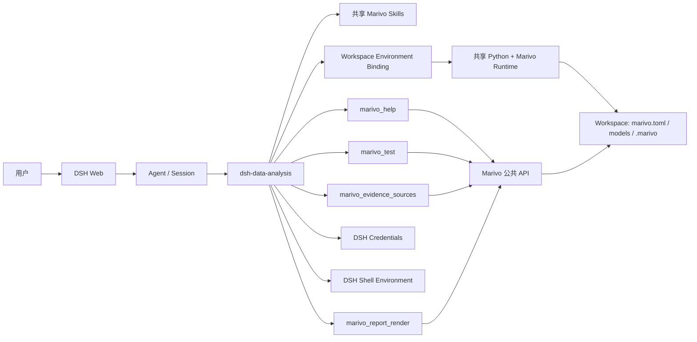

# dsh-data-analysis 总体架构

## 文档定位

本文描述 `dsh-data-analysis` 当前实现的系统边界、运行时拓扑、核心流程和模块关系。模块内部设计见
[模块架构](#模块架构)。当前 TypeScript 实现、DeepSeek Harness 与 Marivo 的已检出源码是事实源；
本文不定义 Harness 或 Marivo 已拥有的公共契约。

## 目标与职责边界

`dsh-data-analysis` 是运行在 DeepSeek Harness（DSH）Web profile 中的 Cordis 插件。它把
Harness 的 Agent、Session、Tool、Skill 和凭证生命周期接到 Marivo，同时保持两端的所有权清晰。

| 系统 | 拥有的职责 | 本项目如何使用 |
| --- | --- | --- |
| DeepSeek Harness | Agent 编排、Session surface、Tool/Skill 生命周期、profile、凭证存储与 Web 扩展点 | 监听 Agent 生命周期，注册 scoped Tool，挂载共享 Skill，使用凭证服务和 Web Tool View |
| Marivo | 分析语义、Datasource 定义、Artifact、Evidence、质量、Lineage 及有效性契约 | 调用真实 `marivo doctor`、`marivo.help()`、`md.describe()` 和 `md.test()` |
| 本项目 | Runtime 与 Workspace 绑定、实时能力披露、安全子进程和凭证桥接、Cordis 打包 | 只实现集成接缝，不复制上游 registry、schema、Evidence 或 Session 模型 |

相关上游入口：

- [DeepSeek Harness architecture](../../deepseek-harness/docs/architecture.md)
- [Harness Tools subsystem](../../deepseek-harness/docs/subsystems/tools.md)
- [Harness Credentials subsystem](../../deepseek-harness/docs/subsystems/credentials.md)
- [Marivo agent-friendly public surface](../../marivo/docs/specs/agent-friendly-public-surface.md)
- [Marivo semantic authoring workflow](../../marivo/docs/specs/semantic/authoring-workflow.md)
- [Marivo Evidence access surface](../../marivo/docs/specs/analysis/evidence-access-surface.md)

## 系统上下文



插件按 Web profile 加载一次。一个 profile 共享一套 Python 与 Marivo 安装；每个 Workspace
拥有独立项目根目录、doctor admission 和 Environment Binding；每个 Agent 拥有独立 Help
披露控制器与 scoped Tool 注册。

## 运行时拓扑

```text
DSH Web profile
├── Cordis plugin: @deepseek-ai/dsh-data-analysis
├── SharedMarivoRuntime
│   ├── Python / Marivo package identity
│   ├── installation.json
│   └── isolated global skills provider
├── Workspace A
│   ├── marivo.toml / models/ / .marivo/
│   └── MarivoEnvironment A
├── Workspace B
│   ├── marivo.toml / models/ / .marivo/
│   └── MarivoEnvironment B
└── Agent scopes
    ├── MarivoDisclosureController
    ├── marivo_help
    ├── marivo_test
    ├── bash/pwsh credential snapshot listener
    ├── marivo_evidence_sources + Turn source delivery
    └── marivo_report_render + immutable HTML publisher
```

共享 Runtime 只解决安装复用问题，不合并 Workspace 状态。Environment fingerprint 包含项目根、
解释器、Marivo 版本、package path 和子进程策略，因此相同 Runtime 下的不同 Workspace 仍有独立身份。

## 模块架构

| 模块 | 主要作用 | 文档 |
| --- | --- | --- |
| Runtime 与 Workspace | 创建或复用共享 Marivo 安装，挂载 Skills，幂等准备各 Workspace | [Runtime 与 Workspace](modules/runtime-workspace.md) |
| Environment 执行边界 | doctor 准入、身份固定、安全子进程、诊断输出 | [Environment 执行边界](modules/environment-execution.md) |
| Help 披露 | 提供 focused `marivo_help`，并在 Skill 激活后注入实时根 Help | [Help 披露](modules/help-disclosure.md) |
| Datasource 与凭证 | 解析 Datasource 凭证引用，调用 `md.test()`，提供 Web 凭证表单 | [Datasource 与凭证](modules/datasource-credentials.md) |
| Evidence 按需来源 | 按用户请求读取精确 Finding、从标准历史回放折叠 Web 来源面板 | [Evidence 按需来源](modules/evidence-sources.md) |
| HTML 报告渲染 | 校验完整 ReportDocument、读取精确 Marivo 投影并生成不可变自包含 HTML | [HTML 报告渲染](modules/html-report-rendering.md) |
| Plugin 集成与交付 | 组合 Cordis 生命周期、Agent scopes、客户端构建和 npm 包契约 | [Plugin 集成与交付](modules/plugin-integration-delivery.md) |

依赖方向保持单向：Plugin 组合层依赖其余模块；Help 与 Datasource 依赖 Environment；Environment
依赖 Runtime 提供的解释器身份，但不依赖 Agent 或 Web UI。Datasource 复用 Help 模块定义的惰性
Environment source 类型，不共享业务状态。

## 启动流程

1. Cordis 调用 `apply(ctx, config)`，插件解析 Runtime 配置。
2. Runtime 模块验证已有 `installation.json`；无有效安装时在安装锁内通过 `uv` 创建 Runtime，或
   验证管理员提供的 Python。
3. 插件将 Runtime 中复制出的 `marivo-analysis`、`marivo-semantic` 作为隔离的全局 Skill provider
   挂载，保留项目级 Skill 的更高优先级。
4. 插件为现有 Agent 安装控制器，并监听后续 `agent/created`、`agent/disposed`。
5. Agent 首次需要 Marivo Environment 时，根据配置或 `session.header.cwd` 解析 Workspace，幂等创建
   最小项目结构，运行 doctor admission 并缓存 binding Promise。
6. Agent scope 注册 `marivo_help`、`marivo_test`、`marivo_evidence_sources` 与 `marivo_report_render`；原 profile 的普通工具可见性不被改写。

## 分析交互流程

### Skill 与 Help

Agent 或用户加载 Marivo Skill 后，插件在下一次模型请求前从当前绑定环境读取对应根 Help：

- `marivo-analysis` → `marivo.help("analysis")`
- `marivo-semantic` → `marivo.help("authoring")`

更具体的 API 信息由 Agent 按 Skill 指引调用 `marivo_help({ targets })`。插件不维护 target registry，
不猜测别名，也不缓存 Help 正文；target 的合法性与输出内容完全由当前 Marivo 决定。

### Datasource 测试

`marivo_test({ name })` 先通过 `md.describe(name)` 获取 `DSH_*` 凭证引用名，再从 DSH Credentials
逐项解析。缺少凭证时 Tool 返回引用名，Web Tool View 收集并保存凭证，用户随后显式重试。引用全部
可用时，插件仅在该次 `md.test(name)` 子进程的环境 overlay 中传递值。插件还缓存每个 Workspace 的
非敏感 datasource 引用名，并在每次标准一次性 `bash`/`pwsh` 调用前重新解析当前凭证，通过 `dshEnv`
注入该次 Shell。Persistent Shell 不消费 `ctx.shellEnv`；存在已解析 datasource 凭证时插件明确拒绝，
避免静默无凭证执行。

### Evidence 按需来源

`marivo-analysis` 激活后，普通分析不调用来源工具。只有用户明确要求来源、出处、审计或 provenance 时，
Agent 才调用 `marivo_evidence_sources`。工具通过当前 binding 原子读取本次请求的已持久化 Finding，并把
双语陈述与精确身份写入闭合的 `tool/result.meta`；Code Mode nested call 把同一投影写入耐久
`tool/code-dispatch` ContentBlock。Web client 用 Conversation Definition 按 Turn 和 closing answer seq
恢复成功来源，在 Turn tail 渲染默认折叠、按 Artifact 分组的来源面板。它不解析或改写最终回答，也不创建
自定义 Session event。

### HTML 报告

用户明确请求或接受耐久 HTML 报告后，Agent 向 `marivo_report_render` 提交完整 `ReportDocument v2`。插件通过
当前 Environment Binding 对每个显式 Artifact 独立 revalidate 并保留有效 partial projection；报告路径不调用
Finding compatibility、Finding 读取或 backing Artifact 发现。Node 将 document、Marivo 与 visual preflight 结果
分组聚合，只有阻断性正确性检查全部通过才发布；相邻解读文字、点数与类别数只作为 Agent 写作/选图指导，
不作为发布硬门槛；只使用原始公开投影行渲染 text、line/bar chart 和 table。页脚把成功主 Artifact Job 及其
input/produce/reuse 关系编译为 Session DAG；Job 详情展示安全 params 与 raw SQL，Artifact 详情展示最多 10 行
持久化原序 preview 和 revalidation。报告以 canonical identity 发布到
`$DSH_HOME` 下的不可变目录。Tool 文本返回绝对路径；顶层 ready 结果把闭合报告摘要写入标准
`tool/result.meta`，Code Mode nested ready 结果把同一摘要写入标准子调用事件的耐久 ContentBlock。Web Tool
View 可在 Session replay 中恢复卡片，并仅在用户点击后调用 `host.openPath`。

## 状态与数据所有权

| 数据 | 位置 | 生命周期与所有者 |
| --- | --- | --- |
| Runtime 安装身份 | `$DSH_HOME/dsh-data-analysis/runtimes/marivo/installation.json` | profile 级，由插件创建和验证 |
| 共享 Skill 副本 | Runtime `skills/` | profile 级，从已验证 Marivo package 同步 |
| Marivo 项目与分析状态 | Workspace 的 `marivo.toml`、`models/`、`.marivo/` | Workspace 级，语义由 Marivo 拥有 |
| Environment Binding | 进程内 manager cache | Workspace 级，插件拥有；dispose 后丢弃 |
| Help 可见性与激活状态 | DSH Session events/surface + Agent controller | Agent/Session 级，Harness 保存 surface，插件投影状态 |
| Datasource 凭证 | DSH Credentials | Harness 拥有；插件只按操作解析和传递 |
| Datasource 引用 registry | 插件进程内 WeakMap | Workspace 级；只缓存 datasource 名称和 `DSH_*` 引用名，dispose 后丢弃 |
| Evidence source delivery | `tool/result.meta` / Code Mode durable ContentBlock | Tool call 与 Turn 级；插件投影，Harness 持久化标准事件 |
| HTML 报告产物 | `$DSH_HOME/dsh-data-analysis/reports/` | 内容寻址、不可变；插件原子发布，不维护 current/latest/registry |

## 信任与失败边界

- 所有插件自有 Python 调用均使用 direct argv，不经过 shell；固定 `cwd`、环境快照、超时、输出上限和
  取消行为。
- Runtime、Workspace、Python、Marivo 版本或 package path 的身份不一致时 fail closed。已失败 binding
  不会自动切换解释器或项目，必须显式重新绑定。
- doctor 顶层 `warning`/`fail` 不是单独的准入结论；插件只要求安装、项目 manifest 和身份检查满足
  当前集成边界。Datasource 凭证缺失可以是诊断问题，不阻断 Help 披露。
- 插件活动期间强制 `MARIVO_PERSIST_CREDENTIALS=0`，dispose 时恢复原值；插件自有子进程也不可由
  operation overlay 覆盖该值。标准一次性 `bash`/`pwsh` 每次重新解析 DSH Credentials 并注入当前
  Workspace registry 中已配置的引用；Shell 脚本仍有读取和输出这些变量的能力。Persistent Shell
  缺少该注入接缝，插件在已有凭证时 fail closed。
- 多 target Help 和多 Skill 根 Help 采用批次原子交付；批次中任一读取失败时不注入部分结果。
- 报告 projection、视觉编译和 staging 发布均为批次原子；任何失败都不会留下被报告为 ready 的半成品。
- Workspace 初始化失败、Tool 失败或 Help 披露失败保持在对应 Workspace/Agent 边界内，不升级为
  plugin-owned Marivo 语义修复。

## 非目标与扩展原则

本项目不实现分析 planner、Marivo target 镜像、Evidence/Claim 模型、Datasource schema 副本、凭证
存储或通用安全沙箱。新增能力应优先扩展现有接缝：

- 新 Marivo 能力通过公开 Help 和 Skill 暴露，不增加私有 registry。
- 新 Workspace 行为必须保持共享 Runtime 与项目状态分离。
- 新凭证型操作复用 DSH Credentials，并保持 operation-scoped overlay 或 Shell execution snapshot。
- 新 Web 交互只投影 Tool 结果，不创建第二套后端状态机。
- 上游契约变化时更新调用边界和测试，链接上游文档而不是复制定义。

## 验证入口

确定性验证以仓库脚本为准：

```sh
npm run check
npm run build
npm run verify:plugin-package
```

确定性测试和补充性真实验证均按[模块架构](#模块架构)组织：

```sh
npm run test:runtime-workspace
npm run test:environment-execution
npm run test:help-disclosure
npm run test:datasource-credentials
npm run test:evidence-sources
npm run test:html-report-rendering
npm run test:plugin-integration-delivery

npm run validate:runtime-workspace:real
npm run validate:environment-execution:real
npm run validate:help-disclosure:real
npm run validate:datasource-credentials:real
npm run validate:html-report-rendering:real
npm run validate:plugin-integration-delivery:real
```

最后一项需要真实模型凭证，其余真实验证需要仓库 `.venv` 中的 Marivo 安装；Datasource 验证会创建
使用当前绑定 Marivo 的临时 `DSH_*` datasource 项目。发布内容与可执行入口由
`packages/dsh-data-analysis/package.json`、`cordis.patch.yml` 和 package verifier 共同约束。
