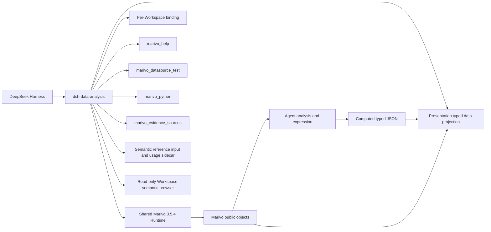

# DSH Data Analysis 总体架构

## 目标与边界

`dsh-data-analysis` 是 DeepSeek Harness 与 Marivo 的窄集成 seam。DSH 拥有 Agent、Session、Tool、Skill、
Credentials、profile 和通用文件/Web 生命周期；Marivo 拥有分析语义、Artifact、Evidence、Quality、
Lineage、revalidation 与 Session runtime；本项目只连接两者，不复制上游契约。

展示重构的 S0 接缝与 S1 一次执行准入已完成，S2 已接入 typed data projection 和最小 Python helper，
见[实施路线图](plan/marivo-analytics-presentation-roadmap.md)与[S2 验收记录](plan/marivo-analytics-presentation-s2-acceptance.md)。
旧 report-kit、报告 Skill 和经典 JS 资产已删除；当前是未发布开发状态，生产 reader、`marivo_present` 和新 Skill 分别在 S3–S5 接入。



## 分层

| 层 | 本项目职责 | 不属于本项目 |
| --- | --- | --- |
| Runtime/Workspace | 精确安装、marker、zero-init binding identity | Marivo 项目语义、Session 数据与按需写入 |
| Environment | checked runner、受限 argv、资源上限、overlay 脱敏 | Artifact/Evidence/Graph schema |
| Help | 当前 binding 的 live Help transport 与激活披露 | 静态 API registry |
| Datasource | DSH Credentials 管理、调用续接、connection test、resolver 注入 | table/source inspection 语义 |
| Evidence delivery | 精确 Artifact/Finding 到 Turn/Web 的忠实投影 | 分析读取、Finding 组合、蕴含判断 |
| Semantic reference input | Catalog 文本检索、原子 ref 序列化、Workspace 热度 | composer 状态机、领域成员有效性与分析执行 |
| Semantic browser | Workspace 对象快照、只读详情与局部关系图 | observe、数据预览、对象编辑、连接配置与凭证读取 |
| Presentation data | 固定公开 Artifact 读取、typed JSON、声明来源快照与最小 Python writer | computed 转换审计、分析正确性、语义补齐、observe 或 revalidation |

模块文档：

- [Runtime 与 Workspace](modules/runtime-workspace.md)
- [Environment 执行边界](modules/environment-execution.md)
- [实时 Help 披露](modules/help-disclosure.md)
- [Datasource Credentials](modules/datasource-credentials.md)
- [Evidence 来源交付](modules/evidence-sources.md)
- [语义对象引用输入](modules/semantic-reference-input.md)
- [只读语义层对象浏览器](modules/semantic-browser.md)
- [展示数据投影](modules/presentation-projection.md)
- [插件集成与交付](modules/plugin-integration-delivery.md)

## Runtime 与 identity

Compatibility manifest 精确固定 DSH peers 与 `marivo[duckdb,trino,clickhouse]==0.5.4`。默认 Runtime 位于
`$DSH_HOME/dsh-data-analysis/runtimes/marivo/`；管理员也可提供绝对 Python。两种模式都必须让版本、
package path、解释器和 marker 一致；Runtime 通过 pip 安装已发布的 Marivo package。

每个 Workspace 独立解析 project root、最小目录与 doctor admission。`MarivoEnvironment` 冻结 binding
identity；各领域 bridge 通过同一 `MarivoCheckedRunner` 执行，并在同一子进程内先复核 import identity。

## Agent scope

Plugin 为每个 Agent 安装一个 controller，并共享同一 Environment 对应的 Help、Datasource 与 Evidence
bridge。可见 DSH Tool 只有：

```text
marivo_help
marivo_datasource_test
marivo_python
marivo_evidence_sources
```

Plugin 当前只挂载 Runtime 的 `marivo-analysis` / `marivo-semantic`。激活后 controller 披露当前 Runtime 的根 Help；
原 Evidence prompt 继续保留到 S4。旧报告路由已删除，新 presentation Skill 在 S5 接入。
Plugin disposal 只移除自身 scope 的 Tool、prompt 与事件接线。

Runtime 安装 `dsh-data-analysis-presentation-kit==1.0.0`；公开 Python 函数
`dsh_data_analysis_presentation.write_dataset(frame, path)` 接受 pandas DataFrame，只写 computed typed JSON。
来源由 Draft 声明。固定 projection 在相同 bound Runtime 恢复 persisted Artifact 和可选 Finding，
不执行 `observe`、`revalidate` 或凭据读取；reader 后续只消费生成文档快照。

## 原生分析读取

Agent 直接使用 Marivo：

- `artifact.show()` / `render()`、`contract()`、`quality_summary`、`lineage`；
- `artifact.findings(...)` / `finding(...)` 和 `session.revalidate(ref)`；
- `session.runs(...)`、`get_run(...)`、`artifact(ref)`、`graph(...)`；
- `mv.session.recent(...)`、`inspect(...)`、`resume(...)`；
- `catalog.readiness(refs=[...])` 与 `md.inspect(datasource_ref, source)`；
- 经实时 Help 确认 terminal boundary 后的 `artifact.to_pandas()`。

插件不注册对应的 inspection、quality、graph、resume、readiness、inspect 或 export wrapper。特别是
`SessionGraph` 的 Run/Artifact/edge、完整性、focus、truncation 和 boundary 字段全部由 Marivo 拥有。

## Datasource 与 Credentials

DSH Credentials 是凭证值权威，Marivo 的公开 description 与 resolver 是字段和使用契约。插件把原始引用
映射到专属 DSH 地址，通过 stdin snapshot 和 `md.credential_scope` 注入；普通 Shell 不获得凭证值。

`marivo_datasource_test` 执行连接测试并同步管理页状态；`marivo_python` 在一次调用内等待全部 datasource
就绪，核验身份并取得 fresh snapshot，再通过 DSH Shell 前台执行服务启动一次代码。配置齐全不附加测试，
取消、轮换或 Workspace 变化终止旧准备，失败不重放。凭证不进入 Agent 参数、环境或 argv；输出在 Host
spill 前执行 exact-value 脱敏。access Tool 与跨调用 lease 已删除。

常驻“数据源与凭证”管理页支持配置、替换、删除和测试。缺失配置时，Web 根 Agent 的原调用保持等待；
提交验证成功后继续，失败可修正或交还 Agent。刷新、丢失响应、取消和定义变更由 Host 操作状态处理，
不依赖历史 Tool Result 自动弹窗。详见 [Datasource Credentials](modules/datasource-credentials.md)。

Source metadata inspection 由 Agent 直接调用 `md.inspect(...)`；connection test 不是 inspection 的前置。

## Evidence 来源 adapter

`marivo_evidence_sources` 接受 1–20 个精确 `{ artifact_ref, finding_id }`。Bridge 恢复 Session、取得 owning
Artifact，再调用 `artifact.finding(finding_id)`，并验证 Finding 的 Session 与 Artifact identity。成功结果
投影到当前 Turn；Tool text 提供完整有界 title、locator、excerpt、状态、截断、revalidation 与语义边界。
Code Mode 子调用通过 durable source block 保留相同元数据；Web 只增强同一 closed result，不重新读取 Evidence。

该 adapter 不是报告数据入口，不自动拦截回答，不生成脚注或 citation manifest，也不证明自由文本正确。

## 展示数据与后续交付

S2 的内部 `MarivoPresentationProjection` 把 Draft 变成纯数据 `PresentationDocument`。
Artifact dataset 必须恢复所需行和字段；computed dataset 从 Workspace 中有界读取 typed JSON；
source-only 保持 `datasets: []`。来源读取失败可以保存 unavailable，但不允许直接 Artifact dataset 假成功。

当前没有生产目录 builder、present Tool 或 reader。S3 将使用相同数据契约构建 reader/离线 HTML，
S4 才负责完整文件提交、receipt 与 Host 只读 RPC；S5 接入唯一展示 Skill。详见[路线图](plan/marivo-analytics-presentation-roadmap.md)。

## 验证

```bash
npm run check
npm run build
npm run verify:plugin-package
```

确定性测试守住 Runtime/helper identity、Tool 最小性、旧 surface 删除、Python/Node typed JSON、
Artifact/source identity、文件预算与包导出。真实 Artifact 恢复与 Chromium 数据读取见
[S2 验收记录](plan/marivo-analytics-presentation-s2-acceptance.md)；不将其当作后续 Host/reader/Agent 交付验收。
