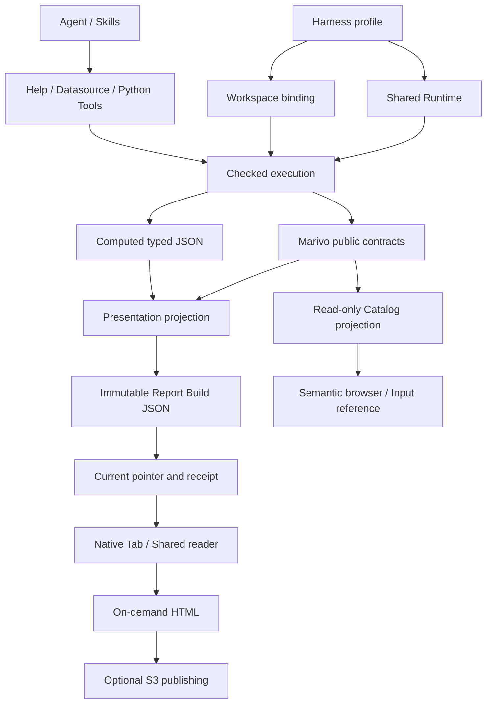

# DSH Data Analysis 总体架构

## 目标与责任边界

`dsh-data-analysis` 是将 Marivo 接入 DeepSeek Harness 的 TypeScript 插件。项目设计以当前代码和上游公开契约为准；模块文档描述实现边界，不代表已安装 profile 或发布版本已经通过真实验收。

| 所有者 | 职责 |
| --- | --- |
| DeepSeek Harness | Agent 编排、Session/Turn、Tool/Skill 生命周期、Credentials、profile、Workspace、附件、输入框和原生 Tab |
| Marivo | 分析语义、Catalog、Artifact、Finding、Evidence、Quality、Lineage、revalidation 与分析 Session |
| 本插件 | Runtime/Workspace binding、受控执行与凭据注入、实时 Help 披露、语义引用及只读投影、报告保存与呈现、可选对象存储发布、打包验证 |

插件使用公开实时接口，不复制 Marivo schema、API registry 或领域推理，不改变 Harness 原生生命周期。`marivo_export_html` 直接从 Session Workspace 的已保存报告导出完整 HTML，与阅读器复用快照校验及渲染，不依赖 Runtime 或发布配置。分析、展示保存、HTML 导出和对外发布是独立操作；其中一个成功不能证明其他操作成功。

## 模块导航

| 领域 | 项目级设计 | 主要边界 |
| --- | --- | --- |
| 运行基础 | [Runtime 与 Workspace](modules/runtime-workspace.md) | profile 共享安装、Workspace 隔离与绑定身份 |
| 运行基础 | [Environment 执行](modules/environment-execution.md) | checked runner、子进程、预算、取消与脱敏 |
| Agent 接入 | [实时 Help 披露](modules/help-disclosure.md) | live Help transport、Skill 激活与上下文恢复 |
| Agent 接入 | [数据源与凭证](modules/datasource-credentials.md) | 配置续接、凭据管理、连接测试与一次 Python 执行准入 |
| Agent 接入 | [Python 工具卡片](modules/python-tool-card.md) | 冻结调用快照的代码与输出展示，不执行或重放分析 |
| Agent 接入 | [文件分析 Skill](modules/file-analysis-skill.md) | 原生附件路径、pandas/DuckDB 与结果交付 |
| 语义交互 | [语义对象引用输入](modules/semantic-reference-input.md) | Catalog 检索、原子引用、提交核验与热度 |
| 语义交互 | [只读语义浏览器](modules/semantic-browser.md) | Catalog 快照、公开定义与声明关系 |
| 报告 | [展示 Skill](modules/presentation-skill.md) | 内容组织、图形选择、来源声明与 Draft 流程 |
| 报告 | [展示数据投影](modules/presentation-projection.md) | typed JSON、固定来源读取、Python writer 与数值预算 |
| 报告 | [展示交付](modules/presentation-delivery.md) | Report/Build、原子保存、current、receipt、RPC 与编辑 |
| 报告 | [共享 reader 与离线构建](modules/presentation-reader.md) | 五类 block、阅读交互、加入提问 与 HTML |
| 报告 | [报告 HTML 发布](modules/report-publishing.md) | 可选 S3 上传、独立凭据与发布回执 |
| 插件交付 | [插件集成与交付](modules/plugin-integration-delivery.md) | 安装回滚、资源关闭、Host 接缝、兼容与分发 |

模块文档承载具体协议和失败边界；本文只描述跨模块关系。[验证指南](validation.md)维护检查入口与证据要求，[发布说明](releases/0.1.2.md)保留已发布版本的历史说明。

[DSH rc.1 升级与分析体验优化设计](designs/dsh-rc-upgrade-ux.md) 的 S1 兼容基线已完成，证据见[验证指南](validation.md#dsh-rc1-基线验收)；S2 文件交付和 S3 引导入口仍待实施。

## 运行与数据流

### Runtime、Workspace 与 Agent

profile 共享精确安装的 Marivo Runtime、presentation-kit 和 Runtime Skill。Workspace 惰性解析 project root 与 binding，绑定过程不创建项目文件；使用领域能力时由 Marivo 执行相应准入。每次 checked execution 在实际子进程中复核解释器、包位置、版本和 marker，身份不匹配明确失败。

Help 使用启动时验证的 shared Runtime，不为读取 API Help 初始化 Workspace。涉及数据源、分析和展示来源的操作使用所属 Workspace 的同一 bound Runtime。Workspace ID 与 Runtime fingerprint 共同约束浏览和引用身份；同路径重新注册的 Workspace 不能接收旧引用。

每个 Agent 独立持有 Skill 激活、Help 可见性和操作生命周期。普通问题使用文字；文件任务加载 `dsh-data-analysis-files`，展示任务加载 `dsh-data-analysis-presentation`；需要 Marivo 分析或语义编写时加载 Runtime 的 `marivo-analysis` 或 `marivo-semantic` 并查询 live Help。

默认跨边界 Tool 为 `marivo_help`、`marivo_datasource_configure`、`marivo_datasource_test`、`marivo_python`、`marivo_present`。开启报告发布后增加 `marivo_publish_report`。Artifact inspection、Session resume/graph、readiness 和 source inspection 由 Agent 使用 Marivo 公开 API，不另加 convenience wrapper。

### 配置与执行

Harness Credentials 是秘密值权威；Marivo 的公开 description、DatasourceSpec 和 resolver 拥有字段及使用语义。插件配置与表单只保存凭据引用，秘密值通过 Harness 接口管理。

`marivo_datasource_configure` 将表单绑定到原调用与所属 Session，用户完成配置后续接；取消或身份变化结束旧操作。`marivo_python` 在一次调用内等待所有声明的数据源就绪，取得 fresh snapshot，通过 stdin 和 `md.credential_scope` 注入，再交给 Harness Shell 前台执行。秘密值不进入 Agent 参数、argv 或环境，输出在 Host spill 前脱敏。

纯文件分析使用 `datasources: []`，仍保留 Runtime/Workspace identity、取消与执行代码记录。每次调用是独立 Python 进程，临时表和内存状态不会跨调用保留；文件结果不会自动获得 Marivo Evidence 或 lineage。

### 语义浏览与输入

语义浏览器从公开 Catalog 生成一次元数据快照，列表、定义和关系图共用该快照，不执行 observe、preview、连接测试或凭据读取。声明关系不等同于执行血缘，也不证明查询组合有效。

`@` 与详情页“加入提问”使用同一原生 reference 和 codec。显式选择可准备绑定；提交只核验已有 Session/Workspace 与 binding，不隐式修复旧引用。Harness 拥有输入 revision、原子插入、撤销、附件与发送；迟到结果不得写入下一条草稿。

### 报告保存、阅读与发布

Agent 将已有 Artifact 或 computed typed JSON 组织成 Draft，由 `marivo_present` 读取来源快照并生成不可变 Build。computed 声明来源只表达作者关联，不证明转换正确；直接 Artifact dataset 不能在必要数据缺失时假成功。reader 只消费保存文档，不重新分析或 revalidate。

Report ID 是稳定报告身份，Build ID 是一次保存的固定身份。新建与更新共用原子提交；更新必须携带 `expected_build_id`，在锁内比较并发布 current 指针。Host 呈现编辑只修改允许的展示字段，Agent 更新使用完整 Draft；两者都不能覆盖并发保存。

默认保存只写 JSON，成功 receipt 通过 Harness 持久事件归属到 Session/Turn。当前会话的新交付自动打开固定 Build 的原生右侧 Tab；成功报告不渲染聊天卡片，历史回放不自动打开。Host 阅读、编辑和历史入口统一由已有 Session 的原生 Tab 承接，不创建无 Session 容器。报告目录与重开可解析 current，已打开 reader 继续显示固定快照，直到用户刷新或保存。

完整 HTML 在下载时按固定 Build 校验并生成；当前视图导出冻结已显示的筛选、排序和图形。两者都不修改 Build 或 current。开启 `reportPublishing` 后，在线 HTML 下载入口改为对象存储发布，Agent 也可在用户明确要求发布时调用 Tool。上传使用独立、操作级凭据；写入响应成功不等于公网链接已验证可访问。

“加入提问”将正在显示的 Workspace/Report/Build/Cell 及临时视图定位插入所属会话草稿，chip 显示友好名称，发送时由 codec 展开完整上下文。current 提示不改变引用身份；实际显示的 document 才决定 Build。

## 生命周期与失败原则

原生 Tab 的状态由 Session/Tab occurrence 拥有，导航携带完整 Workspace 和资源身份。关闭、Session 切换、Workspace 撤销和连接重置取消相关请求，迟到响应不能恢复旧页面或草稿。

已有 Agent 批量安装失败时回滚本批安装，后续 Agent 失败只清理自身。插件关闭先同步撤入口并取消，再等待拥有的 Help、Python、present、RPC、凭据、Catalog、发布和 usage 写入结束，最后释放共享资源。取消等待不证明远端查询或上传已回滚；响应丢失时保留结果未确认状态，不猜测清理。

文件读取按 Host 推导的 Workspace 路径校验真实路径、类型、字节预算与 digest；摘要用于完整性，不能代替授权。共享 Runtime、per-Workspace binding、Agent 操作与浏览器状态分别由各自 owner 释放，已提交报告不随插件卸载删除。

## 语言责任边界

Harness locale 服务拥有插件操作界面的语言设置及持久化；插件仅注册词典并订阅更新。报告展示语言由 DSH 根据用户问题写入 Draft 的 `locale`，由 projection 原样固化到 Document，不读取系统 locale。Reader、打印与 HTML 导出遵循同一报告语言，详见 [报告阅读器](modules/presentation-reader.md#界面语言与报告语言)。

## 插件设置

Harness 拥有设置持久化、配置分层和 revision 冲突检测。插件通过 `dsh-data-analysis` settings namespace 与 `settings.plugin.item` 卡片提供 `pythonTimeoutMs`，在每次 Python 调用入口读取，不重新绑定 Runtime 或 Workspace。界面、继承和生效语义见[超时与执行反馈](modules/datasource-credentials.md#超时与执行反馈)。
