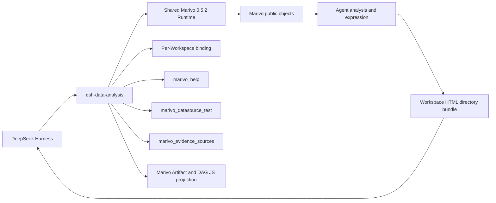

# DSH Data Analysis 总体架构

## 目标与边界

`dsh-data-analysis` 是 DeepSeek Harness 与 Marivo 的窄集成 seam。DSH 拥有 Agent、Session、Tool、Skill、
Credentials、profile 和通用文件/Web 生命周期；Marivo 拥有分析语义、Artifact、Evidence、Quality、
Lineage、revalidation 与 Session runtime；本项目只连接两者，不复制上游契约。



## 分层

| 层 | 本项目职责 | 不属于本项目 |
| --- | --- | --- |
| Runtime/Workspace | 精确安装、marker、Workspace 初始化、binding identity | Marivo 项目语义、Session 数据 |
| Environment | checked runner、受限 argv、资源上限、overlay 脱敏 | Artifact/Evidence/Graph schema |
| Help | 当前 binding 的 live Help transport 与激活披露 | 静态 API registry |
| Datasource | DSH Credentials 缺失收集、connection test、Shell env 注入 | table/source inspection 语义 |
| Evidence delivery | 精确 Artifact/Finding 到 Turn/Web 的忠实投影 | 分析读取、Finding 组合、蕴含判断 |
| Report workflow | 原则型 `dsh-data-analysis-report` Skill 与 Artifact/DAG JS 投影 | 页面模板、通用 chart helper、HTML Checker、renderer、publisher、专用 Web card |

模块文档：

- [Runtime 与 Workspace](modules/runtime-workspace.md)
- [Environment 执行边界](modules/environment-execution.md)
- [实时 Help 披露](modules/help-disclosure.md)
- [Datasource Credentials](modules/datasource-credentials.md)
- [Evidence 来源交付](modules/evidence-sources.md)
- [插件集成与交付](modules/plugin-integration-delivery.md)

## Runtime 与 identity

Compatibility manifest 精确固定 DSH peers 与 `marivo[duckdb,trino,clickhouse]==0.5.2`。默认 Runtime 位于
`$DSH_HOME/dsh-data-analysis/runtimes/marivo/`；管理员也可提供绝对 Python。两种模式都必须让版本、
package path、解释器和 marker 一致。

每个 Workspace 独立解析 project root、最小目录与 doctor admission。`MarivoEnvironment` 冻结 binding
identity；各领域 bridge 通过同一 `MarivoCheckedRunner` 执行，并在同一子进程内先复核 import identity。

## Agent scope

Plugin 为每个 Agent 安装一个 controller，并共享同一 Environment 对应的 Help、Datasource 与 Evidence
bridge。可见 DSH Tool 只有：

```text
marivo_help
marivo_datasource_test
marivo_evidence_sources
```

Plugin 同时挂载 Runtime 的 `marivo-analysis` / `marivo-semantic` 和随包分发的
`dsh-data-analysis-report`。前两者激活后，controller 披露当前 Runtime 的根 Help；报告路由随
`marivo-analysis` 激活，在用户请求 HTML/Web 输出或分析需要多个图表/表格、较长分章节呈现时加载报告
Skill。已有分析恢复并 revalidate persisted Artifacts，不为展示重新执行 `observe`。插件不注册报告 Tool；
Plugin disposal 只移除自身 scope 的 Tool、prompt 与事件接线。

Runtime 另外安装 `dsh-data-analysis-report-kit`。`emit_dataset` 只接受 Marivo `BaseFrame`，
`emit_computed` 只接受 pandas `DataFrame`，`emit_session_trace` 只接受调用方已取得的公开 `SessionGraph`。
浏览器 assets 分别提供 `ReportData`、精简 Artifact 摘要与 Session DAG；Artifact 组件只披露对报告读者有用的
正常摘要和实质风险，不充当 metadata inspector。一次分析涉及多个 Session 时，每个 Session 保持独立 Graph，
Frame preview 按 `session_id + artifact_ref` 关联。插件不拥有页面结构、图表类型、样式或可视化实现。

## 原生分析读取

Agent 直接使用 Marivo：

- `artifact.show()` / `render()`、`contract()`、`quality_summary`、`lineage`；
- `artifact.findings(...)` / `finding(...)` 和 `session.revalidate(ref)`；
- `session.runs(...)`、`get_run(...)`、`artifact(ref)`、`graph(...)`；
- `mv.session.recent(...)`、`inspect(...)`、`resume(...)`；
- `catalog.readiness(refs=[...])` 与 `md.inspect(datasource_ref, source)`；
- 经实时 Help 确认 terminal boundary 后的 `artifact.to_pandas()`。

插件不注册对应的 inspection、quality、graph、resume、readiness、inspect 或 export wrapper。特别是
`SessionGraph` 的 Run/Artifact/edge、完整性、focus、truncation 和 boundary 字段全部由 Marivo 拥有。

## Datasource 与 Credentials

`marivo_datasource_test({ name })` 读取配置中的 `DSH_*` 引用，逐项通过 DSH Credentials resolve，再把
secret 作为单次环境 overlay 传给 `md.test()`。描述成功后的非秘密引用名进入 Workspace 内存 registry，
使普通 one-shot Shell 和 Code Mode 嵌套调用获得相同注入。所有调用强制
`MARIVO_PERSIST_CREDENTIALS=0`，secret 不进入 argv、日志、结果或 telemetry。

Source metadata inspection 由 Agent 直接调用 `md.inspect(...)`；connection test 不是 inspection 的前置。

## Evidence 来源 adapter

`marivo_evidence_sources` 接受 1–20 个精确 `{ artifact_ref, finding_id }`。Bridge 恢复 Session、取得 owning
Artifact，再调用 `artifact.finding(finding_id)`，并验证 Finding 的 Session 与 Artifact identity。成功结果
投影到当前 Turn；Code Mode 子调用通过 durable source block 保留相同元数据。Web 只提供折叠来源面板。

该 adapter 不是报告数据入口，不自动拦截回答，不生成脚注或 citation manifest，也不证明自由文本正确。

## Agent 原生报告与文件交付

Agent 按 Skill 原则自行选择 HTML/CSS/SVG/JavaScript、图表和本地依赖，输出普通目录。插件不提供页面
示例或静态 HTML Checker：

```text
<workspace>/<new-report-directory>/
├── index.html
├── assets/   # optional
└── data/     # optional
```

资源先写，入口最后写。Native/both 的顶层成功 mutation 会让入口路径进入 Produced Files；Code-only 的
嵌套 mutation 只进入 Harness 日志，因此由外层输出和最终回答交付精确路径。Host opener 仅在 loopback 且
`canOpenPath` 可用时工作；remote/headless 只交付路径。

文件级 mutation 可以原子写入，但目录没有事务、ready gate、digest、不可变 identity、历史字节 replay、
权限发布、share 或 GC。资源闭合、离线依赖、安全、浏览器、键盘与打印检查属于 Agent 工作流；失败时必须
明确报告未完成。

## 验证

```bash
npm run check
npm run build
npm run verify:plugin-package
```

确定性测试守住 Tool 最小性、旧 surface 删除、Artifact/DAG 投影契约、Evidence 精确归属与包导出。页面的
Web Produced Files、Host opener、浏览器、打印和隔离磁盘配额由具体交付工作流按 Skill 原则验证，不能由
路径存在或本地日志代替。
