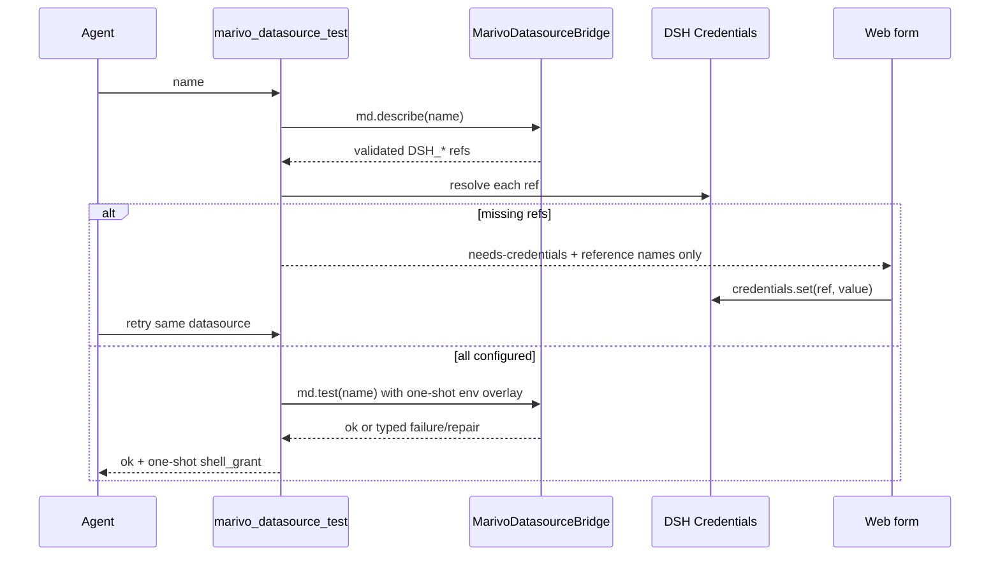

# Datasource Credentials 模块

## 作用

本模块提供 `marivo_datasource_test({ name })`，把 Marivo datasource 的缺失 credential 引用接到 DSH
Credentials，并执行用户明确要求的 connection test。只有测试成功后，插件才签发一次性 foreground Shell
credential grant；Code Mode 内嵌调用服从同一规则。

Datasource/table metadata inspection 不属于该 Tool；Agent 直接调用 Marivo 公共
`md.inspect(datasource_ref, source)`，无需先做额外 connection test。

## 连接测试闭环



Tool 只接受 `name`，不接受 source/table 参数，不返回 inspection 结果。旧名称不注册，也没有 deprecated
alias。

## 一次性 Shell grant

Datasource 的 `*_env` 字段必须引用 `DSH_*` 名称。一次 test 成功后，插件生成至少 128 bit 随机 token，
绑定当前 Agent、Workspace binding、datasource 与去重引用名，最长存活 60 秒。需要凭据的 bash/pwsh 必须把
以下精确 marker 放在 command 第一行：

```text
# dsh-marivo-credential-grant:<opaque-token>
```

`tools/pre-execute` 在异步 credential resolve 前原子 claim；只 fresh-resolve grant 绑定的 refs，并只把快照
关联到该次 `ToolExecution`。settle、cancel、error、Agent/plugin dispose 后清除。没有 marker 的普通 Shell
不 inventory Workspace datasource，也不获得任何 datasource credential：

- secret 不进入 argv、Tool Result、日志或 telemetry；
- stdout/stderr 和结构化错误执行 secret redaction；
- 子进程强制 `MARIVO_PERSIST_CREDENTIALS=0`；
- grant 只保存引用名，不缓存 resolved value；
- 每次操作重新 resolve，支持凭据轮换；
- 错 Agent/Workspace、过期、复用、background 与 persistent 全部在 spawn 前失败；
- Code Mode nested Shell 经过同一 pre-execute 路径。

grant 只限制 secret 进入哪一次 Shell execution，不限制该 execution 内的任意代码读取环境变量；这是运行
Marivo datasource 所需且已经专项安全 review 接受的边界。它不是结构化 datasource sandbox，也不得被描述为
secret 对获授权代码不可见。

## Web 表单

客户端只为 `marivo_datasource_test` 注册 Tool View。它从 settled Tool text 解析严格的
`needs-credentials` JSON，仅展示引用名与 password input。保存调用 DSH `credentials.set()`；错误消息在
渲染前对本轮输入值再次脱敏。保存成功后只提示重试，不自动重放原 Tool call。

## Agent 指导

- `md.register(...)` 或 datasource 文件修改后调用 `marivo_datasource_test({ name })`；
- `needs-credentials` 后等待用户在 Web 保存，再重试；
- 成功后只在一个 foreground Shell 使用返回 token 的精确首行 marker；grant 即使后续 resolve 失败也已消耗；
- 不在聊天、命令、源文件或报告中索取/写入 secret；
- source metadata 问题直接运行 `md.inspect(...)`；
- inspection 本身会连接目标 datasource，不要求先 test。

## 验证

```bash
npm run test:datasource-credentials
npm run validate:datasource-credentials:real
```

测试覆盖旧 alias 缺席、引用名校验、missing/partial credentials、轮换、脱敏、grant claim/TTL/scope、
background/persistent 拒绝、Code Mode 注入和 Web
表单。真实验证使用专用临时 datasource；不得把本地假 credential 写入仓库或验收产物。
