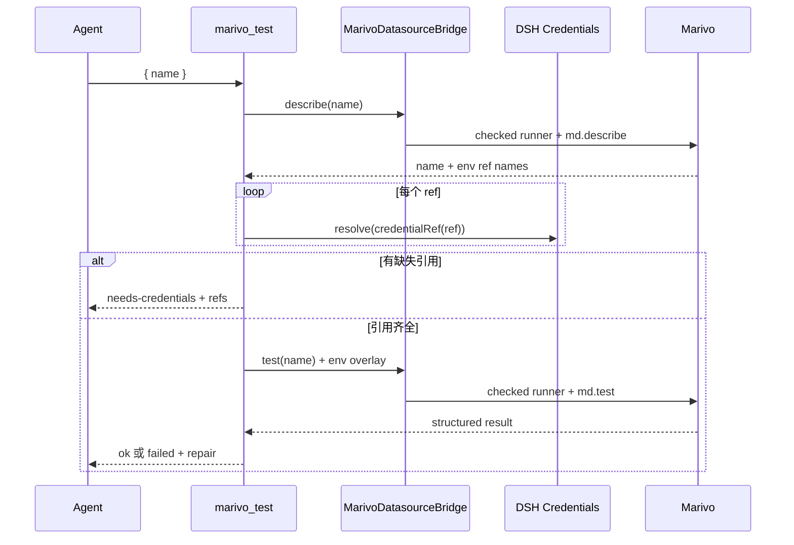

# Datasource 与凭证模块架构

## 作用

本模块提供 `marivo_test({ name })`，把 Marivo Datasource 的连接测试接到 DSH Credentials，并在
Web 中为缺失引用提供一次性收集界面；同时把当前 Workspace datasource 引用的已配置值注入每次
Agent Shell。它不保存凭证、不复制 Datasource schema，也不自行判断连接语义；Datasource 描述、
测试结果和 repair 都来自 Marivo 公共 API。

总体关系见[总体架构](../architecture.md)。服务端与客户端实现分别位于：

- `packages/dsh-data-analysis/src/datasource/test.ts`
- `packages/dsh-data-analysis/src/datasource/bridge.ts`
- `packages/dsh-data-analysis/src/datasource/shell-env.ts`
- `packages/dsh-data-analysis/src/client.tsx`

上游凭证契约见 [Harness Credentials subsystem](../../../deepseek-harness/docs/subsystems/credentials.md)，
Datasource 语义见 [Marivo datasource layer](../../../marivo/docs/specs/semantic/datasource-layer.md)。

## 服务端连接测试流程



输入 `name` 必须是非空、最多 256 字符的字符串。`md.describe(name)` 的投影只允许 datasource name
和 `env_refs` 的引用名；引用名必须匹配 `DSH_[A-Z][A-Z0-9_]*`，并按首次出现顺序去重。出现非
`DSH_*` 引用时，`marivo_test` 在解析凭证和连接数据库前明确失败，要求修改 datasource 配置。

插件按引用逐项调用 `credentials.resolve(credentialRef(ref))`：

- 任一引用缺失时，不运行 `md.test()`，返回
  `{ status: "needs-credentials", name, refs }`；
- 全部存在时，把值组成该次调用专用的 environment overlay，运行真实 `md.test(name)`；
- 成功返回 `status: "ok"` 和可选 latency；
- 业务失败返回 `status: "failed"`、Marivo failure 与 repair 投影；
- describe/test 协议无效、进程失败或 identity mismatch 作为 Tool error，而不是伪造业务结果。

每次 describe 成功后，`marivo_test` 还会用这份非敏感引用名更新对应 Workspace 的内存 registry；
凭证值不进入该 registry。

## Agent Shell 自动注入

首次执行标准一次性 `bash` 或 `pwsh` 时，插件通过绑定的 Python 运行一次 `md.list()`，再对每个条目调用
`md.describe()`，只读取 datasource name 和 `env_refs`。inventory 结果按稳定的 `MarivoDatasourceBridge`
隔离并缓存，后续 Shell 不重复启动 Python；`marivo_test` 的新 describe 结果可以替换单个 datasource
的缓存引用。

每次 Shell 执行都会重新完成以下步骤：

1. 对 registry 中去重后的每个 `DSH_*` 引用调用 `ctx.credentials.resolve()`；
2. 只把已配置值保存到该 `ToolExecution` 的内存快照；
3. 通过 Harness `ctx.shellEnv` contributor 合并到该次 `dshEnv`；
4. 标准一次性 `bash`/`pwsh` 调用 `ctx.shellEnv.collect(execution)`，其启动的 Python 继承该快照，
   Marivo 按原生环境解析和进程内 backend 生命周期工作。

凭证轮换会在下一次 Shell 生效。执行快照按 `ToolExecution` 隔离，引用 registry 按 Workspace 隔离；
不同 Agent、Workspace 或并发调用不会共享凭证值。inventory 失败、引用缺失或 Credentials provider
读取失败都不阻断 Shell，以便 Agent 修复 datasource；缺失值仅不注入。

Harness persistent Bash/Pwsh 复用 PTY，不读取每次 ToolExecution 的 `ctx.shellEnv`，当前也没有可供插件
追加环境的 terminal seam。插件不会把凭证拼进命令：当 registry 中至少一个 datasource 凭证已解析时，
persistent Shell 调用明确失败并要求切换到 standard、code 或 cordis preset；凭证全部缺失时仍允许
Shell 修复配置。

## 凭证安全边界

凭证值只允许经过以下路径：

```text
DSH Credentials -> operation-scoped Node memory -> child environment overlay -> md.test()
DSH Credentials -> ToolExecution memory snapshot -> dshEnv -> one-shot bash/pwsh -> Python/Marivo
```

模块执行以下防护：

- 值不进入 argv、Tool 参数、Tool Result、telemetry 或持久 marker；
- 插件活动期间固定 `MARIVO_PERSIST_CREDENTIALS=0`，dispose 时恢复此前进程值；
- Help、doctor、inventory、describe、test 子进程都不可覆盖该禁用值；
- Python wrapper 捕获被测调用的 stdout/stderr，并按所有 overlay secret values 递归脱敏；
- Environment runner 再次对 stdout、stderr 和 JSON value 脱敏；
- Datasource adapter 在构造 typed result 前做严格 shape 校验；
- 缺失引用只返回 ref name 和配置状态，不返回已有值。

受控 `marivo_test` 会保证凭证不进入 Tool Result；Shell 自动注入则明确授予本地 Agent 脚本读取
环境变量的能力，因此 bash/Python 命令必须避免打印、复制或持久化这些值。

## System Prompt 触发约定

凭证提示只在 `marivo-semantic` 激活时加入插件 System Prompt，不修改 Marivo 自带 skill。提示要求：

- datasource 的全部 `*_env` 只能引用 `DSH_*`；
- 不得在聊天、命令或项目文件中索取或填写凭证值；
- `md.register()` 或手工修改 datasource 文件后立即调用 `marivo_test({ name })`；
- 收到 `needs-credentials` 后等待用户通过 Web 表单保存，再重试 `marivo_test`。

## Web Tool View

客户端扩展在 `tool.call.toolview` slot 上为 `marivo_test` 注册专用视图。它从 settled Tool text 中只
识别严格的 `needs-credentials` JSON；其他结果以普通摘要显示。

缺失凭证时：

1. 以 `sessionId + callId` 为 key，每个 Tool call 最多触发一次自动状态检查；
2. 打开表单前调用 `credentials.describe({ refs })` 读取当前“已配置/未配置”状态；
3. Session replay 中的历史 `needs-credentials` 若已全部配置，不再打开表单，只提示重新调用
   `marivo_test`；
4. 仍有缺失时才打开表单；每个输入框初始为空，不回显或预填已有值，已配置引用禁用输入；
5. 未配置值通过标准 `credentials.set({ ref, value })` 逐项保存；
6. 错误消息再次按本轮输入值脱敏，保存后清空本地输入状态；
7. 全部保存成功后关闭表单并提示用户重试 `marivo_test`。

客户端不会自动重放原 Tool call。取消、部分保存失败或页面关闭也不会改写已经持久化的 Session Tool
Result；DSH Credentials 是唯一持久状态源。

## 结果契约

| status | 含义 | 字段 |
| --- | --- | --- |
| `needs-credentials` | 描述成功，但至少一个引用未配置 | `name`, `refs` |
| `ok` | `md.test()` 返回成功 | `name`, `latency_ms` |
| `failed` | `md.test()` 返回结构化业务失败 | `name`, `latency_ms`, `failure`, `repair` |

`repair` 由 Marivo 生成；插件只保留结构化字段，不升级为自动修复动作。保存凭证也不代表连接已经
验证，必须由新的 `marivo_test` 调用重新执行 describe、resolve 和 test。

## 生命周期与失败隔离

`marivo_test` 与 `marivo_help` 一样注册在 Agent scope，并使用同一惰性 Environment source。
Agent dispose 时 Tool 和 Shell listener 注销；插件 dispose 时清理 contributor、Workspace registry，
并恢复 `MARIVO_PERSIST_CREDENTIALS`。一个 Workspace 的 inventory、describe/test 或凭证缺失不会修改
其他 Workspace 的 binding，也不会阻断共享 Runtime 上的 Help。

客户端连接不可用、describe 状态读取失败时，表单仍保持引用未配置的保守显示；保存失败逐字段
呈现。服务端不依赖客户端存在，因此 native/headless 使用者仍可读取 `needs-credentials` 结果并通过
DSH 的其他标准入口配置凭证。

## 公共接口与验证

`packages/dsh-data-analysis/src/datasource/index.ts` 导出 Tool builder、registration 和结果类型。关键
测试位于：

```text
packages/dsh-data-analysis/tests/datasource-credentials/marivo-test-tool.test.ts
packages/dsh-data-analysis/tests/datasource-credentials/shell-env.test.ts
packages/dsh-data-analysis/tests/datasource-credentials/client-integration.test.ts
```

测试应覆盖 `DSH_*` 校验、首次 inventory、每次重新 resolve、凭证轮换、Workspace/并发隔离、缺失时
fail-open、operation overlay、双层脱敏、结构化 failure/repair，以及 Web 只自动打开一次、空白输入、
配置状态、部分失败和手动重试提示。

`npm run test:datasource-credentials` 先构建 client 再执行确定性测试；
`npm run validate:datasource-credentials:real` 使用当前绑定 Marivo 创建带 `DSH_*` 引用的临时 datasource，
验证缺凭证结果，并以连接调用 guard 证明该路径不会执行 `md.test()`。
