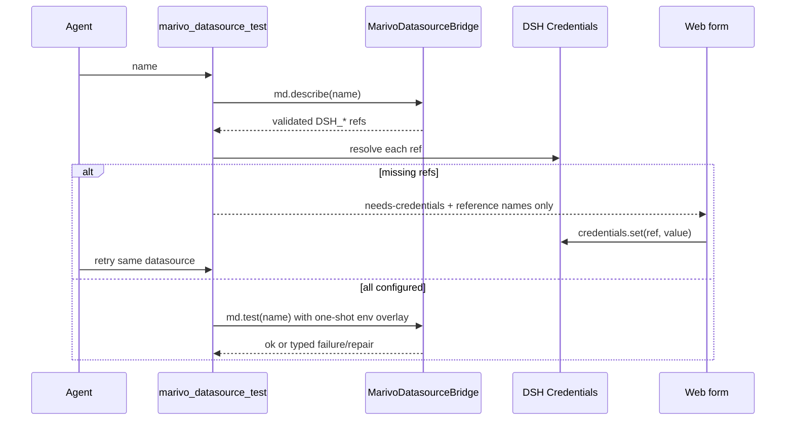

# Datasource Credentials 模块

## 作用

本模块提供 `marivo_datasource_test({ name })`，把 Marivo datasource 的缺失 credential 引用接到 DSH
Credentials，并执行用户明确要求的 connection test。它还把已配置凭据 operation-scoped 注入标准
one-shot Shell，包括 Code Mode 内嵌调用。

Datasource/table metadata inspection 不属于该 Tool；Agent 直接调用 Marivo 公共
`md.inspect(datasource_ref, source)`，无需先做额外 connection test。

## 连接测试闭环



Tool 只接受 `name`，不接受 source/table 参数，不返回 inspection 结果。旧名称不注册，也没有 deprecated
alias。

## 凭据引用与 Shell 注入

Datasource 的 `*_env` 字段必须引用 `DSH_*` 名称。每次 `md.describe()` 成功后，插件把去重后的非秘密引用
名记录在对应 Environment/Workspace 的内存 registry。Shell 执行前按当前 datasource inventory resolve
引用并建立 operation-scoped overlay：

- secret 不进入 argv、Tool Result、日志或 telemetry；
- stdout/stderr 和结构化错误执行 secret redaction；
- 子进程强制 `MARIVO_PERSIST_CREDENTIALS=0`；
- registry 只保存引用名，不保存值；
- 每次操作重新 resolve，支持凭据轮换；
- Workspace 与 Environment fingerprint 隔离。

通用 Shell 与凭据同进程并不是秘密隔离边界；它等价于当前 profile 授权 Agent 在本地执行带凭据代码。
若未来 profile 禁止通用执行，再单独设计更窄 inspection capability。

## Web 表单

客户端只为 `marivo_datasource_test` 注册 Tool View。它从 settled Tool text 解析严格的
`needs-credentials` JSON，仅展示引用名与 password input。保存调用 DSH `credentials.set()`；错误消息在
渲染前对本轮输入值再次脱敏。保存成功后只提示重试，不自动重放原 Tool call。

## Agent 指导

- `md.register(...)` 或 datasource 文件修改后调用 `marivo_datasource_test({ name })`；
- `needs-credentials` 后等待用户在 Web 保存，再重试；
- 不在聊天、命令、源文件或报告中索取/写入 secret；
- source metadata 问题直接运行 `md.inspect(...)`；
- inspection 本身会连接目标 datasource，不要求先 test。

## 验证

```bash
npm run test:datasource-credentials
npm run validate:datasource-credentials:real
```

测试覆盖旧 alias 缺席、引用名校验、missing/partial credentials、轮换、脱敏、Code Mode 注入和 Web
表单。真实验证使用专用临时 datasource；不得把本地假 credential 写入仓库或验收产物。
