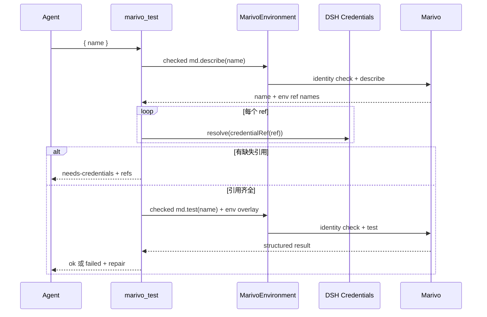

# Datasource 与凭证模块架构

## 作用

本模块提供 `marivo_test({ name })`，把 Marivo Datasource 的连接测试接到 DSH Credentials，并在
Web 中为缺失引用提供一次性收集界面。它不保存凭证、不复制 Datasource schema，也不自行判断连接
语义；Datasource 描述、测试结果和 repair 都来自 Marivo 公共 API。

总体关系见[总体架构](../architecture.md)。服务端与客户端实现分别位于：

- `packages/dsh-data-analysis/src/datasource/test.ts`
- `packages/dsh-data-analysis/src/client.tsx`
- `packages/dsh-data-analysis/src/environment/binding.ts` 中的 checked datasource scripts

上游凭证契约见 [Harness Credentials subsystem](../../../deepseek-harness/docs/subsystems/credentials.md)，
Datasource 语义见 [Marivo datasource layer](../../../marivo/docs/specs/semantic/datasource-layer.md)。

## 服务端连接测试流程



输入 `name` 必须是非空、最多 256 字符的字符串。`md.describe(name)` 的投影只允许 datasource name
和 `env_refs` 的引用名；引用名必须满足 DSH credential ref 规则，并按首次出现顺序去重。

插件按引用逐项调用 `credentials.resolve(credentialRef(ref))`：

- 任一引用缺失时，不运行 `md.test()`，返回
  `{ status: "needs-credentials", name, refs }`；
- 全部存在时，把值组成该次调用专用的 environment overlay，运行真实 `md.test(name)`；
- 成功返回 `status: "ok"` 和可选 latency；
- 业务失败返回 `status: "failed"`、Marivo failure 与 repair 投影；
- describe/test 协议无效、进程失败或 identity mismatch 作为 Tool error，而不是伪造业务结果。

## 凭证安全边界

凭证值只允许经过以下路径：

```text
DSH Credentials -> operation-scoped Node memory -> child environment overlay -> md.test()
```

模块执行以下防护：

- 值不进入 argv、Tool 参数、Tool Result、telemetry 或持久 marker；
- Help、doctor、describe、test 子进程都强制禁用 Marivo credential/secret persistence；
- Python wrapper 捕获被测调用的 stdout/stderr，并按所有 overlay secret values 递归脱敏；
- Node binding 再次对 stdout、stderr 和 JSON value 脱敏；
- Datasource parser 在构造 Tool Result 前做严格 shape 校验；
- 缺失引用只返回 ref name 和配置状态，不返回已有值。

这些保证只覆盖插件启动的受控子进程。Agent 直接通过 bash/Python 调用 Marivo 时，生命周期和输出
不经过本模块。

## Web Tool View

客户端扩展在 `tool.call.toolview` slot 上为 `marivo_test` 注册专用视图。它从 settled Tool text 中只
识别严格的 `needs-credentials` JSON；其他结果以普通摘要显示。

缺失凭证时：

1. 以 `sessionId + callId` 为 key，每个 Tool call 最多自动打开一次表单；
2. 调用 `credentials.describe({ refs })` 只读取“已配置/未配置”状态；
3. 每个输入框初始为空，不回显或预填已有值；已配置引用禁用输入；
4. 未配置值通过标准 `credentials.set({ ref, value })` 逐项保存；
5. 错误消息再次按本轮输入值脱敏，保存后清空本地输入状态；
6. 全部保存成功后关闭表单并提示用户重试 `marivo_test`。

客户端不会自动重放原 Tool call。取消、部分保存失败或页面关闭也不会改写已经持久化的 Session Tool
Result；DSH Credentials 是唯一持久状态源。

## 结果契约

| status | 含义 | 字段 |
| --- | --- | --- |
| `needs-credentials` | 描述成功，但至少一个引用未配置 | `name`, `refs` |
| `ok` | `md.test()` 返回成功 | `name`, `latency_ms` |
| `failed` | `md.test()` 返回结构化业务失败 | `name`, `latency_ms`, `failure`, `repair` |

`repair` 由 Marivo 生成；插件只保留结构化字段，不升级为自动修复动作。保存凭证也不代表连接已经
验证，必须由新的 `marivo_test` 调用重新执行 describe、resolve 和 test。

## 生命周期与失败隔离

`marivo_test` 与 `marivo_help` 一样注册在 Agent scope，并使用同一惰性 Environment source。
Agent dispose 时 Tool 注销。一个 Workspace 的 describe/test 或凭证缺失不会修改其他 Workspace 的
binding，也不会阻断共享 Runtime 上的 Help。

客户端连接不可用、describe 状态读取失败时，表单仍保持引用未配置的保守显示；保存失败逐字段
呈现。服务端不依赖客户端存在，因此 native/headless 使用者仍可读取 `needs-credentials` 结果并通过
DSH 的其他标准入口配置凭证。

## 公共接口与验证

`packages/dsh-data-analysis/src/datasource/index.ts` 导出 Tool builder、registration 和结果类型。关键
测试位于：

```text
packages/dsh-data-analysis/tests/datasource-credentials/marivo-test-tool.test.ts
packages/dsh-data-analysis/tests/datasource-credentials/client-integration.test.ts
```

测试应覆盖引用发现与去重、缺失时不连接、operation overlay、双层脱敏、结构化 failure/repair、Web
只自动打开一次、空白输入、配置状态、部分失败和手动重试提示。

`npm run test:datasource-credentials` 先构建 client 再执行确定性测试；
`npm run validate:datasource-credentials:real` 使用相邻 Marivo 项目的真实 `cdn_replica` 定义验证缺凭证
结果，并以连接调用 guard 证明该路径不会执行 `md.test()`。
