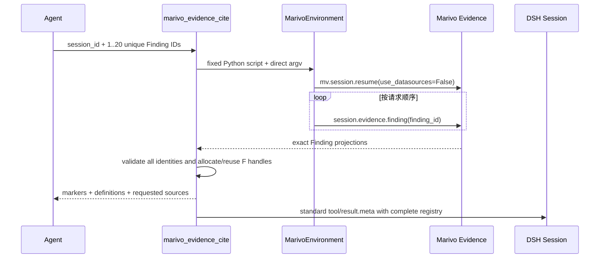

# Evidence 轻量引用模块架构

## 作用

本模块把 Marivo 已持久化的 `Finding` 身份带到 DSH 最终回答中。Agent 可调用
`marivo_evidence_cite({ session_id, finding_ids })` 获取标准 Markdown footnote marker 和 definition；
DSH Web 在不改写回答的前提下，从标准 Session 历史重建“Marivo 来源”卡片。

引用只回答“这个角标对应哪个 Marivo Evidence Finding”。它不判断自然语言是否被 Finding 蕴含，
不验证整句话或业务判断是否正确，也不提高或重定义 Marivo 的 quality/epistemic 语义。

总体关系见[总体架构](../architecture.md)。实现集中在：

- `packages/dsh-data-analysis/src/evidence/citations.ts`
- `packages/dsh-data-analysis/src/environment/binding.ts` 中的 checked Evidence script
- `packages/dsh-data-analysis/src/client.tsx`

Marivo Finding 的内容与有效性契约由
[Marivo Evidence access surface](../../../marivo/docs/specs/analysis/evidence-access-surface.md) 拥有；本模块只读取
公共对象并投影来源身份。

## 签发流程



一次调用只接受 1–20 个非空、唯一 Finding ID。Python bridge 在当前 Environment Binding 的解释器中
先复核 Python、Marivo version 和 package identity，再执行：

```python
session = mv.session.resume(session_id, use_datasources=False)
session.evidence.finding(finding_id)
```

脚本固定在插件代码中；模型只提供作为直接 argv 传入的 Session/Finding ID，不提供 Python 表达式、
模块名或 shell 文本。返回 payload 必须保持请求 Session、Finding ID 和顺序完全一致，且 Finding 自身的
`session_id` 也必须一致。任一读取、进程或 shape 校验失败时整个 Tool call 失败，registry 不发生部分更新。
`finding_type`、`epistemic_kind` 和 `quality_status` 的合法词汇由已完成对象校验的 Marivo Finding 拥有；
插件只检查这些投影的机械 JSON shape，不复制 Marivo 枚举。

## Handle registry

每个 DSH Session 有一个独立 registry。身份键为：

```text
Environment fingerprint + Marivo Session ID + Finding ID
```

同一身份重复请求时复用原 handle；新身份按请求顺序分配 `F1`、`F2`……，每个 DSH Session 最多
`F100`。超过上限会明确失败，已存在 registry 保持不变。跨 DSH Session 不共享 handle，即使两边引用
同一个 Marivo Finding，也会各自从 `F1` 开始。

成功 Tool Result 返回当前请求的每个来源，包括：

- `marker`，例如 `[^mv-f1]`；
- 固定 footnote definition；
- Finding/Artifact/Marivo Session ID；
- Finding 类型、`epistemic_kind`、`quality_status` 和提交时间；
- extractor/schema version 和 Environment fingerprint。

同一次结果的 `tool/result.meta` 携带签发它的 DSH Session ID 和完整 registry，而不是只带增量。服务端
恢复时只接受 DSH Session ID 与当前 Session 完全一致的最近有效 meta，因此 Harness fork 复制的父级事件
不会把 handle 命名空间或上限带入子 Session。Web 仍可读取 fork 历史中的父级 meta，为复制过来的历史
回答还原原来源；子 Session 新签发的 registry 从 `F1` 独立开始。没有新增自定义 Session event，registry
的持久化和回放完全使用 Harness 已有的标准 Tool result 字段。

## 动态 Prompt 规则

短规则仅在 `marivo-analysis` 已激活后加入 system prompt：

- 所有由精确、已持久化 Finding 支撑的关键事实，默认必须在最终回答前调用工具生成引用；
- 解释、建议、假设或没有精确 Finding 支撑的事实不强制引用；重要的无支持边界应明确披露，不得伪造引用；
- 结论后原样复制工具返回的 marker，答案末尾原样复制 definition；
- 不自行构造、重命名或修改 handle/definition；
- 明示引用证明 Evidence 来源身份，不证明整句结论正确。

`marivo-semantic` 单独激活不会加入这段规则。插件也不要求 Agent 在回答前完整复盘
`session.state`；没有由持久化 Finding 支撑的关键事实时，简单分析仍可直接基于已观察到的结果作答。

## Web 重放与来源卡片

浏览器注册两个无自定义后端状态的 Conversation Definition：

1. `marivo-citation-registry` 从 `tool/result.meta` 恢复最近的完整 registry；
2. `marivo-citations` 扫描不含 Tool call 的 settled `assistant/message`，通过
   `reader.previous("marivo-citation-registry")` 精确关联当时最近的 registry，并把结果写入 Turn
   location data。

轻量 Markdown scanner 按 DSH renderer 的边界逐个扫描 text block，识别 `[^mv-fN]` 与同一 block 中的
对应 definition，按首次引用顺序去重，并忽略转义 token、跨行 inline code 和 fenced code。不同 text
block 的 definition 不会互相满足引用。scanner 不解析或改写 DSH Markdown AST；原回答仍由 DSH 自带
Markdown renderer 显示标准 footnote 上标。

`conversation.chat.turnTail` selector 只有在当前 closing assistant 的 seq 存在引用数据时才挂载来源
卡片；无引用时返回空，不产生 UI。卡片展示 resolved Finding/Artifact、Evidence 类型、epistemic、quality
和提交时间。回答引用未知 handle 或缺少 definition 时，卡片明确警告，不猜测或自动修复。

Headless/CLI 没有来源卡片，但标准 marker/definition 仍是可阅读的 Markdown footnote。

## 明确非目标

轻量版本不做以下控制：

- 不截获、重构或重写 DSH 最终回答；
- 不增加自定义 Session event，不接管 `assistant-step` renderer；
- 不做自然语言 entailment、数字一致性或业务结论验证；
- 不判断 `to_pandas` 是“仅展示”还是“产生新统计结果”；
- 不引入 `marivo-governed` 等可信等级；
- 不强制复盘全部 analysis state；
- 不让插件生成分析结论或 `SupportCandidate`；
- 不提供可点击的自定义行内角标 resolver。

需要更强保证时应新增独立、可验证的能力，而不是从模型的自然语言或 pandas 代码猜测意图。

## 验证入口

```sh
npm run test:evidence-citations
npm run check
npm run build
npm run verify:plugin-package
```

测试覆盖工具边界、批次原子性、handle 复用/隔离/上限、回放恢复、动态 prompt、Markdown scanner、
resolved/unresolved Turn 数据、零 UI selector 和现有凭证视图的并存。
