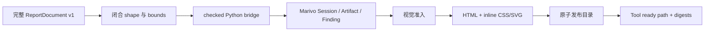

# HTML 报告渲染模块架构

## 作用与当前范围

本模块把一份完整、不可变的 `ReportDocument v1` 编译为本机可离线打开和打印的自包含 HTML 报告。
入口是 `marivo_report_render({ session_id, document })`。Agent 拥有报告标题、章节、顺序、文字和图表选择；
插件只校验文档及精确 Marivo 引用、生成展示投影、渲染并原子发布文件。

当前已交付设计中的 Slice 1 与 Slice 2：Tool 通过文本返回绝对 `index.html` 路径，Web Tool View 和最终回答
下方的耐久交付卡片从标准 Session 事件恢复报告，并在用户点击后调用 `host.openPath`。交付卡片不读取最终
回复文字，因此 Agent 把路径缩写成 basename 时仍保留完整路径和打开动作。Slice 3 的真实 runner 已实现；
当前 Web 与打印 Evidence 门禁仍 blocked，因此真实 Web/视觉验收尚未完成。

## 编译流程



文档仅支持 `text`、`chart`、`table`、`evidence`。`text` 是纯文本；图表仅支持单系列 `line`、`bar`
和无歧义 `auto`。Parser 递归拒绝未知字段，并执行 section/block、文本、唯一 ID、Artifact/Finding 数量、
表格行数和引用长度上限。修订报告时必须再次提交完整文档，插件不读取或 patch 上一份文档。

## Marivo 读取边界

`MarivoEnvironment.runCheckedReportProjection()` 使用固定 Python script 和 direct argv。脚本先在同一进程
复核 Python、Marivo version 和 package path，再执行：

1. `mv.session.resume(session_id, use_datasources=False)`；
2. 先对每个 Finding 调用 `session.evidence.finding()` 和双语 `Finding.render()`；
3. 把显式 Artifact 与每个 Finding 的 backing Artifact 按首次出现顺序合并；
4. 对每个精确 ref 调用 `get_frame()`、`contract()` 和 `revalidate()`，只接受 `admissible`；
5. 只有图表或表格显式引用的 Artifact 才在 `frame.shape[0] <= 2000` 后调用 `to_pandas()`；纯溯源 Artifact 不投影 rows；
6. 对每个带 Finding 的 block 单独调用 `session.evidence.compatibility()`。

任一对象失败时不返回部分 bundle。公开列、shape、content hash、artifact schema version、Lineage、Finding
、双语事实陈述和 compatibility 与可选 rows 一起投影；rows 只接受 JSON 标量、ISO 日期时间和 null。投影超过 16 MiB 时
blocked。Node 再检查完整 payload、请求顺序、Session、Artifact/revalidation identity 和 compatibility 对应关系，
但不复制 Marivo 的内部枚举或 Evidence schema。

已知的文档、引用、revalidation、compatibility、视觉或大小问题返回 `blocked` 和可修复 issue。解释器身份漂移、
子进程异常、取消、超时和本地 I/O 是 Tool error。`admissible` 不证明 datasource freshness；每份报告和
Tool disclosure 都明确保留这条边界。

## 视觉与 HTML

图表只读取 `artifact.contract().artifact_schema` 和原始投影行，不根据自然语言猜图，也不聚合、抽样、
Top-N 或跨 grain 混合。line 的 x 必须是时间或有序数值维度，至少四个唯一点；bar 的 x 必须是类别维度，
最多 30 类且数轴包含零。table 按公开列顺序或显式列选择渲染，并始终显示 displayed/total/omitted。

Renderer 是无 I/O 纯函数，输出 semantic HTML、内联 CSS 和固定 viewBox SVG。所有标题、文字、单元格和
Evidence JSON 和 `Finding.render()` 陈述先做 HTML escaping。每个 block 的来源先展示人读事实，再折叠
subject/value/derivation 与身份状态；Finding 的 Artifact 指向页脚 canonical provenance record。页脚对 Findings
和 Artifacts 去重，展示 content hash、schema、contract、revalidation 与 Lineage。页面不包含 JavaScript、iframe、form、远程脚本、字体或图片，并声明
严格 CSP，也不输出 Parquet 链接或 Marivo 私有路径。图表包含 `<title>`、`<desc>`、点/轮廓和值标签以及同源 fallback table；打印 CSS 展开来源并
避免图表和表格被截断。

## 不可变发布

产物位于：

```text
$DSH_HOME/dsh-data-analysis/reports/<environment-fingerprint>/<report-digest>/
├── index.html
├── report-document.json
└── manifest.json
```

document/report digest 使用递归 key 排序的 canonical JSON 和 SHA-256。renderer v2 与 manifest v2 的 report
identity 覆盖完整文档、Environment fingerprint、Marivo version，以及包含全部显式/backing Artifact、Finding、
compatibility 和投影 rows 的 provenance digest。Node 在边界处移除每次检查都会变化的 `revalidation.checked_at`，
但保留其余 revalidation、contract、schema、Lineage、双语事实和状态；生成时间也不进入 identity。因此同一事实与
来源的重复发布复用首次完整目录，而任何稳定溯源或展示数据变化都会生成新 digest。

Publisher 在同一父目录创建随机 staging，使用目录 `0700`、文件 `0600`，回读并验证 manifest、内容哈希和
权限后 rename。并发首次发布由一个完整目录胜出；其他调用只在已有目录完全一致时复用，不覆盖损坏目录。
`index.html` 超过 10 MiB 时不发布。模块不创建 latest、registry、数据库、Session event 或 GC 状态。

## Web 交付与回放

顶层 ready 结果把 `{ kind, version, title, path, reportDigest, disclosures }` 投影到标准 `tool/result.meta`；
blocked 结果使用 `null` 哨兵，不产生可打开报告卡片。Harness 不为 Code Mode nested Tool 计算
`presentationMeta`，因此插件通过 `tools/result` 与 `tools/code-dispatch-log`，只在标准 `tool/code-dispatch`
事件的耐久日志副本中追加一个 `{ type, turn, meta }` 闭合 `marivo-report-card` ContentBlock。`turn` 必须由同一
root call 的耐久 `tool/call` 解析；无法建立该关联时不签发 card。程序 value 与模型可见文本均不变。

客户端严格校验闭合的 `marivo-html-report` v1 metadata，以及恰好一个闭合的 nested card block，并且只依赖
已冻结的 Tool call/result slice。因此 native、code 与 both 模式的 Session replay 都不读取报告文件、不访问
Marivo，也不引入自定义 Session event。旧版本、畸形、blocked 或失败结果回退到原 Tool 文本。

客户端为每个 Turn 建立一个 `marivo-report-delivery` context：顶层结果必须先通过 `tool/call.callId` 证明调用名
确为 `marivo_report_render`，Code Mode card 则使用其已验证的 `turn`。两者聚合到同一个固定 Turn data key，
消费者只通过 Harness 的 `data.get(key)` 公开契约读取按 seq 排序的交付数据。最终回答下方的 turn-tail 卡片按 report digest 去重，显示完整路径，并通过 Chat owner 的
标准 `openFile(path)` 接缝调用 Host。它不解析最终回复、不会把 basename 当成交付事实，也不创建 `file://`
或 HTTP URL。Tool View 的“打开报告”按钮仍直接调用 `connection.api.host.openPath({ path })`。Host opener
不可用、trust fence 拒绝、RPC 失败或异常不会修改已持久化 Tool Result、metadata 或不可变报告产物。

## Agent 触发边界与验证

`marivo-analysis` 激活后，短 system prompt 要求普通分析默认 inline。只有用户明确请求耐久 HTML、接受 Agent
提议，或要求修改当前对话中已生成的报告时才调用 Tool；quick-answer、no-file 或其他产物要求优先。ready
后 Agent 必须在最终回答中逐字复制 Tool 返回的绝对 `Path`，不得只写 basename、虚构 `file://`/HTTP URL
或声称报告已经发布；turn-tail 卡片仍是独立于模型文字的可靠交付面。路径和 digest 不是 Marivo Evidence。

确定性验证入口：

```sh
npm run test:html-report-rendering
npm run check
npm run build
npm run verify:plugin-package
```

补充真实验证入口：

```sh
npm run validate:html-report-rendering:real
```

runner 在独立 Workspace 创建确定性 DuckDB 与当前 Marivo fixture，执行首次生成、同会话完整修订和明确
blocked 后重试，并把 `0600` 验收记录和不可变报告保存在忽略目录
`artifacts/html-report-rendering-real/<run-id>/`。真实模型和浏览器结果不替代确定性测试；Web 卡片、opener 或
任一视觉门禁失败时，真实验收必须保持 blocked。
