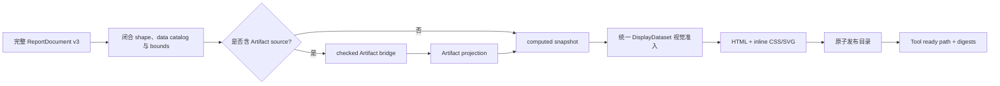

# HTML 报告渲染模块架构

## 作用与当前范围

本模块把一份完整、不可变的 `ReportDocument v3` 编译为可离线打开和打印的自包含 HTML 报告。
入口是 `marivo_report_render({ session_id?, document })`。Agent 决定标题、章节、文字、数据源和图表选择；
插件负责校验闭合文档、取得 Artifact 投影、合并 computed 快照、渲染并原子发布文件。

这是破坏性 v3 契约。实现只接受 `dsh-data-analysis-report/v3`，不读取 v2/v1，不做 alias、迁移或旧目录复用。
普通分析仍默认在对话内回答；只有用户明确请求或接受耐久 HTML 报告时才调用该 Tool。

## 编译流程



文档只支持 `text`、`chart`、`table` 三类 block。`chart` 和 `table` 不再直接绑定 Artifact，而是通过
`data_ref` 引用 `document.data` 中的注册数据源。数据源必须且只能是以下一种：

```ts
type ReportDataSource =
  | { id: string; artifact_ref: string }
  | {
      id: string
      computed: {
        version: 'dsh-computed-data/v1'
        columns: Array<{
          name: string
          type: 'string' | 'number' | 'boolean' | 'datetime'
          role?: 'time' | 'dimension' | 'measure' | 'value'
          unit?: string
          nullable?: boolean
        }>
        rows: Array<Array<string | number | boolean | null>>
      }
    }
```

`computed` 表示调用方提供的计算结果快照。Python 结果必须先转换为 `columns + rows` JSON；不保存 Python
对象、代码、解释器 handle 或新的 registry，也不据此声明 Python 执行证明、数据 lineage 或 freshness。
`datetime` 单元格使用 ISO 日期/时间字符串。

Parser 递归拒绝未知字段，并校验：数据源 ID 与 computed 列名唯一、每行列数匹配、单元格类型正确、数字有限、
数据引用已注册、Artifact ref 不重复，以及 computed 单表和总 payload 大小。资源边界为最多 20 个数据源、100
个 computed 列、2,000 行 computed 数据、16 MiB computed payload、20 个 section、100 个 block、表格最多 100 行，
生成的 `index.html` 最多 10 MiB。`table` 会显示 displayed/total/omitted。

`auto` 只在数据源列契约能唯一确定一条 line 或 bar 映射时可用；复杂场景由 Agent 显式填写 `view`、`x`、`y`。
首版仍只支持单序列 `line`、`bar`，不支持 scatter、area、heatmap、多序列聚合、sampling、Top-N 或自定义图表。

## 数据读取与统一投影

`ReportDocument` 是唯一的报告重放输入。解析成功后，Artifact source 和 computed source 都转换为内部
`DisplayDataset`，共享列类型、角色、行数据、x/y 校验、日期排序、重复 x 检查和表格截断逻辑。

- 只有 Artifact source 时，Tool 要求精确的 `session_id`，并把去重后的 `artifact_ref` 交给固定的
  `runCheckedReportProjection()` bridge。
- 只有 computed source 时，`session_id` 可省略，完全跳过 Artifact bridge 和 Marivo Session DAG；computed
  数据直接由已校验的文档映射为 `DisplayDataset`。
- mixed 请求只把 Artifact refs 交给 bridge，再把 computed datasets 合并到同一个视觉编译输入中。computed
  数据不伪装成 Marivo Artifact，不加入 Session DAG。

Artifact bridge 继续使用固定 Python script 和 direct argv，在同一 binding 中 resume Session、revalidate 显式
Artifact、读取公共列和展示 rows，并构建受控 Job/Artifact DAG。它不发现 backing Artifact，不调用 Finding
compatibility、Finding 读取或 `Finding.render()`，不重新查询 datasource，也不排序、抽样或聚合 rows。
`admissible` 只表示当前语义权威可接受，不表示 datasource fresh。

bridge 为每个显式 Artifact 返回恰好一个 `ready`/`blocked` outcome。Node 严格检查 outcome 数量、顺序、Session、
Artifact identity、revalidation identity 和 payload bounds。单项失败仍可保留其他独立数据源的 partial projection，
但任何 source/visual 阻断都不会发布 ready 报告。报告 blocked 使用固定顺序的 `document`、`source`、`visual`、
`publish` checks；每个 issue 包含稳定路径、原因、修复和 omitted 数量。

## 视觉与 HTML

line 的 x 必须是 time 或有序数值维度，y 必须是有限数值；时间按一个与主机时区无关的 instant 排序，并拒绝重复
x。bar 的 x 必须是类别维度，y 必须是有限数值，数值轴包含零。两者都不聚合、不采样、不做 Top-N、不混合额外
grain。table 按公开列顺序或显式列选择渲染。

Renderer 是无 I/O 纯函数，输出 semantic HTML、内联 CSS、固定 viewBox SVG、同源 fallback table 和一段固定的
DAG 交互脚本。所有标题、文字、单元格、Artifact JSON 和 computed 值都先做 HTML escaping。引用 computed source
的 chart/table 会显示轻量“计算结果快照”说明，说明它不是 Marivo Artifact；页面不会显示 Python 代码或内部对象。

Artifact source 的页脚可展示弱连通 Session DAG：`Artifact → Job` 表示 input，`Job → Artifact` 表示 produces/reuses。
computed-only 报告只显示“不生成 Marivo Session DAG”的来源说明，不创建伪造节点。页面支持本地化日期/数值、SVG
`title`/`desc`、图表 fallback table、响应式单列布局、深浅色外观和打印样式；不加载远程资源、不包含 iframe 或
外部字体，并使用精确 CSP hash。

## 不可变发布

产物位于：

```text
$DSH_HOME/dsh-data-analysis/reports/<environment-fingerprint>/<report-digest>/
├── index.html
├── report-document.json
└── manifest.json
```

`report-document.json` 直接保存归一化后的 v3 文档，包括 computed `columns + rows`；不另建 `report-data.json`，
不保存未解析的 Python 对象或 handle。computed 行数据、列定义和 Artifact projection 都参与 report digest。
当前身份版本为 `dsh-data-analysis-report-digest/v5`、`dsh-data-analysis-report-manifest/v5` 和
`dsh-data-analysis-html/v10`；manifest 另列 `computed_data` 的内容 hash。相同完整输入复用完全一致的目录，
任何稳定文档、computed 数据、Artifact provenance 或 renderer 变化都会生成新 digest。v2/v1 目录不会被迁移或复用。

Publisher 在同一父目录创建随机 staging，使用目录 `0700`、文件 `0600`，回读并验证 manifest、内容哈希和权限后
rename。不会覆盖损坏目录，不创建 latest、registry、数据库、Session event 或 GC 状态。

## Web 交付与回放

ready 结果把 `{ kind, version, title, path, reportDigest, disclosures }` 投影到标准 `tool/result.meta`；
blocked 结果不产生可打开报告卡片。Code Mode nested Tool 通过耐久 `marivo-report-card` block 恢复同一轻量摘要，
不把完整 computed 数据塞进卡片。客户端只依赖已冻结的 Tool call/result slice，用户点击后才通过现有
`host.openPath({ path })` 打开本机文件。

## Agent 触发边界与验证

`marivo-analysis` 激活后的短 prompt 要求普通分析默认 inline。只有用户明确请求耐久 HTML、接受提议或要求修改当前
对话中已生成的报告时才调用 Tool；每次都提交完整 v3 文档，修订生成新文档和新 digest。Tool schema 是报告契约的
唯一实时来源，Agent 不通过 `marivo_help` 查询它。

确定性验证入口：

```sh
npm run test:html-report-rendering
npm run check
npm run build
npm run verify:plugin-package
```

补充真实验证入口：

```sh
npm run validate:html-report-rendering:real
```

确定性测试覆盖 v3 parser、computed payload bounds、computed-only bridge bypass、mixed merge、line/bar/table 共享
编译器、HTML escaping/CSP、digest/manifest、幂等发布和 Code Mode 轻量交付。真实 runner 只补充真实 Marivo/model
journey，不代表外部 Web、Host opener 或打印门禁已经完成。
