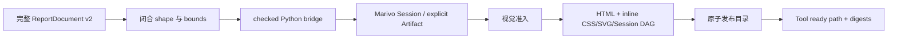

# HTML 报告渲染模块架构

## 作用与当前范围

本模块把一份完整、不可变的 `ReportDocument v2` 编译为本机可离线打开和打印的自包含 HTML 报告。
入口是 `marivo_report_render({ session_id, document })`。Agent 拥有报告标题、章节、顺序、文字和图表选择；
插件只校验文档及精确 Marivo 引用、生成展示投影、渲染并原子发布文件。

当前已交付设计中的 Slice 1 与 Slice 2：Tool 通过文本返回绝对 `index.html` 路径，Web Tool View 和最终回答
下方的耐久交付卡片从标准 Session 事件恢复报告，并在用户点击后调用 `host.openPath`。交付卡片不读取最终
回复文字，因此 Agent 把路径缩写成 basename 时仍保留完整路径和打开动作。Slice 3 的真实 runner 已实现并通过
真实 Marivo 与模型 journey；本地运行未执行外部 Web、Host opener 和打印门禁，因此这些外部验收仍单独保持未完成。

## 编译流程



文档仅支持 `text`、`chart`、`table`。`text` 是纯文本；renderer 会把空行分段，并把连续的
`-`/`*`/`•` 或 `1.` 行转换为语义列表。图表仅支持单系列 `line`、`bar`
和无歧义 `auto`。Parser 递归拒绝未知字段，并执行 section/block、文本、唯一 ID、显式 Artifact 数量、表格
行数和引用长度上限；每个 chart 前后至少有一个相邻 text block 解释结论、读法和影响。Tool schema 给出最小
完整文档骨架，并明确 block 位于 `document.sections[].blocks`。修订或 blocked 后重试时必须再次提交完整文档，
插件不读取或 patch 上一份文档。v2 明确拒绝 `finding_ids` 字段和 `evidence` block；需要来源时使用独立的
`marivo_evidence_sources` Tool。全文 20 个显式 Artifact、2,000 行展示准入、16 MiB projection 和 10 MiB HTML
等独立资源边界不变。

## Marivo 读取边界

`MarivoEnvironment.runCheckedReportProjection()` 使用固定 Python script 和 direct argv。脚本先在同一进程
复核 Python、Marivo version 和 package path，再执行：

1. `mv.session.resume(session_id, use_datasources=False)`；
2. 固定一次 `session.jobs()` ID 快照，读取每个完整 `session.job(id)`，仅投影 `succeeded` 且有主 Artifact
   输出的 Job；分页读取默认 `frame_summaries()`，因此 component、coverage 与 quality sidecar 不作为主节点；
3. 仅对报告中显式列出的 Artifact 调用 `get_frame()`、`contract()` 和 `revalidate()`，只接受 `admissible`；
   只有图表或表格显式引用的 Artifact 才在 `frame.shape[0] <= 2000` 后投影完整展示 rows；
4. 对 Session DAG 中的全部主 Artifact 读取同一持久化数据原序前 10 行和全部公共列，并披露 total/omitted；
   Job 显式引用但不在默认 inventory 的内部 ref 只保留 boundary 节点，不读取 preview；
5. 再次读取 `session.jobs()` ID；若快照变化则整份投影 blocked，要求在 Session 稳定后重试。

DAG Job 只保留 intent、状态、时间、`analysis_purpose`、安全 params、输入/输出 ref、reuse 标志和执行 query
审计。Query 审计包含实际 raw `sql`、query ID、datasource、dialect、digest、状态、耗时、行数和 output ref；
`bind_params`、`normalized_sql`、credential 与 `semantic_project_root` 不进入投影。raw SQL 可包含查询字面量，
但在 HTML 中始终 escape。bridge 不重新查询 datasource，不排序、抽样或聚合 preview。graph-only Artifact
读取失败时保留带有界 issue 的 `unavailable` 节点；显式 Artifact 的严格阻断保持不变。报告 bridge 不调用
`session.evidence.compatibility()`、`session.evidence.finding()` 或 `Finding.render()`。

bridge 为每个显式 Artifact 返回恰好一个 `ready`/`blocked` outcome；单项失败不阻止其他独立 Artifact。公开列、
shape、content hash、artifact schema version、Lineage 和可选 rows 只出现在成功 outcome 中。Node 严格检查
outcome 数量、顺序、Session、目标 Artifact identity 和 revalidation identity，拒绝遗漏、重复、额外或漂移 payload。
文档 inspection 按去重 identity 保留全部原始引用位置；同一坏 Artifact 出现在多个 block 时，每个受影响路径都会
在一次响应中列出。
有效的 partial projection 继续用于仍可检查的 visual block；rows 只接受 JSON 标量、ISO 日期时间和 null。
投影超过 16 MiB 时返回 compact blocked，
并保留已经收集的目标错误及 omitted count，而不是只返回大小错误。

blocked 使用固定顺序的 `document`、`marivo`、`visual`、`publish` checks；每项状态为 `passed`、`failed`、
`partial` 或 `skipped`，并包含有界、去重、稳定排序的 issues、`omitted_issue_count` 和必要的跳过原因。
Marivo 问题使用原始 `document.sections[i].blocks[j].artifact_ref` 作为归因路径。文档失败后仍从安全 inspection
检查可识别引用；Artifact 失败后仍对有效 projection
执行 visual preflight。只有前三项阻断性 check 全部 `passed` 才进入有写入副作用的 publish；读者解读文字、
line 点数和 bar 类别数是 Agent 质量指导，不生成阻断 issue。
已知的文档、引用、revalidation、视觉或大小问题也返回 `blocked` 和可修复 issue。
所有 blocked 文本统一要求保留未受影响内容并重新提交完整文档。解释器身份漂移、
子进程异常、取消、超时和本地 I/O 是 Tool error。`admissible` 不证明 datasource freshness；每份报告和
Tool disclosure 都明确保留这条边界。

## 视觉与 HTML

图表只读取 `artifact.contract().artifact_schema` 和原始投影行，不根据自然语言猜图，也不聚合、抽样、
Top-N 或跨 grain 混合。line 的 x 必须是时间或有序数值维度且至少有一个可绘制点，并明确披露聚焦的数据区间；
bar 的 x 必须是类别维度且至少有一个可绘制类别，数轴包含零，类别多或标签长时改用横向条形。
点数和类别数不作为硬质量门槛。table 按公开列顺序或显式列选择
渲染，使用本地化日期、数值和安全的通用列名，并始终显示 displayed/total/omitted。

Renderer 是无 I/O 纯函数，输出 semantic HTML、内联 CSS、固定 viewBox SVG 和一段固定交互脚本。所有标题、文字、单元格和
Artifact JSON 先做 HTML escaping。ReportDocument v2 只渲染 `text`、`chart` 和 `table` block，不展示 Evidence block、Finding
审计或 Finding 数量；需要来源面板时由独立的 `marivo_evidence_sources` 工具负责。

完整技术溯源按弱连通分量展示一张或多张二部 DAG：`Artifact → Job` 表示 input，`Job → Artifact` 实线表示
produces，虚线表示 reuses。独立注册主 Artifact 作为根节点；DAG 不发现或合并 Finding/backing Artifact。
布局使用稳定拓扑分层与稳定节点顺序；cycle、缺失基础字段或 identity 漂移在 visual 阶段
阻断，不删边或猜测。节点数量不截断，最终只受 16 MiB projection、10 MiB HTML 与 120 秒 subprocess 边界。

节点是可聚焦锚点；无脚本时仍可跳到对应详情。脚本启用后，鼠标、触摸和键盘可选择节点，桌面详情在图右侧、
移动端在图下方，并提供滚轮/按钮缩放、拖拽平移与重置。Job 详情展示 params 和逐条 raw SQL；Artifact 详情
展示 identity、shape、schema、hash、revalidation、contract、Lineage 和最多 10 行 preview。
脚本与样式都使用 CSP 精确 SHA-256 hash，不允许 `unsafe-inline`、`eval` 或远程依赖。打印保留 DAG
和紧凑节点索引，不自动展开 SQL、preview 或原始审计字段。

报告中的来源关系只由 chart/table block 的显式 Artifact ref 表达；text block 不绑定结构化来源。
需要 Finding 来源时，Agent 单独调用 `marivo_evidence_sources`，不把 Finding 重新嵌入报告文档。

页面使用响应式单列阅读流、浅色/深色系统外观、克制的蓝色主色和安静网格。首章节仅对第一个摘要文本
使用无底色的强调线；即使 Agent 把图表放在首章节，图表和表格仍回到正文流，不嵌套摘要底色或独立卡片。
页面不包含 iframe、form、远程脚本、字体或图片，并声明严格 CSP，也不输出 Parquet 链接或 Marivo 私有路径。图表包含本地化日期、
`<title>`、`<desc>`、点/轮廓/末值标签以及同源 fallback table；打印保留正文与图表，但不自动展开原始审计 JSON。

## 不可变发布

产物位于：

```text
$DSH_HOME/dsh-data-analysis/reports/<environment-fingerprint>/<report-digest>/
├── index.html
├── report-document.json
└── manifest.json
```

document/report digest 使用递归 key 排序的 canonical JSON 和 SHA-256。renderer v9、digest v4 与 manifest v4 的 report
identity 覆盖完整 v2 文档、Environment fingerprint、Marivo version，以及显式 Artifact、Session DAG Job、raw SQL、
preview 与 availability 的 provenance digest。Node 在边界处移除每次检查都会变化的 `revalidation.checked_at`，
但保留其余 revalidation、contract、schema、Lineage、双语事实和状态；生成时间也不进入 identity。因此同一事实与
来源的重复发布复用首次完整目录，而任何稳定溯源或展示数据变化都会生成新 digest。旧 v3 产物不会被 v4 复用或删除。

Publisher 在同一父目录创建随机 staging，使用目录 `0700`、文件 `0600`，回读并验证 manifest、内容哈希和
权限后 rename。并发首次发布由一个完整目录胜出；其他调用只在已有目录完全一致时复用，不覆盖损坏目录。
`index.html` 超过 10 MiB 时不发布。模块不创建 latest、registry、数据库、Session event 或 GC 状态。

## Web 交付与回放

顶层 ready 结果把 `{ kind, version, title, path, reportDigest, disclosures }` 投影到标准 `tool/result.meta`；
blocked 结果使用 `null` 哨兵，不产生可打开报告卡片。Harness 不为 Code Mode nested Tool 计算
`presentationMeta`，因此插件通过 `tools/result` 与 `tools/code-dispatch-log`，只在标准 `tool/code-dispatch`
事件的耐久日志副本中追加一个 `{ type, turn, meta }` 闭合 `marivo-report-card` ContentBlock。`turn` 必须由同一
root call 的耐久 `tool/call` 解析；无法建立该关联时不签发 card。程序 value 与模型可见文本均不变。

客户端严格校验闭合的 `marivo-html-report` v1 metadata，以及恰好一个闭合的 nested card block，并且只依赖
已冻结的 Tool call/result slice。因此 native、code 与 both 模式的 Session replay 都不读取报告文件、不访问
Marivo，也不引入自定义 Session event。只有 ready 结果显示“HTML 分析报告”卡片与打开按钮；旧版本、畸形、
blocked 或失败结果显示为默认折叠的“报告未生成”诊断，不占用可交付报告的视觉语义。

客户端为每个 Turn 建立一个 `marivo-report-delivery` context：顶层结果必须先通过 `tool/call.callId` 证明调用名
确为 `marivo_report_render`，Code Mode card 则使用其已验证的 `turn`。两者聚合到同一个固定 Turn data key，
消费者只通过 Harness 的 `data.get(key)` 公开契约读取按 seq 排序的交付数据。最终回答下方的 turn-tail 卡片按 report digest 去重，显示完整路径，并通过 Chat owner 的
标准 `openFile(path)` 接缝调用 Host。它不解析最终回复、不会把 basename 当成交付事实，也不创建 `file://`
或 HTTP URL。Tool View 的“打开报告”按钮仍直接调用 `connection.api.host.openPath({ path })`。Host opener
不可用、trust fence 拒绝、RPC 失败或异常不会修改已持久化 Tool Result、metadata 或不可变报告产物。

## Agent 触发边界与验证

`marivo-analysis` 激活后，短 system prompt 要求普通分析默认 inline。只有用户明确请求耐久 HTML、接受 Agent
提议，或要求修改当前对话中已生成的报告时才调用 Tool；quick-answer、no-file 或其他产物要求优先。当前
Agent request 中的 `marivo_report_render` Tool schema 是精确的 v2 报告输入契约；该 Tool 由 DSH 插件拥有，不是
`marivo.help` target，Agent 不得通过 `marivo_help` 查询报告契约。报告只使用 `text`、`chart` 和 `table` block，
每个 chart/table 都绑定显式 Artifact ref；报告 bridge 不执行 Finding compatibility、Finding 读取或 backing Artifact
发现。ready 报告优先使用用户语言；中文请求默认中文。面向业务读者时先给 2–4 条结论摘要，再按“结论—证据—解释—行动”
组织正文；图表前后必须有解释性 text block。需要结构化来源时使用独立的 `marivo_evidence_sources` 工具。
后 Agent 必须在最终回答中逐字复制 Tool 返回的绝对 `Path`，不得只写 basename、虚构 `file://`/HTTP URL
或声称报告已经发布；turn-tail 卡片仍是独立于模型文字的可靠交付面。路径和 digest 不是 Marivo Evidence。

确定性验证入口：

```sh
npm run test:html-report-rendering
npm run check
npm run build
npm run verify:plugin-package
```

补充真实验证入口：

```sh
npm run validate:html-report-rendering:real
```

runner 在独立 Workspace 创建确定性 DuckDB 与当前 Marivo fixture，执行首次生成、同会话完整修订和明确
blocked 后重试，并把 `0600` 验收记录和不可变报告保存在忽略目录
`artifacts/html-report-rendering-real/<run-id>/`。真实模型和浏览器结果不替代确定性测试；Web 卡片、opener 或
任一视觉门禁失败时，真实验收必须保持 blocked。
