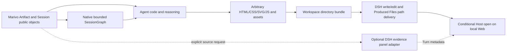

# Agent 原生报告增强能力设计

## 文档状态

本文是已经实施的破坏性替换设计。旧插件内 HTML 渲染路径已删除，不保留兼容入口、旧 schema 解析、
双轨运行或旧报告 replay。确定性实现验证已经迁移到 `test:agent-native-report-primitives`；正式发布仍由
下述真实环境门禁约束，不能把本地测试通过描述为完整验收。

本文提出下一代边界：`dsh-data-analysis` 不再拥有报告结构、图表类型、布局或 HTML renderer。Agent
直接使用 Marivo 原生公共对象读取 Artifact、Quality、Evidence 和 Session 状态；插件只保留真正跨越
DSH/Marivo 边界的能力，不再拥有 Session Graph 的聚合或投影 schema。Agent 完全拥有最终表达。DSH
通用文件与 Web 层只提供文件 mutation、工作区路径交付和本机打开能力，不拥有报告级安全检查、不可变
发布或视觉语法。

本文引用的 DSH `write` / `edit`、Produced Files 和 Host opener 是当前 DSH 能力；插件已经切换到新的
Tool surface，并精确固定正式发布的 Marivo 0.5.1。该 release 包含所需 Session runtime clean break；
真实三模式 Agent、Web/Host 与浏览器验收已经通过，且继续作为后续变更的发布门禁。不得放宽 pin、绑定
sibling 开发 checkout、恢复旧 renderer 或添加兼容层。

Session 与 Evidence 的权威细节分别链接到 Marivo 当前的
[`Session state and runtime`](../../../marivo/docs/specs/analysis/session-state-and-runtime.md) 和
[`Evidence access surface`](../../../marivo/docs/specs/analysis/evidence-access-surface.md)；本文只决定 DSH
集成 seam，不复制它们的类型定义。

## 背景与问题

`ReportDocument v1` 为当前实现带来了闭合校验、Artifact 绑定、原子发布、可重放身份和稳定 Web 卡片，
解决了早期任意 HTML 难以验证、失败结果容易伪装成可用产物等问题。但它同时把插件变成了报告展示语言的
所有者：

- `text`、`chart`、`table` 是插件预定义的唯一 block；
- line、bar、auto 是插件预定义的图表能力；
- 新布局、新图表和新交互都需要修改 schema、renderer、parser 与测试；
- Agent 已经能够使用 HTML、CSS、SVG、JavaScript 和本地绘图库，却必须把表达压缩到
  `ReportDocument`；
- Session DAG 等增强信息被绑定在固定 renderer 中，不能由 Agent 自由组合。

问题不在于 `ReportDocument` 不够丰富，而在于它让插件承担了不应拥有的展示决策。继续增加 scatter、
heatmap、dashboard block 或可配置组件，只会扩大插件的展示本体。

第一版草案又走向了另一个极端：把 Marivo 原生对象的每个读取面包装成独立 Tool，例如
`marivo_artifact_inspect` 和 `marivo_artifact_quality`。这虽然不再限制 HTML，却会在插件中形成第二套
Artifact、Quality 和 revalidation 契约，同样违反所有权边界。

## 决策摘要

- **原生优先**：Agent 直接调用 `artifact.show()` / `render()`、`artifact.contract()`、
  `artifact.quality_summary`、`artifact.lineage`、`artifact.findings(...)`、`artifact.finding(...)`、
  `session.revalidate(ref)` 和 `session.graph(...)`。
- **删除重复 Tool**：不设计 `marivo_artifact_inspect`、`marivo_artifact_quality` 或
  `marivo_session_dag`。Session Graph 的事实聚合、完整性检查、边界与截断语义都由 Marivo 拥有。
- **Skill 路由、原生 API 执行**：Session 恢复、Artifact revalidation、Semantic readiness 和 Datasource
  table metadata inspection 由 Skill 决定何时需要，再由 Agent 直接调用当前 Marivo 公共 API；不增加
  `marivo_session_resume`、`marivo_artifact_check`、`marivo_semantic_readiness` 或
  `marivo_datasource_inspect` convenience Tool。
- **本次不提供 Artifact export Tool**：本次更新不实现 `marivo_artifact_materialize` 或
  `marivo_artifact_export`；Agent 直接使用 `artifact.to_pandas()` 在报告 bundle 中生成所需数据或视觉资产。
- **Datasource Tool 只保留 DSH 闭环**：`marivo_test` 破坏性改名为 `marivo_datasource_test`，不保留旧名称
  alias；它保留的独有价值是缺失 DSH Credentials 的 Web 收集与显式连接测试闭环。已配置凭据由插件注入
  标准 one-shot Shell 执行，包括 Code Mode 对该 Tool 的内嵌调用；Agent 直接调用当前公共
  `md.inspect(datasource_ref, source)`，不注册 datasource/table inspect Tool，也不使用已移除的
  `md.inspect_table` 名称。
- **Evidence 读取与 UI 交付分离**：Agent 使用 Artifact-owned Evidence API 进行分析读取；
  `marivo_evidence_sources` 破坏性改为接受精确 Artifact/Finding 对，只作为用户明确要求来源时的 DSH
  Turn/Web 来源面板 adapter，不成为报告数据读取 API，也不恢复 Session Evidence namespace 或 Finding
  compatibility。
- **表达完全归 Agent**：插件不规定章节、图表、布局、模板、交互或 provenance 的页面展示方式。
- **使用当前 DSH 文件交付面**：Agent 把普通目录 bundle 写入当前 Workspace；DSH 只提供文件 mutation、
  Produced Files 路径投影和条件受限的 Host opener，不把这些文件升级为不可变报告对象。
- **不做机械蕴含声明**：报告可以自行展示输入说明，但不存在 publisher manifest，也不声称自由文本被
  这些输入证明。
- **一次性破坏性切换**：同一发布中删除 `marivo_report_render`、ReportDocument parser/renderer、专用 Web
  卡片和旧报告 replay；不提供 deprecated alias、兼容模板或读取旧产物的 fallback。

## Tool 存在性判据

新增公开 Tool 必须至少满足以下一项：

1. **跨系统边界**：需要 DSH 凭据、受控子进程、Host 文件生命周期、Turn metadata 或 Web UI 交付，无法由
   Marivo Python 对象自身拥有。
2. **跨对象机械聚合**：需要读取多个 Marivo 公共对象并建立确定、无判断的整体结构，且该流程对 Agent
   具有显著的重复成本。
3. **不可直接传输**：原生对象或大数据无法安全、稳定地跨越当前 Native/Code Mode 边界。

同时必须满足：

- 只使用 Marivo 公共 API，不读取私有数据库、sidecar 或目录布局；
- 不创建与 Marivo 并行的 Artifact、Quality、Evidence、Lineage 或 revalidation 语义；
- 不把静态 Help、字段别名或一次普通方法调用包装成新的 Tool；
- 输出是可验证的忠实投影或传输回执，不是推荐、结论或展示模型；
- 当 Marivo 后续提供等价原生公共面，插件 Tool 应降为纯传输 adapter 或删除。

“调用会使用凭据”本身不满足跨系统边界。插件已经把当前 Workspace 的已配置 DSH Credentials 作为
operation-scoped environment 注入标准 one-shot Shell 执行；Code Mode 可以内嵌调用同一 Tool。Agent
调用 `md.inspect(...)`、
`catalog.readiness(...)` 或其他 Marivo 公共 API 时不需要读取、传递或理解凭据值。只有缺失凭据收集、
专用 Web 交付、不可由现有执行面获得的权限收窄，或其他可验证的 DSH lifecycle 责任才能证明新增 Tool。

Tool 也不自动形成约束。只要 Bash/Python 和普通 Workspace 文件 mutation 仍可用，没有下游 DSH 能力强制
消费某个 Tool receipt，Agent 就能绕过 convenience Tool。工作流触发、分析选择和停止规则应由 Skill
拥有；签名、状态与 repair 由实时 Help 和原生对象拥有；不可绕过的 authority/Evidence admission 由
Marivo Runtime 拥有。

“调用更方便”本身不足以证明 Tool 应存在。一个只把
`session.artifact(ref).contract().model_dump()` 换成 JSON Tool Result 的能力，没有独立产品价值。

## Tool 审查结果

| 能力 | Marivo 原生公共面 | 插件独有价值 | 决策 |
| --- | --- | --- | --- |
| `marivo_artifact_inspect` | `session.artifact(ref)`、`show()` / `render()`、`contract()`、`lineage`、`state`、`revalidate()` | 无；只是重新装箱 | 删除 |
| `marivo_artifact_quality` | `quality_summary` | 无；只是重新装箱 | 删除 |
| `marivo_session_resume` / `marivo_session_context` | `mv.session.recent(...)`、`inspect(...)`、`resume(...)`、`session.recap()`、`runs(...)` | 无已确认的 DSH lifecycle 消费者；选择正确 Session/branch 仍是 Agent 判断 | 不设计；Skill 路由原生恢复 API |
| `marivo_artifact_check` | `session.artifact(ref)`、`session.revalidate(ref)`、Artifact quality/Evidence/issues | 当前没有强制消费 receipt 的 publisher 或 delivery gate；插件聚合会形成第二套 trust contract | 不设计；若 Marivo 提供原生 aggregate 且 DSH 有强制消费者，再另立设计 |
| `marivo_session_dag` | `session.graph(...)` | 无；原生对象已经拥有拓扑、完整性、边界与截断契约 | 不设计、不注册；不增加 DSH graph schema |
| `marivo_semantic_readiness` | `catalog.readiness(refs=[...])` | 无；何时检查、选择哪些 refs 才是主要认知成本 | 不设计；Skill 决定触发，Agent 直接调用原生 API |
| `marivo_datasource_inspect` / `marivo_table_inspect` | `md.inspect(datasource_ref, source)` | 无；现有 one-shot Shell credential injection 已支持直接调用 | 不设计；不与 connection test 合并 |
| `marivo_artifact_materialize` / `marivo_artifact_export` | `session.artifact(ref)`、`to_pandas()` | 无已确认的独立边界价值 | 本次不实现；Agent 直接在代码中生成 bundle 资产 |
| `marivo_evidence_sources` | `session.artifact(ref)`、`artifact.finding(id)`、`Finding.render()` | DSH Turn metadata 与 Web 折叠来源面板 | 破坏性调整精确选择键；仅保留显式来源 UI 交付，不用于报告读取 |
| `marivo_help` | `marivo.help(...)` | Native Tool mode 的受控解释器与实时 Tool transport | 保留薄 adapter，不维护 target registry |
| `marivo_datasource_test` | `md.describe()`、`md.test()` | 缺失 DSH Credentials 的 Web 收集、operation-scoped resolve 与显式连接测试闭环 | 保留；破坏性替换 `marivo_test`，不提供 alias；不承担 table inspection |
| `marivo_report_render` | 无 | 当前不可变 HTML 交付，但同时拥有展示 DSL | 破坏性删除，不保留 alias 或旧产物读取 |
| `report_check` / `report_publish` | 当前 DSH 不提供 | 无可调用的通用报告检查或发布面 | 不设计、不注册，也不以文档假设其存在 |

这张表是新增 Tool 的回归门禁。后续设计若再次出现 `marivo_artifact_schema`、
`marivo_artifact_lineage`、`marivo_artifact_contract` 或类似能力，应默认视为重复，除非能够证明新的跨边界
责任。

## 所有权边界

| 参与方 | 拥有的职责 |
| --- | --- |
| Marivo | Session、Run、Session Graph、Artifact、Finding、Evidence、Quality、Lineage、revalidation、公共读取语义 |
| `dsh-data-analysis` | Runtime/Workspace binding、实时公共能力 transport、DSH Credentials、精确来源的 Turn/Web 投影 |
| Agent | 调用 Marivo 原生对象、分析解释、内容选择、图表选择、HTML/CSS/JS、页面结构、交互和报告叙事 |
| Skill / Template | 可选工作流、风格、可访问性和报告质量指导；不成为运行时硬 schema |
| DSH 文件与 Web 能力 | 单文件原子 `write` / `edit`、Workspace 权限、Produced Files 路径投影、条件受限的 Host opener |

当前 DSH 没有通用 report publisher。报告因此只是 Workspace 中的普通目录和文件，不具备内容寻址、
不可变身份、bundle 级原子提交、历史字节 replay、权限发布或分享语义。插件不提供临时 publisher，也不
以继续保留 ReportDocument 填补这些能力；未来若 DSH 增加通用交付对象，应另立设计决定是否迁移。

## 目标架构



架构存在四条明确边界：

1. **原生分析边界**：单个 Artifact、Quality、Evidence 和 revalidation 直接由 Marivo 公共对象回答。
2. **Session Graph 边界**：Marivo 原生 `session.graph(...)` 拥有机械聚合、完整性、focus、上限、边界与
   截断语义；插件不复制、不窄化，也不为它增加 digest 或环境 wrapper。
3. **Agent 创作边界**：Agent 可以任意组合 Marivo 与非 Marivo 数据，插件不观察或限制页面语法。
4. **文件交付边界**：DSH 对单次文件 mutation 提供原子写入、可选的观察/权限策略和路径交付，但不检查
   bundle 完整性、HTML 安全、资源引用、内容正确性或视觉质量。

## Agent 直接使用的 Marivo 原生能力

报告工作流不需要把以下能力转换成 Tool：

| 报告需要 | 原生读取路径 |
| --- | --- |
| Artifact 有界概览和数据预览 | `artifact.show()` 或 `artifact.render()` |
| 可机械消费的 schema、issues、affordances 和边界 | `artifact.contract()` |
| identity、状态和列 | `artifact.ref`、`artifact.kind`、`artifact.state`、`artifact.columns`、`artifact.shape` |
| lineage | `artifact.lineage` |
| bounded quality | `artifact.quality_summary` |
| 当前语义权威和 Evidence 完整性 | `session.revalidate(artifact.ref)` |
| Evidence Digest 与 Finding | `artifact.evidence_digest`、`artifact.findings(...)`、`artifact.finding(id)` |
| 自由数据处理与绘图 | `artifact.to_pandas()` |
| Session 历史导航 | `session.runs(...)`、`session.get_run(id)`、`session.graph(...)`、`session.artifact(ref)` |
| Session cold-start 发现与恢复 | `mv.session.recent(...)`、`mv.session.inspect(...)`、`mv.session.resume(...)` |
| 精确 Semantic readiness | `catalog.readiness(refs=[...])` |
| Datasource source metadata | `md.inspect(datasource_ref, md.table(...))` |

Skill 负责教 Agent 在何时调用这些原生能力；`marivo_help` 提供实时契约。插件不得再维护一份对应字段表或
把它们聚合成 `artifact_snapshot` 巨型对象。

Datasource 公共 API 使用与当前 Workspace 相同的凭据注入执行面。正常调用只消费 Marivo Datasource
配置中的 `*_env` 引用，Agent 不需要取得凭据值；`marivo_datasource_test` 仅在缺失引用需要 DSH Web
Credentials 闭环，或者用户明确要求连接测试时使用。Source inspection 直接调用
`md.inspect(datasource_ref, source)`，不先强制运行 connection test：inspection 自己会建立连接，额外
test 既增加一次 round trip，也不能证明目标 table 存在或具备 metadata 权限。

## 原生 Session Graph：不新增 `marivo_session_dag`

Marivo 当前公开 `session.graph(...) -> SessionGraph`，并在一次一致的 Store snapshot 上投影事实拓扑：

```python
graph = session.graph(max_nodes=100)
ancestors = session.graph(
    artifact_ref=artifact_ref,
    direction="ancestors",
    max_nodes=100,
)
descendants = session.graph(
    artifact_ref=artifact_ref,
    direction="descendants",
    max_nodes=100,
)
```

该原生对象已经闭合拥有：

- `IncompleteRun`、`SucceededRun`、`FailedRun` 及其精确输入、输出或失败事实；
- `ArtifactSummary`、`SessionGraphEdge(kind="consumes" | "produces" | "reuses")`；
- root Runs、head Artifacts、failed/incomplete Runs；
- focused ancestor/descendant traversal；
- `truncated` 与 `boundary_artifact_refs` / `boundary_run_ids`；
- 重复 identity、悬空引用、metadata 不一致、环、非法参数和资源上限的 typed failure。

因此插件不得实现 `dsh-marivo-session-dag/v1`、重新命名 edge、把 Run 降格为 Job-shaped JSON、计算第二个
graph digest，或重新定义“完整 DAG”。`SessionGraph` 中的 Artifact Evidence 摘要、quality 与 issue counts
也是 Marivo 原生事实；插件不为了维持旧草案而剥离它们，也不把它们解释成当前语义权威或 datasource
freshness。需要当前权威时仍显式调用 `session.revalidate(ref)`。

Graph 构建不读取 Evidence ledger、不加载完整 Artifact 数据、不 revalidate、不重算 quality，也不查询
Datasource。`ArtifactSummary.evidence`、quality 和 issue counts 只是已提交 metadata 的有界投影；精确
Digest、Finding、Artifact contract 与 rows 仍从 owning Artifact 读取。

原生 graph 是有界读取：`truncated=True` 且存在 boundary refs 是成功但不完整的投影，不应改写为插件
`blocked`，也不得在报告中标成完整 Session。Agent 可以直接使用 `.render()` / `.show()`，或按原生 typed
字段绘制 DAG、时间线、表格和步骤列表；布局、颜色、摘要与展示选择仍归 Agent。

如果未来证明 Native-only Tool transport 无法承载该对象，可以另立设计增加忠实序列化 adapter；该
adapter 必须由当前 Marivo 类型机械编码，保留其字段、边界和 typed errors，并且不建立插件版本化 graph
schema。本次更新没有该前置证据，因此不注册 adapter。

## Artifact 数据进入报告

本次更新不注册 `marivo_artifact_materialize` 或 `marivo_artifact_export`。Agent 在绑定 Python 中直接读取
公开数据并写入报告 bundle：

```python
artifact = session.artifact(artifact_ref)
df = artifact.to_pandas()
# Agent 按报告需要写入 bundle 内的 parquet/json/csv 或直接生成图像。
```

Agent 根据报告需要选择 parquet、JSON、CSV、图像或直接生成页面数据。插件不复制 schema、columns、
`quality_summary` 或 lineage，也不访问 Marivo 私有 parquet 路径。输出是当前 Workspace 中的普通目录
bundle：一个入口 HTML 加零个或多个相对资源文件。DSH 不统一检查 bundle 文件数、总大小、资源闭合或
后续生命周期。

## Evidence：原生读取与来源交付

Agent 在分析和 HTML 创作中直接使用：

```python
artifact.evidence_digest
page = artifact.findings(limit=20)
finding = artifact.finding(finding_id)
```

Marivo 不再提供 Session Evidence namespace、Session-wide Finding lookup 或 Finding selection
compatibility。Finding 由一个精确 Artifact 拥有；跨 Artifact 的组合、因果解释和业务判断归 Agent。

`marivo_evidence_sources` 的保留理由不是“读取 Finding 更方便”，而是它把用户显式选择的精确 Finding
投影为 DSH Turn metadata，并驱动 Web 的折叠来源面板。其参数破坏性改为：

```ts
interface MarivoEvidenceSourcesArgs {
  session_id: string
  sources: Array<{
    artifact_ref: string
    finding_id: string
  }>
}
```

bridge 对每项执行 `session.artifact(artifact_ref).finding(finding_id)`，并校验返回 Finding 的 Session 与
Artifact 归属；跨 Artifact Finding 必须按 Marivo 的 `FindingNotFoundError` 失败，不得退回 Session-wide
搜索。输出也使用 `artifact_ref` 词汇，不保留插件自有 `artifact_id` alias。因此：

- 仅在用户明确要求来源、出处、审计或 provenance 时调用；
- 不作为 HTML 报告的数据入口，不要求报告调用它；
- 不提供 Finding compatibility、自动组合、蕴含或选择安全性；
- 不证明 Agent 的整句话、计算、图表或建议被 Finding 蕴含；
- 不截获最终回答，不自动插入 marker、脚注或来源 appendix；
- 若 DSH 提供通用结构化来源附件，直接删除 Marivo 专用 UI adapter，不维持双轨投影。

## Agent 报告创作流程

目标工作流不要求任何报告文档 schema：

1. Agent 使用 Marivo 完成分析，保留 Session 与 Artifact identity。
2. Agent 直接读取 Artifact 的 `show()` / `render()`、`contract()`、`quality_summary`、lineage、
   revalidation 和 Artifact-owned Evidence；需要跨 Artifact 分析过程图时直接调用 `session.graph(...)`，
   并保留其 bounded/truncated 状态。
3. Agent 使用 `to_pandas()`、任意 Python/JavaScript 库、模板和本地依赖生成完整 HTML、CSS、SVG、
   JavaScript 与资源文件。
4. Agent 为每个新报告或修订默认创建新的 Workspace 目录，在其中写入普通 bundle；资源只能通过相对路径
   留在该目录内，入口文件固定为 `index.html`。
5. Agent 先生成资源并完成可执行的检查，再写入最终 `index.html`。Native/both 模式使用顶层 DSH
   `write` / `edit`，使 Produced Files 记录主要交付路径；Code-only 模式通过 `run_code` 内的 SDK
   `tools.write` / `tools.edit` 写入，并从外层程序输出精确路径。最后回答原样引用该路径。

报告可以混合：

- Marivo Artifact；
- Python 自由计算结果；
- Workspace CSV/Parquet；
- 用户提供的文本与图片；
- 不属于 Marivo 的其他已授权数据源。

插件不能因为报告包含非 Marivo 内容而伪造统一 lineage，也不能要求所有报告输入先转成 Marivo Artifact。

目录布局不成为插件 schema，但交付入口保持固定：

```text
<workspace>/<new-report-directory>/
├── index.html
├── assets/   # optional local CSS, JavaScript, images, fonts
└── data/     # optional report snapshots such as JSON, CSV, or Parquet
```

目录名由 Agent 根据任务选择，并保证每个默认修订使用新路径；`assets/`、`data/` 和其他子目录都是可选的
普通文件组织，不获得运行时类型或特殊解释。

## 当前 DSH 文件交付

当前交付复用 DSH 已有能力，不引入报告专用 Tool 或 Web 卡片：

- `write` / `edit` 通过当前 `ctx.fs` 对一个 UTF-8 文件执行原子 mutation；这不构成目录级事务。
- 默认观察与 sandbox 策略可以限制或拒绝单次 mutation，但不扫描完整 bundle。
- Web 的 Produced Files 从本 Turn 顶层成功 mutation 的 `locations` 投影路径；终端命令、嵌套 Code Mode
  调用和进程间接生成的资源不会自动加入这份列表。
- Native/both 模式的最终 `index.html` 通过顶层 `write` / `edit` 落盘。Code-only 模式只能在
  `run_code` 内调用同一文件 Tool；嵌套 mutation 会进入 Harness 日志，但不会加入 Produced Files，因此
  该模式的交付降级为外层程序输出和最终回答中的精确 Workspace 路径。
- 其他资源可以由已授权的文件、Shell 或 Code Mode 能力生成，但主要交付入口只有 `index.html` 路径。
- 本机回环 Web 且 Host 报告 `canOpenPath` 时，点击入口路径会把 HTML 交给 Host 默认浏览器或应用；remote、
  headless 和不具备 opener 的环境只交付路径。

目录 bundle 使用以下工作流约束降低误交付风险，但这些约束不是 DSH 强制安全门禁：

- 每次新报告和修订默认使用新目录，避免多文件原地覆盖被误认为原子更新；用户明确要求覆盖时才复用目录。
- `index.html` 的本地资源引用使用相对路径并留在 bundle root；报告不得依赖私有绝对路径。
- Agent 在交付前检查入口与资源存在、引用闭合、无远程依赖、无已知凭据内容，并按任务需要执行
  HTML、accessibility、浏览器、交互和打印检查。
- 检查失败、写入失败或浏览器验收失败时，最终回答明确报告未完成，不把 Produced Files 中出现的普通文件
  描述为 ready 报告。

DSH 当前不保存 bundle digest，不复制或冻结目录，也不为它创建稳定报告 identity。Session replay 最多能
从日志重新投影“当时产生过这个路径”；再次打开时读取的是 Workspace 中该路径的当前内容。文件被覆盖、
移动或删除后，不提供历史恢复。站点托管、权限发布、分享链接和 GC 均不在本设计内。

## Provenance 与自由文本边界

Agent 最终 HTML 是自由表达，不能通过 Tool call 历史机械证明其自然语言被某个 Finding 或 Artifact 蕴含。

### 可以机械证明

- Session、Run、Artifact、Finding 的 identity 和归属；
- Artifact revalidation、content hash、lineage 和 `quality_summary` 状态；
- 单次 DSH 文件 mutation 成功写入了哪个路径；
- 在一次明确检查时，Workspace 中观察到哪些文件与资源引用。

### 不能机械证明

- 自由文本是否准确概括数据；
- “主要原因”“显著改善”“持续下降”等程度或因果措辞是否成立；
- 业务建议是否由数据直接推出；
- Agent 是否遗漏反例、范围、denominator 或替代解释；
- HTML 中某个视觉元素是否真实消费了声明的数据文件。
- replay 时同一路径是否仍保留交付当时的字节。

插件不决定 provenance 是否展示给用户。Skill 可以建议图表、表格和 KPI 提供适合受众的数据范围、口径、
freshness 与质量说明；机器 identity、SQL 和完整 DAG 只在审计需要时展开。这是 Agent 写作策略，不是 Tool
schema 或文件交付门禁。报告可以自行包含输入说明，但 DSH 不生成或验证 `declared_analysis_inputs`、
`report_provenance` 或 verified citation manifest。

## 破坏性切换范围

该设计以一次发布完成切换，不设计过渡状态。发布提交必须同时完成以下删除和替换，不能先暴露半成品新
Tool，也不能保留双轨路径等待后续清理。

### 必须删除

- `marivo_report_render` Tool、Tool schema、动态 prompt 和注册逻辑；
- `ReportDocument` 的 parser、validator、visual compiler、HTML renderer 和专用 publisher；
- 只服务于旧 renderer 的 Artifact projection、DAG layout、SVG/交互脚本和 bridge 字段；
- `report-document.json`、旧 manifest/digest schema 及其读取、复用和损坏恢复逻辑；
- `marivo-report-card` Tool metadata、Code Mode durable block、Web selector、卡片和 Host opener 接线；
- 其他版本输入兼容、deprecated alias、旧产物 replay/open 和兼容测试；
- README、模块架构、Skill 和验收脚本中把 ReportDocument 描述为可用能力的内容。

已生成的旧报告目录可以作为不再受支持的普通本地文件留在磁盘上，但新版本不发现、不解释、不打开、不
校验也不迁移它们。删除文件属于独立的用户数据清理操作，不由本次更新自动执行。

### 必须在同一发布中具备

- compatibility manifest、managed Runtime、管理员解释器校验和包文档精确固定到包含公开
  `session.runs(...)`、`session.artifact(ref)`、`session.graph(...)`、Artifact-owned Finding 与
  `session.revalidate(ref)` 的同一个 Marivo 正式版本；
- Agent 可直接使用原生 `show()` / `contract()`、`quality_summary`、lineage、revalidation、Evidence 和
  `to_pandas()` 完成报告创作；
- Agent 直接使用原生 `SessionGraph`；插件不注册 `marivo_session_dag`，不拥有第二套 graph schema；
- `marivo_evidence_sources` 以 `artifact_ref` + `finding_id` 精确定位 Artifact-owned Finding，删除
  Session-wide Finding lookup 与 `artifact_id` alias；
- 当前 DSH profile 提供文件 mutation、Produced Files 和按 Host 能力降级的路径打开；报告交付不依赖专用
  Tool、卡片、不可变 publisher、历史字节 replay 或 share；
- 更新后的 HTML report Skill 只指导自由 HTML 工作流，不包含 ReportDocument fallback；
- Native 和 both 模式以顶层 `write` / `edit` 提交最终入口并验证 Produced Files；Code-only 模式以内嵌
  文件 Tool 提交入口并验证精确路径降级；三种模式都完成真实 Agent 端到端验收；
- 三种不同报告形态均以普通目录 bundle 通过浏览器、打印、资源完整性和适用的安全检查。

任何一项缺失都阻断破坏性发布；解决方式是补齐新架构，不是恢复旧 renderer 或添加兼容层。

## 验收标准

### Tool 最小性验收

- 不新增 Artifact、Evidence、Session Graph 或报告读取 Tool；`marivo_session_dag` 不注册。
- 不注册 `marivo_artifact_inspect`、`marivo_artifact_quality`、`marivo_artifact_contract` 或
  `marivo_artifact_lineage`。
- 不注册 `marivo_session_resume`、`marivo_session_context`、`marivo_artifact_check`、
  `marivo_semantic_readiness`、`marivo_datasource_inspect` 或 `marivo_table_inspect`。
- 本次更新不注册 `marivo_artifact_materialize` 或 `marivo_artifact_export`。
- Datasource 测试 Tool 只注册 `marivo_datasource_test`，不注册 `marivo_test` alias。
- Agent 使用凭据注入后的 one-shot Shell（包括 Code Mode 内嵌调用）直接完成 `md.inspect(...)`；不把
  source inspection 合并进
  `marivo_datasource_test`，也不要求 inspection 前先 test。
- 每个保留 Tool 都记录其相对原生 API 的独有责任和删除条件。

### 架构验收

- 核心 Tool surface 不出现 ReportDocument、section、block、chart type、layout 或 renderer 概念。
- Artifact、Quality、Evidence 和 revalidation 的权威读取来自 Marivo 原生对象。
- Session Graph 的字段、Run/Artifact/edge 类型、quality/Evidence summary、完整性、边界和截断语义全部由
  Marivo `SessionGraph` 拥有；插件没有并行 schema 或字段过滤规则。
- Session Graph 不被解释为 current semantic authority 或 datasource freshness；需要当前权威时显式
  `session.revalidate(ref)`。
- 文件交付不依赖 Marivo package、Artifact schema 或报告专用 publisher。

### Agent 自由度验收

同一组 Marivo Session/Artifact 输入，真实 Agent 在不修改插件代码的情况下生成并交付：

1. 一个静态叙事长文，使用自定义 SVG；
2. 一个交互 dashboard，使用 Agent 选择的本地前端库；
3. 一个打印优先的审计报告，以表格和 Session 时间线为主。

三份报告可以使用完全不同的 DOM、CSS、图表和交互；每份都是入口为 `index.html` 的独立 Workspace
目录 bundle，通过同一顶层文件交付流程暴露入口路径。

### 分析增强验收

- Agent 可以直接使用 Marivo 原生 `quality_summary`、lineage、Evidence 和 contract，不经过插件重复 schema。
- Agent 可以自由选择是否以及如何展示原生 Session Graph，并且不会把 truncated graph 标成完整 Session。
- Agent 可以通过 Skill 与实时 Help 直接使用 Session recovery、Artifact revalidation、Semantic readiness
  和 `md.inspect(...)`，不依赖 convenience Tool。
- Agent 可以通过 `to_pandas()` 使用插件未知的图表库和图表类型。
- 报告可以混合 Marivo 与非 Marivo 数据，不伪造统一 Marivo lineage。
- 页面中的 provenance 说明属于 Agent 内容，不声称 DSH 验证了 declared inputs 或自由文本。

### 真实环境验收

- 当前受支持 Marivo 版本与真实 Workspace binding。
- Native、Code 和 both 模式的完整 Agent journey；Code-only 不期待 Produced Files 或报告专用 durable
  block。
- 本机回环 DSH Web 在 Native/both 下的 Produced Files 与 Host opener，以及 Code-only、remote/headless
  环境只返回路径的降级行为。
- Native/both 的 Session 刷新后可从日志重建 Produced Files 路径投影；Code-only 只保留嵌套调用和最终文本
  中的路径。任何模式下文件覆盖、移动或删除后都不承诺历史内容恢复。
- 浏览器加载、相对资源、离线依赖、打印、键盘操作和至少一个交互报告。
- 大数据、取消、并发文件 mutation、部分目录、损坏资源和磁盘不足场景。

### 2026-08-31 实施验收记录

| 验收层 | 结果 | 证据与边界 |
| --- | --- | --- |
| 破坏性 surface 收敛 | 通过 | 旧 report 源码、导出、Tool、Web/Host 接线与专用测试已删除；确定性 surface 测试同时禁止旧名称、convenience Tool 和重新出现的 report 模块。 |
| Datasource 与 Evidence clean break | 通过 | 仅保留 `marivo_datasource_test`；Evidence 参数固定为 `artifact_ref` + `finding_id` 精确对并从 Artifact-owned Finding 读取，旧 alias 有拒绝测试。 |
| Agent 报告 Skill | 通过 | 包内分发并挂载 `dsh-data-analysis-report`；激活 prompt 只负责按需路由，Skill 拥有自由目录 bundle、模式差异、检查与失败工作流，不含 ReportDocument fallback。 |
| 确定性测试 | 通过 | `npm run check` 全部通过：runtime 8、environment 22、help 30、datasource 21、evidence 11、Agent-native 5、integration delivery 3。 |
| 构建与分发 | 通过 | `npm run build`、`npm run verify:plugin-package` 和 `git diff --check` 通过；打包检查显式拒绝 `lib/report` 与旧 root report exports。 |
| 正式 Marivo identity | 通过 | compatibility 精确固定已经发布的 `marivo[duckdb,trino,clickhouse]==0.5.1`；PyPI 与 `v0.5.1` tag 均确认包含所需公共 Runtime reads。 |
| 真实三模式 Agent | 通过 | `npm run validate:agent-native-report-primitives:real` 于 2026-08-31 生成 [`validation.json`](../../artifacts/agent-native-report-primitives-real/2026-08-31T08-11-21-125Z-d6cf1617/validation.json)：shared Runtime 实测为 Marivo `0.5.1`；真实 `deepseek-v4-flash` 分别在 Native、Code、both 生成静态 SVG、带本地模块的 keyboard-operable dashboard 和打印审计 bundle。每轮实际加载 `marivo-analysis` 与 `dsh-data-analysis-report`，通过 production Bash 读取 public Artifact/Run/graph/revalidation surface；Code 入口与 Bash 均为 nested，Native/both 均为顶层。 |
| 本机 Web、Produced Files 与 Host | 通过 | 当前 `web` profile 已安装本地 `dsh-data-analysis@1.0.0` package。真实 Native turn 在 `artifacts/web-produced-files-acceptance/native-20260831/` 显示顶层 `style.css` 与 `index.html`；真实 both turn 在 `both-real-20260831/` 仅显示顶层 `index.html`，验证 nested CSS 不会投影。两份入口均已点击 Host opener 且无 Host/UI error；重启 Web 后历史 turn 重新投影路径。该验证只证明路径导航，不能证明目录就绪、字节冻结或历史内容恢复。 |
| Code-only 与 headless 降级 | 通过 | 本机 Web `DSH_TOOLS_MODE=code` 的真实 Agent 在 `artifacts/web-produced-files-acceptance/code-20260831/` 仅经 `run_code` 内 SDK 写入资源和入口，最终只输出路径、没有 Produced Files。无 Web/Host 的真实 `headless` profile 同样只经 `run_code` 写入 `headless-code-20260831/index.html`，最终返回 `WEB_HEADLESS_CODE_ONLY_OK` 与精确路径。 |
| 浏览器、离线资源、打印和键盘交互 | 通过 | 本机回环浏览器实际加载 0.5.1 runner 产物 `2026-08-31T07-28-35-731Z-30cce883`：三份入口均有单一 `main`、相对资源成功加载且无 console error；静态 SVG 正常渲染，dashboard 的生成按钮可点击并可用 `ArrowRight` 切换，审计页包含可用的 A4/分页 print CSS。该检查是当时文件的视觉/交互快照，不把 HTML 内容提升为 DSH 安全证明。 |
| 大数据与失败矩阵 | 通过 | 最终 runner 在同一 production File Tool stack 中生成 100,000 行（878,590 bytes）本地数据并只返回 2,000/100,001 行有界预览；已取消的 write 返回 `ABORTED_BEFORE_DISPATCH` 且不落盘；并发 write 保持完整文件、陈旧写入返回 `FS_STALE_VERSION`，重新读取后恢复成功；部分目录、缺失 CSS 资源和受限 quota 写入（exit `73`）均没有生成 `index.html`，因此没有被当作 ready bundle。 |

截至该记录，破坏性切换已通过代码、契约、打包、真实 Agent、Web/Host、headless、浏览器与故障矩阵门禁。
这不改变文件交付的边界：Produced Files 是本 Turn 顶层 mutation 的路径投影，既不是目录级提交，也不是
ready 状态、不可变报告 identity 或历史字节 replay。后续失败仍保持发布阻断，不回退 pin、不绑定 sibling
开发 checkout，也不恢复旧报告路径。

## 风险与权衡

### Agent 直接使用原生对象增加工作流要求

删除 convenience wrapper 后，Agent 必须理解 `show()`、`contract()`、`quality_summary` 和 Evidence 的
不同用途。应由精简 Skill 与实时 `marivo_help` 路由解决，不能用第二套 schema 换取表面便利。

### 凭据注入不是同进程秘密隔离

Agent 正常调用 `md.inspect(...)` 不需要读取凭据，但带凭据的 Shell 子进程技术上仍可读取自身
environment。这是当前允许通用 Bash/Python 的既有信任边界。单独增加 inspect Tool 可以提供更窄的路径，
却不能在通用执行面仍开放时消除该暴露；只有未来 Profile 禁止带凭据的通用执行、并把 metadata inspection
设为唯一授权能力时，才应重新评估专用 Tool。

### 原生 Session Graph 仍可能被插件重新装箱

Marivo 已提供原生 graph 契约，因此本次设计直接删除插件侧模型。后续不能以 JSON 更方便、字段太多或
需要统一报告样式为理由重新引入 graph schema。若出现已验证的 Native-only transport 缺口，只能机械
序列化当前 Marivo 对象与 typed errors；业务阶段、关键节点、摘要、布局和展示筛选仍由 Agent 拥有。

### 报告质量从硬 schema 转移到 Agent 与 Skill

取消展示 DSL 后，插件不再保证每份报告都有统一章节、fallback table 或固定可访问性。对应治理放在 Skill、
可选 Template、Agent 执行的机械 lint、真实 Agent eval 和视觉验收中，不能重新塞回插件 Tool。

### 任意 HTML 的安全边界

自由展示扩大了 HTML/JavaScript 攻击面。当前 DSH 只对文件 mutation 与 Host opener 施加已有权限，
不会审查 HTML、脚本、远程依赖或秘密内容。Skill、Agent 检查和真实浏览器验收只能降低风险，不能写成
安全证明；需要可分享报告或更强隔离时，必须另立通用 DSH 能力设计。

### 普通目录 bundle 没有原子身份

每个文件可以原子写入，但整个目录不能原子提交。使用新目录和最后写入入口文件可以减少读到半成品的
概率，不能形成事务、digest 或不可变 identity。Produced Files 记录路径而非字节，因此它是交付导航，不是
报告存储或 ready 状态。

## 已决架构约束

- Session Graph 的语义与实现归 Marivo；插件不实现 `marivo_session_dag`、graph digest、字段子集或状态
  映射，也不维持双轨。
- 破坏性切换必须同步更新精确 Marivo pin；在早于 0.5.1 的 Runtime 上不得宣称原生 Session Graph 与
  Artifact-owned Finding 读取已经可用。
- 本次更新不实现 `marivo_artifact_materialize` 或 `marivo_artifact_export`；Artifact 数据统一由 Agent
  通过 `to_pandas()` 写入报告 bundle。未来若出现经过验证的新跨边界需求，另立设计处理。
- Datasource 测试 Tool 命名为 `marivo_datasource_test`；破坏性删除 `marivo_test`，不提供 alias。
- `marivo_datasource_test` 只拥有缺失 Credentials 的 DSH/Web 闭环与显式 connection test；Datasource
  source inspection 由 Agent 在凭据注入后的 one-shot Shell 中直接调用 `md.inspect(...)`，两者不合并。
- Session recovery、Artifact revalidation/quality/Evidence 读取和 Semantic readiness 使用 Skill + Help +
  Marivo 原生 API；没有强制 receipt 消费者时不增加 convenience Tool。
- 当前版本使用普通 Workspace 目录 bundle，不等待或假设通用 publisher，也不在插件中增加临时替代品。
- 同一发布删除 `marivo_report_render`、ReportDocument、专用 Web 投影和旧产物读取路径。
- provenance 不强制展示，也没有 DSH publisher manifest；Agent/Skill 根据受众和用户请求决定页面表达。
- 不实现自然语言 citation verifier；不把不确定的 entailment 判断升级为可信证明或发布门禁。
