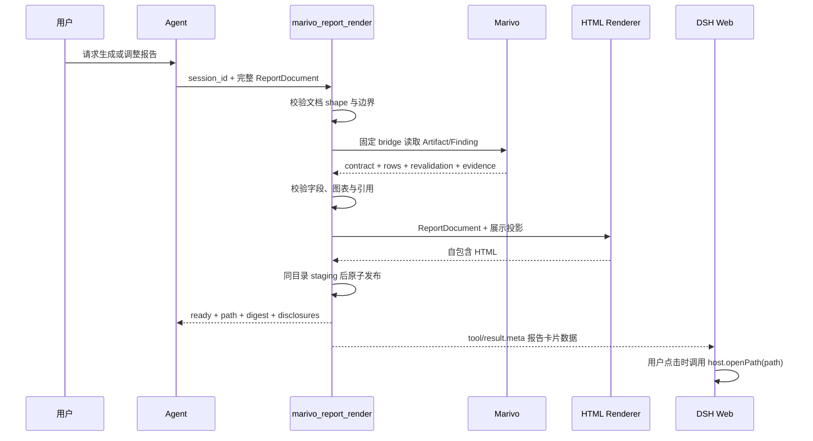

# HTML 分析报告最小实现设计

## 文档状态

本文是分 Slice 实施设计。Slice 1 的服务端编译器、checked Marivo projection、不可变发布和
`marivo_report_render`，以及 Slice 2 的 Web 交付卡片均已实现。Slice 3 的真实 runner 已实现并执行，当前仍因
DSH Web Agent 未获得 `marivo_report_render`、打印 Evidence 未展开而 blocked，尚未完成。目标是在不引入
Report 状态机、不复制 Marivo 分析契约的前提下，让 Agent 把一次分析编排成可打开、可打印、可追溯的
自包含 HTML 报告。

当前实现事实见[总体架构](../architecture.md)和
[HTML 报告渲染模块](../modules/html-report-rendering.md)；本文件继续保留后续 Slice 的设计与验收边界。

上游事实源是 [Marivo operators and frames](../../../marivo/docs/specs/analysis/operators-and-frames.md)、
[Marivo Evidence access surface](../../../marivo/docs/specs/analysis/evidence-access-surface.md) 与
[Harness Tool contract](../../../deepseek-harness/docs/cookbook/adding-a-tool.md)。本设计只定义集成与展示接缝。

## 决策摘要

- Agent 每次提交一份完整的 `ReportDocument`，自行决定标题、章节、顺序、文字和图表。
- 插件只提供一个原子的 `marivo_report_render` Tool；不提供 create/update/patch/current Report API。
- 插件把 `ReportDocument` 当作不可变输入，校验 Marivo 引用后确定性编译为新的不可变 HTML 产物。
- 首版只支持 `text`、`chart`、`table`、`evidence` 四类 block；图表只支持 `line` 和 `bar`。
- HTML 使用内联 CSS 与 SVG，不执行 JavaScript，不加载远程脚本、字体或图片。
- 产物写入插件自有的 DSH Home 目录；Tool Result 和 Web UI 只投影产物路径与校验摘要。
- 插件不验证整段自然语言是否被 Evidence 蕴含，也不把展示用表格重新包装成 Marivo Evidence。

## 所有权与非目标

| 参与方 | 首版职责 |
| --- | --- |
| 用户 | 指定问题、受众、重点和修改要求 |
| Agent | 生成完整 `ReportDocument`，决定报告内容和结构 |
| Marivo | 拥有 Artifact、Finding、Quality、Lineage、有效性和兼容性契约 |
| 插件 | 校验文档和引用、读取展示投影、渲染与原子发布 HTML |
| DSH | 保存 Tool call/result 历史，提供 Web Tool View 与本机打开能力 |

首版明确不做：

- 不维护 Report registry、当前版本、草稿、patch 或发布状态；
- 不实现分析 planner、自然语言 entailment、数字一致性检查或业务建议审查；
- 不调用新的分析 Intent，不自动补做 QualityReport，也不修改已有 Artifact；
- 不提供实时筛选、跨图联动、下钻、在线刷新、任意 Vega/ECharts spec 或任意 JavaScript；
- 不注册公开 HTML Web 路由，不扩展当前仅支持图片的 DSH Attachment 边界；
- 不实现产物删除、GC、分享权限、远程下载或 PDF 导出。

## 报告触发策略

HTML 报告是可选的耐久交付面，不是分析流程的默认终点。`marivo-analysis` 激活只让 Agent 获得
`marivo_report_render` 能力，不构成调用授权；普通分析默认在对话中返回结论、表格或图表。

Agent 只在以下任一条件成立时调用 `marivo_report_render`：

1. 用户明确要求耐久 HTML、可分享或可打印的分析报告；
2. Agent 提议生成报告后，用户明确接受；
3. 用户要求修改本次对话中已经生成的报告。

分析复杂、章节或图表较多、已有 Artifact/Finding，以及 `marivo-analysis` 已激活，都不能单独触发报告。
用户明确要求快速回答、不生成文件或改用 Dashboard、Notebook、CSV 等其他产物时，该要求优先。Agent
可以在复杂分析完成后提议生成报告，但在用户接受前不得调用 Tool。用户不需要在分析开始前决定；可以先
获得对话内结果，再要求整理为报告。

该决策只存在于当前 Agent 任务和对话上下文，不进入 `ReportDocument`，也不由插件持久化。对已有报告的
修改意图成立后，Agent 仍提交一份新的完整 `ReportDocument`，而不是读取或 patch 旧文档。

插件在 `marivo-analysis` 激活后动态加入以下短 system prompt：

```text
When marivo-analysis is active, answer inline by default.
Call marivo_report_render only when the user explicitly requests a durable HTML report,
accepts an offer to create one, or asks to revise a report already created in this conversation.
Do not call it solely because the analysis is complex or contains charts or Artifacts.
An explicit quick-answer, no-file, or other-output request takes precedence.
Every call must submit a complete ReportDocument; a revision creates a new report.
The returned path and digest are not Marivo Evidence.
```

Tool description 在模型选择 Tool 的位置再提供一层相同边界：

```text
Render a new immutable HTML report after the user has requested or accepted a durable
report deliverable. Do not use for ordinary inline analysis.
```

完整示例和正反触发矩阵只保留在设计与验收测试中，不扩张常驻 prompt。

## 用户流程



用户要求修改时，Agent 再提交一份完整文档。第二次调用不读取第一份 ReportDocument，也不发送 patch；
它生成另一个内容寻址产物。DSH 历史自然保留两次 Tool call 及其结果。

## ReportDocument v1

### 顶层结构

```ts
interface ReportDocumentV1 {
  version: 'dsh-data-analysis-report/v1'
  title: string
  subtitle?: string
  locale: 'zh-CN' | 'en-US'
  sections: ReportSectionV1[]
}

interface ReportSectionV1 {
  id: string
  title: string
  blocks: ReportBlockV1[]
}

type ReportBlockV1 =
  | TextBlockV1
  | ChartBlockV1
  | TableBlockV1
  | EvidenceBlockV1
```

`sections` 的内容、名称和顺序完全由 Agent 决定。首版不提供 audience、theme、grid、tabs、嵌套 section
或 Report preset；这些字段没有验证需求前不进入 v1。

### Block

```ts
interface TextBlockV1 {
  kind: 'text'
  id: string
  text: string
  finding_ids?: string[]
}

interface ChartBlockV1 {
  kind: 'chart'
  id: string
  title: string
  subtitle?: string
  artifact_ref: string
  view: 'auto' | 'line' | 'bar'
  x?: string
  y?: string
  finding_ids?: string[]
}

interface TableBlockV1 {
  kind: 'table'
  id: string
  title: string
  artifact_ref: string
  columns?: string[]
  max_rows: number
  finding_ids?: string[]
}

interface EvidenceBlockV1 {
  kind: 'evidence'
  id: string
  title: string
  finding_ids: string[]
}
```

`text` 是纯文本而非 Markdown 或 HTML。Renderer 对全部用户/Agent 文本做 HTML escaping，并按换行生成
段落。`finding_ids` 只表示相邻展示来源，不宣称 Finding 蕴含整段文字。

### 固定边界

- 1–20 个 section，每个 section 1–20 个 block，全文最多 100 个 block；
- section/block `id` 在文档内唯一，使用非空 ASCII kebab-case；
- 标题最多 200 字符，单个 text 最多 20,000 字符，全文文本最多 100,000 字符；
- 最多引用 20 个唯一 Artifact 和 20 个唯一 Finding；
- `table.max_rows` 为 1–100；表格截断时必须显示 `displayed / total / omitted`；
- 一个 Artifact 在导出前由公开 `frame.shape[0]` 准入，超过 2,000 行时整次调用 blocked；
- 生成的 `index.html` 最大 10 MiB，超过时不发布半成品。

这些是插件资源和展示边界，不是 Marivo 业务语义。后续若需放宽，应以性能与真实报告验收数据为依据。

### 最小示例

```json
{
  "version": "dsh-data-analysis-report/v1",
  "title": "支付成功率异常分析",
  "locale": "zh-CN",
  "sections": [
    {
      "id": "summary",
      "title": "核心判断",
      "blocks": [
        {
          "kind": "text",
          "id": "summary-text",
          "text": "支付成功率下降主要集中在 Android 旧版本。",
          "finding_ids": ["finding-summary"]
        }
      ]
    },
    {
      "id": "trend",
      "title": "变化趋势",
      "blocks": [
        {
          "kind": "chart",
          "id": "success-rate-trend",
          "title": "支付成功率趋势",
          "artifact_ref": "artifact-success-rate",
          "view": "auto"
        }
      ]
    }
  ]
}
```

## Tool 契约

唯一入口：

```text
marivo_report_render({ session_id, document })
```

Tool 注册在 Agent scope，复用现有 `MarivoEnvironmentSource`。Tool 是否调用遵循“报告触发策略”；动态
system prompt 和 Tool description 共同约束默认 inline、显式报告意图、完整文档修订与 Evidence 边界。

输出是关闭的联合类型：

```ts
type ReportRenderValueV1 =
  | {
      status: 'ready'
      title: string
      path: string
      report_digest: string
      document_digest: string
      artifact_refs: string[]
      finding_ids: string[]
      disclosures: string[]
    }
  | {
      status: 'blocked'
      stage: 'document' | 'marivo' | 'visual' | 'publish'
      issues: Array<{
        code: string
        location: string
        message: string
        repair: string
      }>
    }
```

可修复的文档、引用、图表与大小错误返回 `blocked`，让 Agent 根据 location 和 repair 重新提交完整文档。
Environment identity 改变、子进程失败、取消、超时和本地 I/O 失败仍抛出 Tool error，不伪装成文档问题。

`tool/result.meta` 只在 `ready` 时投影 `kind`、schema version、title、path、report digest 和 disclosures。
CLI/Headless 直接读取 Tool 文本中的绝对路径；Web Tool View 展示“打开报告”按钮并调用现有
`connection.api.host.openPath({ path })`。本机 opener 不可用或被 Harness trust fence 拒绝时，卡片显示错误，
不改变原 Tool Result。

## Marivo 读取边界

新增一个固定、不可由模型修改的 checked Python bridge。Node 先解析文档并提取去重后的 Artifact/Finding
ID；传给 Python 的 argv 只包含绑定身份、Session ID 和这些 ID，不包含 Python 表达式或 shell 文本。

bridge 执行：

1. `mv.session.resume(session_id, use_datasources=False)`；
2. 对每个 ref 调用 `session.get_frame(ref)`；
3. 调用 `session.revalidate(frame)`，首版只接受 `admissible`；
4. 读取 `frame.contract()`、公开 family/shape/columns、`frame.state.content_hash` 和 Lineage；
5. 在行数准入后调用 `frame.to_pandas()`，只生成绑定于原 Artifact ref 的展示表；
6. 对每个 Finding 调用 `session.evidence.finding(id)`；
7. 对每个包含 Finding 的 block 单独调用 `session.evidence.compatibility(...)`，状态不是 `compatible` 时
   blocked；不同 block 的 Finding 不做报告级组合检查；
8. 返回有上限的 JSON projection，任一对象失败时不返回部分 bundle。

`to_pandas()` 是终端展示出口，不保留 Evidence、Lineage 或 typed re-entry。插件必须把 rows 与原始 Artifact
identity、contract 和 revalidation 放在同一临时 bundle 中；rows 本身不得被标记为 Evidence，也不得重新
送入 Marivo Intent。block 上的 Finding 仍只是相邻来源；首版不验证它是否蕴含 Agent 文本，或是否恰好
对应图中每个 mark。

Datasource freshness 不属于 `session.revalidate()` 的保证。报告页脚必须显示 Artifact ref/content hash、
报告生成时间、可用的 Finding 提交时间，以及“admissible 不等于 datasource fresh”的固定披露。

## 图表选择与验证

首版由 Agent 选择 `line`、`bar` 或 `auto`。插件不根据自然语言猜图。

`auto` 只在 contract 中存在唯一无歧义映射时工作：

- 一个有序/时间字段加一个数值字段，且至少 4 个不同 x 值 → `line`；
- 一个类别字段加一个数值字段，且类别数不超过 30 → `bar`；
- 其他情况 blocked，要求 Agent 指定 x/y/view 或改用 table。

显式图表仍需满足：

- x/y 必须是 `artifact.contract().artifact_schema` 中的真实公开列；
- `line` 的 x 必须唯一且可稳定排序，y 必须为数值；少于 4 个点 blocked，少于 8 个点生成 disclosure；
- `bar` 的 x 必须是唯一类别，y 必须为数值，最多 30 个类别，绝对量比较从零开始；
- 不混合不同 grain 的行，不从字符串猜单位，不构造不存在的 denominator 或 sample size；
- 不能静默抽样、聚合或 Top-N；超限时要求 Agent 先产生更合适的 Marivo Artifact；
- 图表标题必填；subtitle 可省略，但 Renderer 必须补充可用的单位、范围、行数和来源信息。

这些规则只判断展示是否机械可用，不推荐业务结论。首版不支持 multi-series 或 waterfall；前者需要显式
series identity 与非颜色区分，后者的 additive/reconciliation 准入比普通柱图更强，都应在单独 Slice 中
基于对应 Artifact 公共契约加入。

## 确定性 HTML Renderer

Renderer 在 Node 服务端生成一个 `index.html`：

- 只使用 semantic HTML、内联 CSS 和内联 SVG；
- 不包含 script、iframe、form、远程 URL、外部字体或运行时依赖；
- `text` 渲染转义后的段落和简单语义列表；
- `line` 和 `bar` 生成固定 viewBox SVG，同时提供可展开的同源数据表；line 至少八个有序点并明确披露
  聚焦纵轴，bar 使用 4–30 个类别，长标签或较多类别改用横向条形；
- `table` 使用 `<table>`、`<caption>`、`<th scope>`，截断信息始终可见；
- 普通 block 的 Finding 引用默认折叠，只先展示报告 locale 对应的 `Finding.render()` 人读事实；ID、Artifact、
  quality、value、subject 与 derivation 留在二级技术审计，显式 `evidence` block 才直接展示事实列表；
- 每张图具有可见 title、用户语义 context subtitle、本地化日期/数值、SVG `<title>`/`<desc>` 和非颜色区分；
- 提供答案优先的响应式单列 CSS、系统浅色/深色外观与 `@media print`；摘要只强调首个文本块，图表和表格
  使用正文流加轻分隔线，不嵌套摘要底色或卡片容器；打印保留正文和图表，不自动展开原始审计 JSON。

页面加入严格 CSP：

```text
default-src 'none'; style-src 'unsafe-inline'; img-src data:; font-src 'none';
script-src 'none'; object-src 'none'; frame-src 'none'; base-uri 'none'; form-action 'none'
```

## 产物与无状态发布

默认根目录：

```text
$DSH_HOME/dsh-data-analysis/reports/
└── <environment-fingerprint>/
    └── <report-digest>/
        ├── index.html
        ├── report-document.json
        └── manifest.json
```

`report-digest` 覆盖 canonical ReportDocument、Environment fingerprint、Artifact ref/content hash、Finding ID、
Marivo version 和 renderer version。相同输入可以复用已存在且 manifest 一致的目录；这只是内容寻址缓存，
不是“当前 Report”状态。

发布流程为：在同一父目录建立随机 staging 目录，写入并复核三份文件，目录 mode `0700`、文件 mode
`0600`，最后 rename 到 digest 目录。失败时删除 staging；不得覆盖已有 digest 目录，不维护 latest symlink、
registry、数据库或 Session event。首版不做 GC，运维可按目录时间和容量独立清理不可变产物。

## 代码切片

### Slice 1：纯编译器

状态：已实现。

新增：

```text
packages/dsh-data-analysis/src/report/
├── document.ts       # v1 类型、解析、bounds
├── projection.ts     # checked Marivo bridge 与 JSON 校验
├── visual.ts         # auto/line/bar admission
├── render.ts         # escaped HTML/CSS/SVG
├── publish.ts        # digest、mode、staging/rename
├── tool.ts           # marivo_report_render
└── index.ts
```

本 Slice 只通过 Tool 文本返回路径，不改客户端。完成条件是确定性 fixture 能生成可离线打开的 HTML。

### Slice 2：Web 交付卡片

状态：已实现。

- `presentationMeta` 投影不可变报告摘要；
- `client.tsx` 注册 `marivo_report_render` Tool View；
- settled card 显示 title、disclosures、path 和“打开报告”；
- 点击后调用 `host.openPath`，错误只留在卡片本地；
- Session replay 从 meta 恢复同一张卡片，不访问文件或 Marivo。

当前 Harness 要求 `presentationMeta` 对所有成功 Tool 值返回 lossless JSON，因此 ready 使用闭合的
`marivo-html-report` v1 对象，blocked 使用 `null` 哨兵。Code Mode nested Tool 不计算 `presentationMeta`，
插件通过 `tools/code-dispatch-log` 只向标准子调用事件的耐久日志副本追加同 shape card block，不改变程序 value
或模型文本；客户端只把上述两种严格投影视为可打开报告。

### Slice 3：真实环境验收

当前状态：**blocked**。`npm run validate:html-report-rendering:real` 已通过真实 Marivo 与
`deepseek-v4-flash` 的三条 journey，并把 `0600` 记录与不可变报告写入
`artifacts/html-report-rendering-real/<run-id>/`。2026-08-27 的 Web/视觉门禁未通过：当前 Web Agent toolset
没有 `marivo_report_render`，因而没有报告卡片或 `host.openPath` 证据；Chrome print media 还会折叠
Evidence details。桌面与 390px 布局检查通过，但不能替代上述门禁，因此本 Slice 不标记完成。

- 用当前绑定 Marivo 生成 MetricFrame fixture；
- 生成 line、bar、table、evidence 四类 block；
- 从 DSH Web 打开报告并检查桌面、窄屏和打印布局；
- 运行真实 Agent 的首次生成、完整文档修改、blocked 后修复三条 journey；
- 记录文档 shape 错误、重试次数和最终产物，不预设 token 成本结论。

## 测试与验收

新增仓库入口：

```text
npm run test:html-report-rendering
npm run validate:html-report-rendering:real
```

真实 runner 默认模型为 `deepseek-v4-flash`，可通过 `DSH_DATA_ANALYSIS_VALIDATION_MODEL` 覆盖。它记录 Tool
调用、blocked stage/code、重试、时延、原始 token usage、最终路径和 digest，不记录凭证值或完整 Help 正文。
真实模型结果只补充确定性测试；任何 Web、opener、打印或外部模型前置条件失败都必须保持 blocked。

确定性测试至少覆盖：

- ReportDocument 闭合 shape、全部 bounds、重复 ID 和未知字段拒绝；
- Agent 第二次提交完整文档会产生独立 digest，编译器不读取第一次输入；
- Artifact/Finding 批次原子读取、identity drift、stale/indeterminate revalidation、block 级 incompatible
  Evidence，以及互不组合的跨 block Finding 不被全局误拒绝；
- `auto` 的唯一映射与歧义拒绝，line/bar 字段、点数、类别数和零基线规则；
- text/标题/单元格的 HTML escaping 与 CSP，无 script/remote URL；
- 表格截断披露、图表同源 fallback table、Evidence details 和打印样式；
- staging 失败不发布目录，相同 digest 幂等复用，不创建 latest/registry/state 文件；
- Tool ready/blocked 文本、presentation meta、Web replay 与 `host.openPath` 失败视图；
- Agent 面对普通分析、单指标查询、对话内图表以及明确 quick-answer/no-file 请求时不调用 Tool；
- Agent 只在用户明确请求报告、接受报告提议或修改已有报告时调用 Tool，提议但未获接受时不调用；
- `npm run check`、`npm run build`、`npm run verify:plugin-package` 全部通过。

首版验收标准：Agent 能自由改变章节与 block 顺序；插件不保存可变 Report 状态；每个数据 block 都绑定
精确 Artifact；每个来源展示都绑定精确 Finding；HTML 在无网络、无 JavaScript 条件下可读、可打印，且
任何引用、视觉或发布失败都不会留下被报告为 ready 的半成品。

## 后续扩展门槛

只有首版真实报告证明需求后才加入：

- KPI block：需要 Marivo 提供稳定的 value presentation，而不是插件解析任意 Finding value；
- waterfall/forecast/funnel：每种图单独映射对应 Artifact 公共契约并新增 admission tests；
- Markdown：需要复用或引入经过 HTML 安全验证的 parser，不接受 raw HTML；
- 声明式 custom chart：需要关闭 schema、无脚本 renderer 和独立视觉 QA；
- Live report：需要新的授权读取与刷新接缝，不能把静态路径变成隐式当前状态；
- 分享、下载、PDF 与 GC：分别设计权限、生命周期和失败恢复，不扩张本 MVP Tool。
