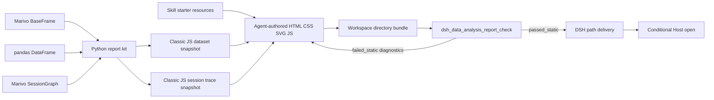

# Workspace 报告 Bundle 工具链设计

## 文档状态

本文已实施，定义 `dsh-data-analysis` 在不恢复报告 DSL、HTML renderer 或 publisher 的前提下，
为 Agent 原生 Workspace 报告补充四项能力：

1. 只读静态检查 Tool `dsh_data_analysis_report_check`；
2. 随插件 Runtime 安装的 Python package `dsh-data-analysis-report-kit`；
3. 随 `dsh-data-analysis-report` Skill 分发的可选 Starter、CSS 与图表组件；
4. Artifact 报告默认采用的有界 Marivo Session trace snapshot 与可访问 DAG appendix。

代码、确定性测试、打包和真实 Agent 验收已于 2026-09-01 通过。本文现已破坏性替换
[Agent 原生报告增强能力设计](agent-native-report-primitives-design.md) 中
“不提供 `report_check`”“Artifact 只能由 Agent 手工 `to_pandas()` 导出”“Skill 不提供 Template”以及
“没有已确认报告消费者时不提供 Session Graph transport”四项局部决策，不恢复任何旧 `ReportDocument`
路径或兼容入口。

本次验收包括 `npm run check`、`npm run build`、`npm run verify:plugin-package`、解包后的 Checker/Starter/wheel
smoke、`web` profile 重装，以及真实 Agent 从 Starter `failed_static` 修复至 `passed_static`；下一普通 turn
确认 Checker Tool 未继承。`passed_static` 仍只代表静态检查，browser、visual 与 analysis coverage 不因此变为
已验证。

本文只决定 DSH/Marivo 集成 seam。Marivo 的 Artifact、Quality、Evidence、Lineage、revalidation 与
Session runtime 契约仍以上游当前公共 API 为权威；本文定义的 dataset/trace objects 都是报告展示或传输
快照，不复制或替代这些上游对象。

## 背景

旧 `marivo_report_render` 通过固定 `ReportDocument` schema 和 renderer 提供了闭合校验，但同时限制了
Agent 的页面结构、图表类型、布局和交互。当前架构删除该 renderer 后，Agent 可以直接生成任意
HTML/CSS/SVG/JavaScript，不过暴露出四类重复成本：

- 报告目录没有内置静态完整性检查。属性引号损坏、HTML 嵌套错误和缺失本地资源只能由 Agent 临时编写
  脚本检查；
- Artifact 数据必须先 `to_pandas()`，再由 Agent 手工序列化并拼接 schema、quality、lineage 等展示所需
  信息，容易丢失来源边界或制造二次错误；
- Skill 只描述原则，没有一套可直接复制修改、默认安全的 HTML/CSS/chart 起点；
- Persisted Artifact 报告缺少统一、低干扰的执行链路 appendix；若让 Agent 手工序列化 `SessionGraph`，容易
  丢失 `truncated`、boundary、Run lifecycle 和 edge kind，或误把 DAG 描述成当前权威证明。

这些问题不要求恢复 renderer。它们分别属于：对普通 Workspace 文件执行机械检查、把公开 Python 对象
安全写成展示快照、提供不具强制性的创作起点，以及把公开 Session Graph 投影成有界追溯 appendix。

## 目标

- 让 Agent 通过一个参数极小的 Tool 获得稳定、可定位、可修复的静态报告诊断。
- 让同一个 helper 同时接受 `pandas.DataFrame` 和 Marivo `BaseFrame`，避免无意义的手工桥接。
- 对 Artifact 只投影公开、稳定、有界、报告确实需要的事实，并明确当前有效性是否实际检查。
- 为使用 persisted Marivo Artifact 的报告提供默认折叠、可访问的 focused Session trace appendix。
- 为本地 `file://` 打开、键盘访问和图表提供可用默认值，但不要求报告必须离线。
- Starter 可以被 Agent 复制、删改或完全绕过；Tool 不要求使用 Starter 的 DOM、class 或组件。
- 保持普通 Workspace 目录 bundle、Produced Files 路径投影和 Host opener 的现有生命周期边界。
- 让 managed Runtime 和管理员 Python 都使用精确、可探测的 Python package identity。
- 让尚未触发过 HTML 报告工作流的非 HTML 分析路径只承担 Skill catalog 中一条可判别 description 的发现
  成本；不注入报告 prompt，不展示 Checker Tool schema，也不加载 references、Starter 或 Python helper 用法。

## 非目标

- 不定义章节、block、layout、chart type 或报告内容 schema。
- 不把任意 HTML 编译成插件拥有的展示模型。
- 不运行 Chromium，不验证像素布局、运行时 DOM、交互正确性或截图差异。
- 不验证分析计算、自由文本、图表选择、因果结论或建议是否正确。
- 不创建不可变报告 identity、bundle digest、目录事务、历史字节 replay、share 或 publisher。
- 不把 dataset snapshot 恢复成 Marivo Artifact，也不允许它冒充 Evidence、Finding 或当前权威。
- 不复制完整 `ArtifactContract`、完整 Session Graph 对象、Evidence ledger、Finding 内容或私有存储布局；只
  允许本文定义的有界、安全 Session trace transport projection。
- 不在管理员提供的 Python 中自动安装、升级或删除任何 package。
- 不托管、代理、缓存或验证远程资源，也不为报告提供服务端运行时或前端框架。
- 不提供或检查打印、分页和 PDF 导出；未来若出现明确需求，另立能力与验收设计。
- 不修改 sibling Marivo 或 DeepSeek Harness 的源码、Skill、文档、package、发布流程或公共契约。

## 决策摘要

| 问题 | 决策 |
| --- | --- |
| Checker 入口 | Agent 使用 `dsh_data_analysis_report_check` Tool；CLI 仅作为共享内核的开发/人工适配器 |
| 渐进披露 | 默认只暴露 Skill name/description；明确 HTML 意图后才加载 `SKILL.md`，再按数据、组件、trace、修复需要读取 reference |
| Tool 可见性 | Checker 默认不存在于 Agent 可见 Tool 集；本轮成功加载 report Skill 后按 Agent/turn 注册，以权威 `turn/end` 撤销，取消与 Agent dispose 兜底 |
| Checker 权威 | 只声明 `passed_static` / `failed_static`，永不声明 `ready` 或 `render_validated` |
| Checker 副作用 | 只读，不修改、格式化、补齐或发布文件 |
| 外部资源 | 允许报告引用；观察到外部引用/网络能力时披露 `coverage.external=not_checked`，未观察到时为 `none_observed`，两者都不证明运行时无网络 |
| Python 安装 | managed Runtime 安装插件随包 wheel；管理员 Python 只探测精确版本，缺失或不匹配即失败 |
| Python 输入 | `emit_dataset()` 接受 `pandas.DataFrame | marivo.analysis.BaseFrame` |
| Artifact 元数据 | 输出有界 public projection；完整上游对象仍由 Marivo 拥有 |
| revalidation | 只有调用方显式传入并通过 identity 核对后才写入；否则记录 `not_checked` |
| 数据文件 | V1 固定输出适合 `file://` 的 classic `.js` 注册文件，不提供 `.json` 分支 |
| Session trace | `emit_session_trace()` 接受 public `SessionGraph`，输出有界拓扑 snapshot，不查询 Session 或重新解释 Graph |
| Trace 默认策略 | 使用 persisted Artifact 的报告默认加入折叠 appendix；computed-only 报告删除，不伪造追溯链路 |
| Chart quality | Built-in chart 右上角自动提供与其 dataset 绑定的“数据与质量详情”；hover 只是入口之一，同时支持 focus/click/touch |
| 纯文本输出 | 不使用 trace/JS/Checker；直接遵循 `marivo-analysis` closeout，只披露影响结论的数据质量和必要 current-state 边界 |
| Starter | `basic` 只提供最小技术 shell；数据、chart/KPI/table、`ReportTrace` 作为可选 components/snippets；完整分析报告只作为 example |
| 展示自由度 | Starter 是 copy-and-eject 资源；Agent 可任意改写或不用，Checker 不检查其 class |

## 所有权边界

| 参与方 | 拥有的职责 | 明确不拥有 |
| --- | --- | --- |
| Marivo | Artifact、schema、Quality、Lineage、Evidence、revalidation、Session Graph 及其有效性 | HTML、CSS、报告布局和 DSH 文件交付 |
| `dsh-data-analysis` | Runtime 安装、Workspace 边界、静态 bundle 检查、公开对象到展示快照的机械传输、Session trace transport、Skill 资源分发 | 分析语义、Graph 构建/遍历、报告 DSL、主报告 renderer、视觉结论和 publisher |
| Agent | 分析解释、内容取舍、DOM、CSS、图表、交互、叙事、是否采用 Starter | Marivo 权威契约和 DSH 生命周期 |
| Skill / Starter | 触发、步骤、停止条件、默认安全实现和低认知成本示例 | 强制 schema、可信证明或运行时硬门禁 |
| DSH 文件/Web | 单文件 mutation、Workspace 权限、Produced Files 路径、条件 Host opener | bundle ready、目录事务、内容冻结和历史恢复 |

### 仓库变更边界

本文所有实施变更只允许落在本仓库：

- `packages/dsh-data-analysis/src/`：Checker、report disclosure controller、Runtime 安装与插件 prompt 清理；
- `packages/dsh-data-analysis/skills/dsh-data-analysis-report/`：短入口、references 与 Starter 资源；
- `packages/dsh-data-analysis/tests/`、`scripts/` 与 package metadata：确定性测试、真实验收和分发门禁；
- 本仓库 `docs/`：当前设计、架构与交付说明。

Marivo 只通过本插件当前固定版本的 public Python objects、live Help 和 Skill 被消费；`marivo-analysis` 的
内容、quality closeout、Artifact/Graph 契约与发行物不在本文修改范围。DeepSeek Harness 只通过现有公开的
Skill catalog/invocation、scope-local Tool registration、durable `session/event turn/end`、session/agent lifecycle 和
Workspace file/Host 能力被组合；不要求新增或修改 Harness API。

对 sibling checkout 的读取只能用于确认现有契约和运行验收，不产生 sibling 工作树修改或提交。如果实现发现
上述宿主能力不足，本设计在本插件侧标记 blocked 并重新评审 seam，不能把 sibling 改动静默扩入本计划。

`dsh_data_analysis_report_check` 满足公开 Tool 的存在性判据：它需要插件持有的 Workspace root 和 DSH Tool
生命周期，并对多个文件进行确定、无分析判断的资源图聚合。它不是把一个 Marivo 方法重新装箱。

`emit_dataset` 和 `emit_session_trace` 都不做成 Tool。它们在受控 Python Runtime 内直接处理可能较大的内存
对象，写入目标 bundle，避免对象先跨 Tool JSON 边界；安装和版本校验由插件负责，Artifact 与 Graph 语义
仍由 Marivo 公共类型负责。

## 目标架构



### 披露层级与上下文预算

报告能力使用四级披露，后一级只能由前一级的明确决策触发：

| 层级 | 进入上下文的内容 | 触发条件 | 不进入的内容 |
| --- | --- | --- | --- |
| L0 发现 | Skill catalog 中的 `name` 和一条可判别 `description` | 插件可用 | report prompt、Tool schema、references、Starter、Python API |
| L1 路由 | 短小 `SKILL.md`：HTML 意图复核、公共边界、工作流目录、停止条件 | 用户明确要求 HTML/网页报告、接受该交付，或修订本会话 HTML 报告 | schema 细节、组件 API、完整规则表、examples |
| L2 任务细节 | 当前报告实际需要的 reference；Starter 文件只按路径复制 | 已选择对应能力 | 未选择的 dataset/trace/component/example 指导 |
| L3 执行 | 当前 Agent 当前轮次的 Checker Tool schema/result | report Skill 成功加载且报告任务仍在本轮执行 | 其他 Agent 和后续非报告轮次的 Checker |

在一次从未触发过 report Skill 的新会话中，L0 是普通分析路径唯一新增的报告信息，目标是只有一条 catalog
metadata，而不是一段系统提示词。report Skill 一旦通过 Tool 或显式 invocation 加载，其 body/result 会成为
Harness Session history；后续轮次可以撤销 Checker schema，却不能保证 compaction 前的历史 Skill 内容从模型
上下文中消失。因此本文区分“首次 HTML 触发前的披露成本”与“同会话触发后的历史成本”，不把 Tool 撤销描述
为历史清除。
`description` 建议固定为：

```text
Create or revise a Workspace HTML analysis report. Use only when the user explicitly requests HTML/web output or accepts it; never use for inline, text, or other non-HTML output.
```

“分析较复杂”“包含图表/Artifact”“用户说报告但没有指定 HTML”都不触发 L1；这些请求继续由
`marivo-analysis` inline closeout 处理。插件不主动推销 HTML 报告。若用户只说“报告”，Agent 默认按当前输出
介质回答；只有用户随后明确选择 HTML/网页交付才进入 report Skill。

当前本插件 `packages/dsh-data-analysis/src/plugin.ts` 中随 `marivo-analysis` 激活的
`MARIVO_AGENT_REPORT_PROMPT` 应删除。它复制了 catalog description，且一旦分析 Skill 在会话中激活，就会
在所有后续普通分析 step 中重复携带 HTML 路由、Workspace bundle 和能力否定信息。报告选择只由 Skill
catalog 完成；`marivo-analysis` 继续独立拥有普通文本 closeout，本文不修改该 sibling Skill。

生命周期如下：

1. 默认分析只看到 L0 catalog metadata；不注入报告 prompt，也看不到 Checker Tool。
2. 用户明确请求或接受持久 HTML 报告后，Agent 加载短小 `dsh-data-analysis-report/SKILL.md`；加载失败时不
   暴露 Tool，也不尝试手写替代工作流。
3. Agent 通过 Marivo 公共 API 完成分析，并对恢复的 Artifact 执行需要的 revalidation。
4. Agent 只读取本报告需要的 references，可复制最小 `starter/basic`，再按任务选择 components/snippets；也可
   自行创建任意目录结构和页面。未选择的 references 和 assets 不读取到上下文。
5. Python helper 把 DataFrame 或 Artifact 写成 dataset snapshot；persisted Artifact 报告另外把 focused
   `SessionGraph` 写成 trace snapshot。Agent 仍可使用其他格式和图表库。
6. Skill 加载成功后，report disclosure controller 才为当前 Agent/turn 注册 Checker；Agent 先写资源、再写
   `index.html`，然后调用 Tool。
7. `failed_static` 时只选择包含返回 code namespace 的 `checker-rules/<group>.md`，完整读取该小文件后修复并
   重跑；
   `passed_static` 只允许声明静态检查通过。
8. 有浏览器能力时继续做浏览器、键盘和交互验收；没有时明确未运行该层检查。
9. 完成后交付精确 `index.html` 路径。权威 `turn/end` 到达时撤销 Checker；取消和 controller/Agent dispose
   作为未能观察正常边界时的兜底。后续修订重新加载 report Skill。Produced Files 和 Host opener 行为保持
   现状。

## 静态 Checker Tool

### Tool 名称与可见性

公开名称固定为：

```text
dsh_data_analysis_report_check
```

名称使用项目 ownership，而不使用 `marivo_` 前缀，因为它检查的是任意 Workspace HTML bundle，不读取
Marivo，也不要求报告包含 Artifact。Plugin 不在 Agent 创建时注册该 Tool，也不在
`marivo-analysis` 激活后把它加入可见 schema。

新增轻量的 report disclosure controller，只观察两种确切事件：

- inherited `skill` Tool 成功返回 `name=dsh-data-analysis-report`；
- 用户显式 Skill invocation message 的 source name 为 `dsh-data-analysis-report`。

命中后 controller 通过当前 `agent.ctx` 注册 scope-local Checker，并按 `{agent identity, turn}` 幂等持有唯一
disposer。失败的 Skill 调用、仅加载 `marivo-analysis`、普通文本中的“report”字样都不能注册。
另一个 Agent scope 不继承该 Tool。新一轮 HTML 修订必须再次加载/显式调用 report Skill，不能依赖前一轮残留
可见性。

撤销权威是该 Agent Session 的 durable `session/event` 中与已记录 turn 相同的 `turn/end`。controller 必须覆盖
`completed`、`error`、`aborted`、`disposed` 和 Harness 支持的其他终止 reason，并在撤销后删除 lease 记录。
`agent/turn-stopping` 只表示一次可能的自然停止检查：其他 listener 可以在其后 steer 同一 turn，因此不能在该
事件中最终撤销 Tool。turn signal 取消与 Agent/controller dispose 仍立即撤销，作为异常和生命周期兜底；新
turn 的 `agent/pre-step` 若发现旧 lease 仍在，也必须先清理再决定本轮是否重新激活。

Native/both 模式直接调用；Code Mode 通过现有 Tool SDK 调用同一个标准 Tool，不增加 durable content、
报告卡片或专用 Web 投影。Tool registry change 必须在 Skill 调用后的下一 model step 同时反映到原生 schema、
Code Mode lookup 和 execution；Tool 结果只属于当前调用，不形成可重放的报告 receipt。

### 输入契约

V1 只有一个 Agent 必填参数：

```ts
interface ReportCheckArgs {
  entry_path: string
}
```

约束：

- 必须是当前 Workspace 内的文件路径；相对路径相对当前 Workspace root 解析；
- 文件 basename 必须为 `index.html`；
- bundle root 固定为入口的父目录，Agent 不能自行声明另一个 root；
- 入口和所有递归引用资源的真实路径必须留在 bundle root，symlink 也不能逃逸；
- 不提供 `strict`、`profile`、`ignore` 或规则列表参数，避免 Agent 为获得通过而选择更弱策略。

未来若确有不同发布策略，应由插件配置或版本化 checker profile 决定，不能把安全级别选择交给每次 Tool
调用。

### 输出契约

```ts
interface ReportCheckResultV1 {
  schema: 'dsh-data-analysis-report-check/v1'
  status: 'passed_static' | 'failed_static'
  entry_path: string
  bundle_root: string
  checked_at: string
  coverage: {
    static: 'complete' | 'incomplete'
    external: 'none_observed' | 'not_checked'
    browser: 'not_run'
    visual: 'not_run'
    analysis: 'not_checked'
  }
  summary: {
    errors: number
    warnings: number
    infos: number
    files_checked: number
    bytes_checked: number
  }
  issues: ReportCheckIssueV1[]
  omitted_issue_count: number
}

interface ReportCheckIssueV1 {
  severity: 'error' | 'warning' | 'info'
  code: string
  path: string
  line: number | null
  column: number | null
  message: string
  repair: string | null
}
```

`status` 由 error 与 coverage 共同决定：零 error 且 `coverage.static == "complete"` 才是
`passed_static`，否则为 `failed_static`。Warning 不阻断，但必须保留在结果中供 Agent 判断。HTML 本身的
静态失败作为正常 Tool result 返回，使 Agent 可以机械修复；只有参数非法、Workspace 越界、取消、I/O
不可判定或 checker 内部错误才让 Tool 调用失败。

Tool render 向 Agent 展示紧凑摘要和前若干问题；结构化 value 保留全部预算内问题。V1 最多返回 200 个
issue，超出部分计入 `omitted_issue_count`。结果不使用 `ready`、`safe`、`validated` 或 `published` 等词。

Tool value 的 `entry_path` 与 `bundle_root` 固定为当前 Workspace root 相对、无前导 `/`、使用 `/` 分隔的
normalized path；`issues[].path` 固定为 bundle-root-relative path。任何字段都不返回 absolute host path。
CLI 把调用进程 cwd 作为 operator Workspace root，入口必须位于 cwd 内，并使用相同路径投影；因此同一目录
下 Tool 与 CLI 的 status、coverage、summary、issues 和相对路径可以逐字段比较，仅 `checked_at` 允许不同。

### 检查流水线

Checker 从入口构建只读资源图：

1. 解析 `index.html`，收集 HTML parser errors 和带 source location 的节点/属性；
2. 收集 `link[href]`、`script[src]`、`img[src/srcset]`、`source[src/srcset]`、`video[poster]`、
   `object[data]`、本地导航链接等静态引用；
3. 递归解析本地 CSS 的 `@import` 和 `url(...)`；
4. 解析本地 JavaScript 的静态 `import`、`export ... from` 和字符串字面量 dynamic import；
5. 对 JSON 和本工具定义的 dataset JS 注册文件执行格式检查；
6. 对每个引用执行路径闭合、存在性、文件类型和预算检查；
7. 在完整 DOM 上执行基础文档与 accessibility 规则；
8. 排序、去重并产生稳定诊断。

诊断顺序固定为 severity、path、line、column、code，保证测试和 Agent 修复循环稳定。

### V1 检查范围

#### HTML 与文档结构

- HTML parser 报告的未闭合属性、错误 token、异常 EOF 和明显嵌套问题；
- `<!doctype html>`、非空 `<html lang>`、唯一且非空 `<title>`、viewport；
- 正好一个主内容区域：一个 `<main>`，或没有 `<main>` 时一个可识别的 `role="main"`；
- 重复 `id`、空 fragment target、引用不存在的 `aria-labelledby` / `aria-describedby`；
- `<script>`、`<style>`、`<link>` 和常见媒体标签的基础属性一致性；
- 明显危险 scheme，如 `javascript:`，以及入口中的 `<base>` 改写。

Checker 不尝试证明浏览器 error recovery 后的 DOM 与作者意图一致。任何 parser error 都是 error，即使某个
浏览器可以容错显示。

#### 本地资源闭合与外部边界

- 每个静态本地引用存在且为普通文件；
- 引用路径、realpath 和 symlink 不能逃逸 bundle root；
- `http:`、`https:` 和 protocol-relative URL 允许使用；Checker 不下载、不解析、不探测可用性，出现时将
  `coverage.external` 设为 `not_checked`；
- 外部 script、stylesheet、font、media 等依赖产生 `resource.external-dependency-unchecked` warning，普通外部
  navigation link 产生 `resource.external-navigation-unchecked` info；两者都不单独使 `status` 变成
  `failed_static`；
- `file:` 和绝对文件路径仍作为 bundle/Workspace 越界失败，不属于外部网络资源放开范围；
- anchor 的 `mailto:` / `tel:` 可以作为外部动作保留，但产生 `resource.external-action-unchecked` info；
- 允许同页 fragment；本地跨页链接必须存在并检查 fragment；
- 有界 `data:` 图片可以使用，但 JavaScript、HTML 和字体 data URL 禁止；
- CSS `@import`、font/image URL 和 JavaScript 静态模块引用中的本地目标进入资源图，外部目标只记录边界；
- 非静态拼接 URL、`fetch()`、`XMLHttpRequest`、WebSocket、EventSource、动态 script/link/media URL 和其他
  可静态识别的网络能力产生 `resource.dynamic-network-unchecked` info，并把 `coverage.external` 设为
  `not_checked`；Checker 不尝试解析运行时目标。

没有观察到静态外部引用或上述网络能力语法时，`coverage.external` 为 `none_observed`；它只表示“静态扫描未
观察到”，不证明运行时绝无网络行为。只要观察到任一外部引用或网络能力就是 `not_checked`。该字段不影响
`passed_static`，但 Agent 不能把两种状态改述为“外部依赖已验证”“不存在运行时网络行为”或“报告可离线
加载”。

#### CSS、JavaScript、JSON 与 SVG

- CSS 使用严格 parser 检查语法，并扫描 `@import` 和 `url(...)`；
- JavaScript 根据 `<script type>` 以 script 或 module 模式做语法解析；
- JSON 使用标准 JSON parser，不接受 NaN、Infinity、comments 或 trailing comma；
- Starter dataset `.js` 必须是单一、静态的 `ReportData.register(id, object)` 形式，不执行文件；
- 对使用本 dataset contract 的页面，`report-data.js` 必须先于所有注册文件加载，注册文件必须先于使用对应
  literal dataset id 的 consumer script；重复注册和静态可判定的未注册读取失败；
- Session trace `.js` 必须是单一、静态的 `ReportTrace.register(id, object)`；provider/registration/consumer
  顺序、trace schema、唯一 Run/Artifact identity、Run inputs/outputs、edge 引用、状态集合和 report Artifact
  refs 必须闭合；普通引用必须命中 node，超出投影的引用必须显式出现在对应 boundary 集合；
- 页面包含 `source.kind="marivo_artifact"` dataset 而没有 Session trace 时产生 warning，而不是 error；Skill
  负责默认加入 appendix，Checker 不把它升级成不可绕过的报告 schema；
- 独立 SVG 以 XML parser 检查 well-formedness，inline SVG 随 HTML DOM 检查；
- 二进制图片、字体、Parquet、CSV 只检查存在、路径和大小，不解释内容语义。

Checker 不执行 JavaScript，不运行 CSS layout，也不加载字体或图片解码器。

#### 基础 accessibility

- 非装饰图片必须有非空 `alt`；装饰图片必须显式使用空 `alt`；
- form control 必须有 label 或可访问名称；
- button/link 必须有文本或可访问名称；
- table 缺 caption/邻接说明为 warning，完全没有 `<th>` 为 error；复杂表格的 header association 不确定只做
  heuristic warning；
- figure 中的图表应有 `figcaption`，SVG 应有 `<title>` 和 `<desc>`；
- heading 不能从 `h1` 直接跳到更深层级；页面必须有一个 `h1`；
- 正 tabindex、自动播放、仅 hover 显示关键内容和明显的 color-only 标记产生 error；
- CSS 应有可见 focus 样式；观察到 animation/transition 时应有 `prefers-reduced-motion` 处理，两者缺失产生
  heuristic warning。静态分析无法证明对比度和键盘旅程。

这些规则是基础机械检查，不使用“WCAG compliant”措辞，也不代替真实键盘和读屏测试。

### 资源预算

V1 使用固定上限防止 Tool 扫描失控：

| 预算 | 上限 |
| --- | ---: |
| 递归资源文件 | 512 |
| 资源图深度 | 32 |
| 单个待解析文本文件 | 16 MiB |
| 累计待解析文本 | 64 MiB |
| 单个 data URL | 256 KiB |
| 诊断返回数 | 200 |

前五项扫描预算超限不是静默跳过：对应资源产生 error，`coverage.static` 为 `incomplete`。诊断仍完成收集；
超过 200 项时保留排序后的前 199 项，把第 200 项固定为 `budget.issue-count-truncated` info，并写精确
`omitted_issue_count`，不会仅因返回截断把 static coverage 改为 incomplete。大型 CSV、Parquet 和图片可以
超过文本解析上限，只要单文件和 Workspace 文件策略允许；它们只做元数据检查并计入文件数，不计入“已解析
文本”字节。

### 规则标识

规则 code 使用稳定命名空间。V1 权威全集如下；实现、`checker.md`、测试 fixture 和 Tool 输出都从同一
checked-in registry 派生，不能各自维护列表：

```text
html.parse-error
html.doctype-missing
html.lang-missing
html.title-invalid
html.viewport-missing
html.main-invalid
html.duplicate-id
html.fragment-target-missing
html.aria-reference-missing
html.element-attributes-invalid
html.dangerous-url-scheme
html.base-element-forbidden
resource.missing
resource.not-regular-file
resource.type-unsupported
resource.outside-bundle
resource.file-url-forbidden
resource.data-url-kind-forbidden
resource.external-dependency-unchecked
resource.external-navigation-unchecked
resource.external-action-unchecked
resource.dynamic-network-unchecked
css.parse-error
javascript.parse-error
json.parse-error
svg.parse-error
dataset.registry-order-invalid
dataset.duplicate-id
dataset.unregistered-read
dataset.schema-invalid
trace.registry-order-invalid
trace.duplicate-id
trace.unregistered-read
trace.schema-invalid
trace.identity-dangling
trace.missing-for-artifact-report
a11y.image-alt-invalid
a11y.control-name-missing
a11y.table-caption-missing
a11y.table-header-missing
a11y.table-header-association-uncertain
a11y.figure-caption-missing
a11y.svg-name-missing
a11y.heading-order-invalid
a11y.h1-invalid
a11y.positive-tabindex
a11y.autoplay-enabled
a11y.hover-only-content
a11y.color-only-state
a11y.focus-style-missing
a11y.reduced-motion-missing
security.secret-like-name
starter.placeholder-unresolved
budget.file-count-exceeded
budget.graph-depth-exceeded
budget.text-file-bytes-exceeded
budget.total-text-bytes-exceeded
budget.data-url-bytes-exceeded
budget.issue-count-truncated
```

固定 severity 规则：parser、结构、路径逃逸、缺失资源、禁止 scheme/data URL、registry/schema/identity、
Starter placeholder 与扫描资源预算是 `error`；外部 executable/style/font/media 依赖、Artifact 报告缺
trace、secret-like name、table caption、复杂 header association、focus/reduced-motion 静态启发式是
`warning`；普通外部 navigation、`mailto:`/`tel:`、动态网络能力和 issue 截断是 `info`。其余 accessibility
规则（包括完全没有 `<th>`）是 `error`。同一 code 的默认
severity 不得按调用变化；若同一语义确需 warning/info 两级，必须拆成不同 code。`a11y.reduced-motion-missing`
仅在静态 CSS 观察到 animation 或非零 transition 且没有对应 reduce override 时触发；无法静态证明的对比度、
JS 键盘旅程和语义重要性不产生伪诊断。

Message 和 repair 可以改进措辞；自动化只依赖 code、固定 severity、path 和位置。registry 改变若可能让旧
通过结果变为失败，必须升级 checker schema 或在发布说明中明确为门禁收紧，不能静默漂移。

### 实现分层

Checker 分为三个不含 Agent 逻辑的层：

```text
src/report-check/
├── core.ts          # resource graph, parsers, rules, deterministic result
├── workspace.ts     # Workspace/path/realpath boundary adapter
├── tool.ts          # DSH Tool schema, cancellation, compact rendering
└── cli.ts           # optional operator/developer adapter
```

Core 接受已规范化 Workspace root、入口、只读文件访问接口和 `AbortSignal`，不依赖 DSH Session。Tool 使用
当前 Agent 的实际 Workspace binding，而不是 `process.cwd()`。CLI 名称为
`dsh-data-analysis-report-check`，参数为 `<index.html> [--json]`，其 cwd 是 operator Workspace root；它与
Tool 使用完全相同的 core 和固定 profile，不提供额外弱化选项。

HTML、CSS、JavaScript 和 XML 固定使用 parse5、PostCSS parser、Acorn 和 saxes 产生 AST/source location；
不得用正则表达式承担语法正确性判断。正则只能用于已解析属性值中的
局部格式检查。

## Python Report Kit

### 分发与安装

Python distribution 名称：

```text
dsh-data-analysis-report-kit
```

本设计作为 breaking release 交付：npm package 目标版本为 `2.0.0`，Python distribution 版本同为 `2.0.0`，
wheel 固定为 `dsh_data_analysis_report_kit-2.0.0-py3-none-any.whl`。Report kit 的 `Requires-Python` 为
`>=3.10`，与插件当前 managed Python 下限一致；支持矩阵至少覆盖 3.10、3.11、3.12、3.13。版本或 Python
下限未来改变时必须更新 compatibility manifest 与 package smoke matrix，不能只替换 wheel 字节。

公开 import：

```python
from dsh_data_analysis_report import emit_dataset, emit_session_trace
```

插件 npm package 内分发一个预构建 pure-Python wheel。构建流程校验 wheel 中只包含 report kit 源码、类型
标记和 metadata；运行时不从网络下载该 package，也不从工作区临时 build。wheel 的版本与插件 release
建立精确映射，并在 compatibility manifest 中显式记录。Wheel metadata 声明与当前正式 Marivo 的精确
兼容关系：`Requires-Dist: marivo==0.5.1` 与 `pandas>=2.2.0,<3.0.0`；managed install 使用 `--no-deps`，因为
Marivo 已在前一步由插件按自己的完整 extras pin 安装，不得让 report kit 再次解析或升级依赖。管理员 Python
probe 同时 import pandas 并验证该范围。

Compatibility manifest 同步 clean break 为 `dsh-data-analysis-compatibility/v2`，闭合字段为：

```json
{
  "schema": "dsh-data-analysis-compatibility/v2",
  "dsh": {
    "distribution": "@deepseek-ai/dsh",
    "peerRange": "0.1.1-rc.2"
  },
  "marivo": {
    "version": "0.5.1",
    "packageSpec": "marivo[duckdb,trino,clickhouse]==0.5.1"
  },
  "reportKit": {
    "distribution": "dsh-data-analysis-report-kit",
    "version": "2.0.0",
    "wheel": "dsh_data_analysis_report_kit-2.0.0-py3-none-any.whl",
    "requiresPython": ">=3.10"
  },
  "contracts": {
    "runtimeInstallation": "dsh-data-analysis-runtime/v2",
    "subprocessPolicy": "direct-argv-inherited-env-snapshot-overlay-v1"
  }
}
```

插件 major 与 `runtimeInstallation` major 保持相同，因此本次 Runtime v2 必须随 npm 2.0.0 发布。Subprocess
policy 没有改变，继续为 v1；现有“所有 contract major 必须等于 plugin major”的测试应收窄为只约束
`runtimeInstallation`，而不是错误地把独立版本的 subprocess policy 升级为 v2。Manifest parser 拒绝未知和
缺失字段；package verification 同时核对文件名、wheel METADATA version/Requires-Python、manifest version 和
解包后 import version。

Managed Runtime 安装顺序：

1. 创建受管 Python/venv；
2. 安装精确 pin 的 `marivo[duckdb,trino,clickhouse]`；
3. 以 `--no-deps` 安装随插件分发的精确 report-kit wheel；
4. 在同一 Python 子进程中探测 Marivo 与 report kit 的 version、package path 和 public imports；
5. 同步 Marivo Skills；
6. 原子写入新的 Runtime installation marker。

Runtime marker 升级为 `dsh-data-analysis-runtime/v2`，新增：

```json
{
  "schema": "dsh-data-analysis-runtime/v2",
  "marivoVersion": "0.5.1",
  "pythonExecutable": "/.../.venv/bin/python",
  "packagePath": "/.../marivo/__init__.py",
  "reportKitVersion": "2.0.0",
  "reportKitPackagePath": "/.../dsh_data_analysis_report/__init__.py",
  "skillsRoot": "/.../skills"
}
```

旧 v1 marker 被视为不满足当前 Runtime identity。Managed Runtime 在安装锁内重建；不保留 v1/v2 双读或
迁移逻辑。

管理员通过 `DSH_DATA_ANALYSIS_PYTHON` 或配置提供 Python 时，插件只执行探测：Marivo 和 report kit 必须
都已安装且版本精确匹配。插件不得对管理员解释器执行 `pip install`、upgrade 或 uninstall。缺失时返回包含
所需 distribution/version 和安装说明的明确启动错误；Runtime root marker 不能掩盖解释器实际 identity。

### Python API

V1 公开 API：

```python
def emit_dataset(
    value: pandas.DataFrame | marivo.analysis.BaseFrame,
    target: str | os.PathLike[str],
    *,
    dataset_id: str | None = None,
    max_rows: int | None = None,
    revalidation: marivo.analysis.ArtifactRevalidation | None = None,
) -> DatasetReceipt: ...
```

`DatasetReceipt` 是 frozen dataclass：

```python
@dataclass(frozen=True, slots=True)
class DatasetReceipt:
    path: str
    schema: str
    dataset_id: str
    source_kind: Literal["computed", "marivo_artifact"]
    total_rows: int
    written_rows: int
    omitted_rows: int
    column_count: int
    byte_size: int
    content_hash: str
```

规则：

- `target` 后缀必须是 `.js`；helper 不接受 format 参数，也不根据其他后缀选择序列化格式；
- `dataset_id` 缺省时从安全文件 stem 推导，必须匹配 `[A-Za-z0-9][A-Za-z0-9._-]{0,127}`；
- `max_rows` 缺省表示不截断；显式提供时必须是正整数，按原有行序保留前 N 行并记录 omitted rows；
- 不自动排序、聚合、采样、Top-N、重命名列、推断单位或业务角色；
- 写入同目录临时文件，flush/close 后原子 rename，不产生半写目标；
- 目标父目录必须已存在，helper 不创建报告目录结构；
- 失败时不留下目标文件的新版本，异常包含稳定 error code 和可执行 repair；
- 输出写单一 classic-script 注册调用，内嵌标准 JSON-compatible object，不包含 ESM import 或网络读取；
- 输出 escape `</script`、U+2028/U+2029 等可破坏 script/HTML 上下文的内容；
- NaN、Infinity、NaT 和缺失值写为 `null`，不得输出非标准 JSON token。

### Dataset schema

顶层 schema 固定为：

```json
{
  "schema": "dsh-data-analysis-dataset/v1",
  "dataset_id": "monthly-revenue",
  "emitted_at": "2026-08-31T12:00:00Z",
  "source": { "kind": "computed" },
  "table": {
    "total_rows": 120,
    "written_rows": 120,
    "omitted_rows": 0,
    "columns": [],
    "rows": []
  }
}
```

V1 root 只允许 `schema`、`dataset_id`、`emitted_at`、`source`、`table`；所有 object 都是
`additionalProperties: false`，所有字段必填，只有本文显式写成 `null` 的字段可空。`emitted_at` 是 UTC
RFC 3339 timestamp。`source` 是 `computed` 或下文 `marivo_artifact` 两种闭合 union；`table` 固定包含
`total_rows`、`written_rows`、`omitted_rows`、可选于 computed/必填于 Artifact 的 `semantic_shape`、`columns`
和 `rows`。三个 row count 必须非负且满足 `written_rows == rows.length`、
`total_rows == written_rows + omitted_rows`；每行 cell 数必须等于 columns 数。Checker、Python emitter 和
`ReportData.register` 使用同一份 checked-in schema fixture，不重复手写验证逻辑。

Rows 使用 positional arrays，而不是每行重复 column name：

```json
{
  "columns": [
    { "name": "month", "dtype": "datetime64[ns]", "contains_null": false },
    { "name": "revenue", "dtype": "float64", "contains_null": false }
  ],
  "rows": [
    ["2026-01-01T00:00:00", 1024.5]
  ]
}
```

列顺序和行顺序与 public DataFrame view 保持一致。`dtype` 描述实际被序列化的 terminal DataFrame dtype，
`contains_null` 只描述本次 snapshot 是否观察到 null，不冒充可空性约束。允许的 cell 是 JSON scalar：
`string`、有限 `number`、`boolean` 或 `null`。整数必须落在 JavaScript safe integer 范围，超出时明确失败；
日期、时间和 timedelta 采用稳定 ISO/string 表示；Decimal 在 Artifact 的公共 `to_pandas()` terminal
boundary 规则下变为 float。无法无损转换的 object cell 明确失败，不隐式调用任意对象的 `repr()`。

V1 上限：100 列、100,000 写入行、16 MiB 最终输出文件（包含 `.js` 注册 wrapper）。超过任何上限必须由
调用方显式设置更小 `max_rows`、预聚合或选择其他格式；helper 不静默截断。即使设置 `max_rows`，
`total_rows` 和 `omitted_rows` 仍必须准确。

### DataFrame 输入

普通 DataFrame 的 `source` 固定为：

```json
{
  "kind": "computed"
}
```

列只包含从 DataFrame 可机械取得的 `name`、`dtype`、`contains_null`。Helper 不根据列名推断 time、
dimension、measure、unit、nullable contract、quality、lineage、Evidence 或 freshness。MultiIndex、重复
列名、非字符串列名和不支持的 extension/object cell 明确失败，并提示调用方先在普通 Python 中整形成
可展示 DataFrame。

Computed snapshot 只证明这些值被写入文件，不证明生成它们的 Python 执行、输入、公式或当前有效性。

### Marivo Artifact 输入

Helper 通过公开 `marivo.analysis.BaseFrame` 类型识别 Artifact，然后：

1. 调用 `value.to_pandas()` 取得 terminal public rows；
2. 调用 `value.contract()` 取得 public `artifact_schema` 和 issues；
3. 读取 `value.meta` 中公开的 identity、quality、Evidence summary 与 lineage；
4. 对这些对象执行固定、有界、无分析判断的 projection；
5. 若提供 revalidation，先核对 identity，再写入投影。

Artifact `source`：

```json
{
  "kind": "marivo_artifact",
  "artifact": {
    "session_id": "session-...",
    "ref": "artifact-...",
    "kind": "metric_frame",
    "artifact_schema_version": "analysis-artifact/v13",
    "content_hash": "sha256:...",
    "created_at": "2026-08-31T11:00:00Z",
    "row_count": 120,
    "evidence_status": "complete",
    "finding_count": 3
  },
  "quality_summary": {
    "coverage": 0.99,
    "null_rate": 0.01,
    "sample_size": 120,
    "sample_coverage_min": null,
    "sample_coverage_avg": null,
    "sample_coverage_partial_buckets": null,
    "zero_denominator_rows": 0,
    "evaluated_check_count": 4,
    "failed_check_count": 0,
    "warning_check_count": 1
  },
  "issues": [],
  "issues_omitted": 0,
  "lineage": {
    "external_inputs": [],
    "external_inputs_omitted": 0,
    "steps": [],
    "steps_omitted": 0
  },
  "revalidation": {
    "status": "not_checked"
  }
}
```

Artifact 没有 quality summary 时，`quality_summary` 为 `null`，不得合成默认“通过”状态；Artifact
`content_hash` 为空时保持 `null`，不得用 dataset 文件 hash 替代。

非空 QualitySummary projection 固定包含示例中的 10 个字段，不允许 additional fields：coverage/null/sample
coverage 为有限 number 或 `null`，sample/check/bucket/zero-denominator counts 为非负 integer 或 `null`。Report
kit 不计算缺失字段，Starter 只展示非 null 值；Session trace 的 `quality` 复用这一相同 shape。

Artifact column 除 `name`、terminal `dtype` 和 `contains_null` 外，增加 public contract 中的
`artifact_dtype`、`nullable` 与 `role`；table 增加一次 `semantic_shape`。Helper 必须验证 contract column
与 terminal DataFrame column 的名称和顺序一致；不一致时 fail closed：

```json
{
  "semantic_shape": "time_series",
  "columns": [
    {
      "name": "month",
      "dtype": "datetime64[ns]",
      "artifact_dtype": "datetime64[ns]",
      "contains_null": false,
      "nullable": false,
      "role": "time"
    }
  ]
}
```

V1 不输出 `unit`，因为当前通用 `ArtifactColumn` public contract 没有该字段；不得从 semantic refs、列名或
Finding 内容猜测。未来 Marivo 公共 schema 增加稳定 unit 后再版本化扩展。

Lineage 每类最多 100 项；每个 step 的 input refs 同样最多 100 个，单个字符串最多 2 KiB，超出部分有明确
omitted count。每个 step 只输出：

```json
{
  "intent": "compare",
  "job_ref": "job-...",
  "inputs": ["artifact-..."],
  "params_digest": "...",
  "analysis_purpose": "..."
}
```

不输出 `LineageStep.params` 原值。`external_inputs` 和 `inputs` 保留上游公开引用，但 Starter 默认不直接把
它们展示给普通读者；Agent 在审计报告中按需要展示。

Artifact issues 使用独立于上游 Pydantic layout 的闭合 tagged union；每个 object 都拒绝 additional fields：

```ts
interface ProjectedRepairV1 {
  kind: 'retry' | 'inspect' | 'user_choice' | 'semantic_authoring' | 'environment'
  action: string
  help_target: string
}

type ProjectedArtifactIssueV1 =
  | {
      category: 'data_quality'
      kind: string
      severity: 'warning' | 'blocking'
      check_id: string
      expectation: string
      repair: ProjectedRepairV1 | null
    }
  | {
      category: 'comparability'
      kind: string
      severity: 'warning' | 'blocking'
      incompatible_fields: string[]
      approximation_details: string[]
      repair: ProjectedRepairV1 | null
    }
  | {
      category: 'evidence_availability'
      kind: string
      severity: 'warning' | 'blocking'
      failed_stage: 'extract' | 'digest' | 'store'
      findings_available: boolean
      stable_error_category: string
      repair: ProjectedRepairV1 | null
    }
  | {
      category: 'candidate_resolution'
      kind: string
      severity: 'warning'
      historical: boolean
      repair: ProjectedRepairV1
    }
```

Data quality 不输出可能含实际业务值的 `observed_value`；comparability 不输出完整 left/right scope；candidate
resolution 不输出 semantic refs。`ProjectedRepairV1` 只保留公开 kind、action 与 help target，不输出 snippet
或 candidates。每个字符串最多 2 KiB，每个字符串数组最多 100 项，每类 issue object 最多 8 KiB，总数最多
100；超出字符串、数组或对象上限失败，issue 总数超限时保留前 100 项并写 source-level
`issues_omitted`。Projection 遇到不认识的 public issue kind 或不符合精确 Marivo pin 的 shape 时 fail
closed，要求更新 report kit，而不是丢弃问题。

`emit_dataset` 的 dataset snapshot 不输出：

- `project_root`、`byte_size`、私有 parquet 路径；
- 完整 `ArtifactContract`、affordances、preconditions、boundary ports；
- Evidence Digest、Finding statement/value、Evidence rows；
- Session Graph、完整 Run history；trace 必须经独立 `emit_session_trace` 明确生成；
- lineage raw params；
- credential/env values、SQL 或 datasource secrets；
- 自动生成的 provenance 文案或自然语言蕴含结论。

### Revalidation 绑定

未传入 revalidation 时固定输出：

```json
{ "status": "not_checked" }
```

传入时 helper 必须验证：

- `artifact_ref == value.meta.ref`；
- `session_id == value.meta.session_id`；
- `content_hash == value.meta.content_hash` 且非空；
- `artifact_schema_version == value.meta.artifact_schema_version`。

任何不一致都失败，不降级为 `not_checked`。闭合 transport union 为：

```ts
type ProjectedRevalidationIssueV1 =
  | ProjectedArtifactIssueV1
  | {
      category: 'evidence_rule'
      kind: string
      severity: 'warning' | 'blocking'
      expected: string
      received: string
      repair: ProjectedRepairV1
    }

type RevalidationProjectionV1 =
  | { status: 'not_checked' }
  | {
      status: 'checked'
      result: 'admissible' | 'stale' | 'indeterminate'
      semantic_status: 'current' | 'stale' | 'indeterminate'
      evidence_status: 'complete' | 'partial' | 'unavailable'
      dependency_status: 'admissible' | 'stale' | 'indeterminate'
      checked_at: string
      issues: ProjectedRevalidationIssueV1[]
      issues_omitted: number
    }
```

成功示例：

```json
{
  "status": "checked",
  "result": "admissible",
  "semantic_status": "current",
  "evidence_status": "complete",
  "dependency_status": "admissible",
  "checked_at": "2026-08-31T11:59:00Z",
  "issues": [],
  "issues_omitted": 0
}
```

`result` 原样投影 public `ArtifactRevalidation.status`；不得把 stale/indeterminate 降级、改名为 warning 或
映射成 admissible。Revalidation issue 使用与 Artifact issue 相同的有界规则，并额外支持 public
`EvidenceRuleIssue`。不输出 catalog、authority 或 environment fingerprints。这个对象说明某次检查的结果和
时间，不保证用户稍后打开报告时仍然 current。Skill 必须使用“检查于”而不是“当前永远有效”的文案。

### `.js` 注册格式

为了支持直接 `file://` 打开而不依赖 `fetch()`，V1 唯一输出格式固定为：

```javascript
ReportData.register("monthly-revenue", { /* dataset object */ });
```

文件不包含变量声明、函数、条件、网络调用或其他副作用。Checker 不执行它，只解析并验证调用形状、dataset
schema 和 id 一致性。选择 `.js` 是报告交付约束，不是通用数据交换决策：纯 JSON 会要求页面通过
`fetch()`、本地服务器或再次内联，在 `file://` 主路径下形成第二套不稳定消费方式。若未来出现独立于 HTML
报告的 JSON 交换需求，应另设明确 API，而不是给 `emit_dataset` 增加 format 分支；普通 Python 现在已经可
直接使用 DataFrame/标准库完成这种导出。

### Session trace API

`SessionGraph` 不是表格 dataset，因此不扩展 `emit_dataset` 的输入 union。Report kit 提供独立、单一目的 API：

```python
def emit_session_trace(
    graph: marivo.analysis.SessionGraph,
    target: str | os.PathLike[str],
    *,
    report_artifact_refs: Sequence[str],
    trace_id: str | None = None,
) -> SessionTraceReceipt: ...
```

`SessionTraceReceipt` 是 frozen dataclass：

```python
@dataclass(frozen=True, slots=True)
class SessionTraceReceipt:
    path: str
    schema: str
    trace_id: str
    session_id: str
    report_artifact_refs: tuple[str, ...]
    run_count: int
    artifact_count: int
    edge_count: int
    truncated: bool
    byte_size: int
    content_hash: str
```

调用方先使用 Marivo 原生读取决定 graph scope；helper 不接受 Session、不调用 `session.graph(...)`、不遍历
Store，也不合并多个 Graph：

```python
graph = session.graph(
    artifact_ref=artifact.ref,
    direction="ancestors",
    max_nodes=100,
)

emit_session_trace(
    graph,
    report_dir / "data" / "analysis-trace.js",
    report_artifact_refs=[artifact.ref],
)
```

规则：

- `graph` 必须是当前精确 Marivo pin 导出的 public `marivo.analysis.SessionGraph`；
- `target` 必须以 `.js` 结尾，`trace_id` 缺省从文件 stem 推导，使用与 dataset id 相同的安全格式；
- `report_artifact_refs` 必填、唯一、1–20 项，并且每一项必须存在于 `graph.artifacts`；
- 单个 snapshot 最多 200 个 Run + Artifact nodes、1,000 条 edges、4 MiB 最终文件；超过时要求调用方用
  更小 `max_nodes` 重新取得 focused graph；
- helper 保留输入 Graph 的 node/edge 顺序、identity、edge kind、lifecycle、`truncated` 和 boundary；不计算
  第二套拓扑、关键路径、阶段、根因、重要性或 completeness；
- 不允许用 `truncated=False` 覆盖输入，也不因 boundary 不方便展示而丢弃；
- 与 dataset 相同，使用同目录临时文件和原子 rename，失败时保留目标旧版本。

### Session trace schema

V1 snapshot：

```json
{
  "schema": "dsh-data-analysis-session-trace/v1",
  "trace_id": "analysis-trace",
  "emitted_at": "2026-08-31T12:00:00Z",
  "session_id": "session-...",
  "report_artifact_refs": ["artifact-result"],
  "artifacts": [
    {
      "ref": "artifact-result",
      "family": "MetricFrame",
      "semantic_shape": "time_series",
      "created_at": "2026-08-31T11:58:00Z",
      "produced_by_run": "run-2",
      "analysis_purpose": "比较月度收入",
      "row_count": 12,
      "materialization": "materialized",
      "evidence": {
        "status": "complete",
        "finding_count": 2,
        "digest_present": true,
        "digest_item_count": 2,
        "omitted_item_count": 0
      },
      "quality": null,
      "issue_counts": { "warning": 0, "blocking": 0 }
    }
  ],
  "runs": [
    {
      "run_id": "run-2",
      "lifecycle": "succeeded",
      "capability_id": "compare",
      "analysis_purpose": "比较月度收入",
      "input_artifact_refs": [],
      "started_at": "2026-08-31T11:57:00Z",
      "finished_at": "2026-08-31T11:58:00Z",
      "output_artifact_ref": "artifact-result",
      "output_mode": "produced"
    }
  ],
  "edges": [
    { "kind": "produces", "run_id": "run-2", "artifact_ref": "artifact-result" }
  ],
  "queries": [
    {
      "run_id": "run-2",
      "query_id": "query-1",
      "datasource": "warehouse",
      "dialect": "trino",
      "sql": "SELECT month, SUM(revenue) FROM orders WHERE month >= ? GROUP BY 1",
      "digest": "7f83b1657ff1fc53",
      "status": "succeeded",
      "duration_ms": 842,
      "row_count": 12,
      "started_at": "2026-08-31T11:57:01Z",
      "finished_at": "2026-08-31T11:57:01.842Z",
      "output_artifact_ref": "artifact-result"
    }
  ],
  "root_run_ids": ["run-2"],
  "head_artifact_refs": ["artifact-result"],
  "failed_run_ids": [],
  "incomplete_run_ids": [],
  "boundary_artifact_refs": [],
  "boundary_run_ids": [],
  "truncated": false,
  "projection": {
    "run_arguments": "omitted",
    "failure_values": "omitted",
    "query_bind_values": "omitted"
  },
  "read_boundaries": [
    "semantic_authority_not_checked",
    "datasource_freshness_not_checked",
    "report_entailment_not_checked"
  ]
}
```

V1 root 只允许示例中的字段；所有 object 都是 `additionalProperties: false`，所有字段必填，只有 public
`SessionGraph` 中可空且本文明确允许的 `semantic_shape`、`produced_by_run`、`analysis_purpose`、quality 与
failure location，以及 Query 的 `output_artifact_ref` 可为 `null`。Run 使用 lifecycle-discriminated union：

```ts
interface TraceRunBaseV1 {
  run_id: string
  capability_id: string
  analysis_purpose: string | null
  input_artifact_refs: string[]
  started_at: string
}

type TraceRunV1 =
  | (TraceRunBaseV1 & {
      lifecycle: 'incomplete'
    })
  | (TraceRunBaseV1 & {
      lifecycle: 'succeeded'
      finished_at: string
      output_artifact_ref: string
      output_mode: 'produced' | 'reused'
    })
  | (TraceRunBaseV1 & {
      lifecycle: 'failed'
      failed_at: string
      failure: {
        error_type: string
        location: string | null
      }
    })
```

Artifact node 固定为示例中的 `ref`、`family`、`semantic_shape`、`created_at`、`produced_by_run`、
`analysis_purpose`、`row_count`、`materialization`、`evidence`、`quality` 和 `issue_counts`；`quality` 为 dataset
使用的同一闭合 QualitySummary projection。
Evidence summary、issue counts 和 row count 必须非负；family、materialization、evidence status、edge kind、
lifecycle 与 output mode 必须来自精确 Marivo pin 的公开 Literal 集合。`projection` 与 `read_boundaries` 是示例
中的固定 literal，不接受 Agent 自定义文字。每个 identity 必须唯一，所有非 boundary 引用必须闭合，
`report_artifact_refs` 必须命中 artifact node；failed/incomplete/root/head 集合必须与 node lifecycle 和 edge
拓扑一致。未知 lifecycle、edge kind、node field 或 schema version fail closed。

Graph projection 只编码当前 `SessionGraph` public dataclass 的安全子集。字段名称和值沿用 Marivo，不把 Run
改名为 Job，不重新命名 edge，也不增加 `critical`、`stage`、`cause`、`trusted` 等推断字段。可选
`queries` 是调用方显式提供的 DSH 报告 disclosure，不从 Graph 推断，也不读取 Marivo 私有 Store；每条记录
必须绑定本地 Run，可选 output 必须绑定本地 Artifact，query id 唯一，最多 500 条。SQL 字段只允许调用方已
确认可披露的参数化 SQL，bind values 固定省略。每个 node 的
`analysis_purpose`、`capability_id`、`failure.error_type` 与 `failure.location` 最多 2 KiB；超过时失败而不是静默
截断。Identity 最多 2 KiB，并须非空。

Run projection 不输出：

- `RunArgument.value`、argument names 或 `omitted_argument_names`；
- failure message、expected、received、repair 参数；
- 任意 raw params、raw SQL、bind values 或 credential value。仅显式 `SessionTraceQuery` 可携带参数化 SQL、
  datasource identity、dialect、digest、状态、时长、行数和时间；不得借此恢复业务字面量。

Failed Run 只保留 union 中的 `failed_at`、`failure.error_type` 和 `failure.location`；Incomplete Run 只保留
base fields。Artifact projection 不输出 content hash 原值、完整 Quality、Evidence Digest 或 Finding；quality
只使用与 dataset 相同的 bounded `QualitySummary` 字段。

这是一份 DSH 报告 transport schema，不是第二个 Graph authority。Marivo 仍拥有 Graph 构建、focused
ancestor/descendant traversal、完整性、node limits、boundary 和 typed failures。未来 Marivo 提供正式
versioned JSON serializer 后，report kit 应改为包装上游 payload，并删除重复 field encoder，而不是维持双轨。

### Session trace `.js` 注册格式

```javascript
ReportTrace.register("analysis-trace", { /* session trace object */ });
```

文件与 dataset snapshot 一样只允许一个静态注册调用。它不包含 layout 坐标：布局属于 Starter
`report-trace.js`，不是持久 Graph 事实。Checker 不执行文件，只校验 call shape、schema 和内部 identity
闭合。

### Graph scope 与多 Artifact

标准内容展示“报告实际使用 Artifact 的追溯链路”，不是无差别展示整个 Session：

- 单一主要 Artifact：使用 focused ancestors graph，并把该 ref 放入 `report_artifact_refs`；
- 多个主要 Artifact：分别取得 focused ancestors graph，分别生成 trace snapshot 和 appendix；不在插件中
  合并 Graph；
- 只有用户明确需要 Session 全景且完整 graph 在预算内时，才使用 `session.graph(max_nodes=...)`；仍通过
  `report_artifact_refs` 高亮真正进入报告的 Artifact；
- `truncated=True` 是可交付但有界的 trace，UI 必须显示 boundary；不得称为“完整 Session DAG”；
- computed-only 或无 persisted Artifact 的报告不生成空 Graph，也不显示伪造的 Marivo trace。

## Starter 与 Skill 资源

### 定位

Starter 是 copy-and-eject 的技术资源，不是报告内容模板或 renderer 输入。Skill 提供资源路径、组合步骤和
写作原则；复制后所有文件都是普通 Workspace 文件，Agent 可以任意修改、替换或删除。

职责明确拆分：

| 能力 | 归属 |
| --- | --- |
| `doctype`、charset、viewport、lang、title、skip link、唯一 main/h1 | `starter/basic` |
| CSS tokens、响应式、focus、dark mode | `report-base.css` |
| Dataset/Chart/Trace 的安全 JS 实现 | `starter/components` |
| Script 顺序、mount markup、fallback 和 error wiring | `starter/snippets` |
| 一份完整 answer-first 分析报告长什么样 | `starter/examples/analysis-brief`，仅供参考 |
| 报告应回答什么、包含哪些 material disclosure、如何组织 | Skill 原则 |
| 静态语法、资源、accessibility 和 trace snapshot 完整性 | Checker |

Starter 不规定固定章节名、DOM 层级、class、图表类型、provenance DOM 或所有报告必须使用
`emit_dataset`。Persisted Artifact 报告默认加入 trace 是 Skill 工作流决策，不是 `basic/index.html` 或文件
系统硬 schema。

### 分发目录

Integration Skill 改为包含完整资源目录：

```text
skills/dsh-data-analysis-report/
├── SKILL.md
├── references/
│   ├── checker.md
│   ├── checker-rules/
│   │   ├── accessibility-budget.md
│   │   ├── dataset-trace.md
│   │   └── html-resource-syntax.md
│   ├── dataset.md
│   ├── material-disclosure.md
│   ├── report-content.md
│   ├── session-trace.md
│   └── starter-components.md
├── scripts/
│   └── copy-starter.mjs
└── starter/
    ├── basic/
    │   ├── index.html
    │   └── assets/
    │       └── report-base.css
    ├── components/
    │   ├── report-data.js
    │   ├── report-charts.js
    │   └── report-trace.js
    ├── snippets/
    │   ├── dataset-scripts.html
    │   ├── chart-with-table.html
    │   ├── kpi-grid.html
    │   ├── marivo-session-trace.html
    │   └── mount-error.js
    └── examples/
        └── analysis-brief/
            ├── index.html
            ├── app.js
            ├── example.js
            └── example-trace.js
```

`SKILL.md` 保持短小，只包含：再次确认 HTML trigger、加载 `marivo-analysis`、选择内容/数据/trace/component
分支、Checker 必须执行、失败停止和最终路径交付。它不内联 schema、CSS class、组件签名、完整 Checker 规则
或 example。Reference 路由固定为：

| 资源 | 何时读取 | 何时不读取 |
| --- | --- | --- |
| `report-content.md` | 已进入 HTML 工作流，需要决定受众、内容和组织 | 用户已给出完整内容约束时可跳过 |
| `material-disclosure.md` | 报告消费 Artifact、computed snapshot 或其他质量边界，需要决定正文披露 | 纯叙事且没有数据/质量边界 |
| `dataset.md` | 页面需要把 DataFrame/Artifact 数据发射为 JS snapshot | 纯叙事 HTML、用户提供现成数据文件或自定义其他传输 |
| `starter-components.md` | 采用内置 chart/table/KPI 或质量详情组件 | 自定义 DOM/SVG/Canvas 或外部图表库 |
| `session-trace.md` | 报告实际使用 persisted Artifact 且未明确省略 trace | computed-only、纯文本、用户要求无技术 appendix |
| `checker.md` | Tool 返回失败/警告，需要理解 coverage、停止条件或通用修复循环 | 首次调用前；调用方式已在 `SKILL.md` |
| `checker-rules/<group>.md` | Tool 返回该 namespace 的 code，需要具体修复 | 不读取无关规则组；每个被选择的文件完整读取 |
| `examples/analysis-brief` | 用户明确需要参考样式，或 Agent 选择以该 example 为起点 | 默认不读取；绝不能为了了解 Skill 工作流而加载 |

Package `files` 和 package verification 必须包含所有资源，不再只匹配 `skills/**/*.md`。被打包不等于进入
prompt；Skill loader 只返回 `SKILL.md`，reference 由 Agent 显式按需读取，Starter/example 文件可按路径复制。

Agent 选择 component 时，把它复制到报告 bundle 的 `assets/`；snippets 中的相对路径均以这个落盘布局为准。
`starter/components` 是 Skill 分发源目录，不成为报告运行时特殊路径。首选通过 allowlist-only
`scripts/copy-starter.mjs` 复制 `basic`、具名 component 或具名 snippet：脚本拒绝未知名称、bundle 外目标、
symlink escape 和默认覆盖，成功后打印复制的 Workspace-relative 文件清单。通过 Bash/Code execution 运行该
脚本时，未修改资源的文件正文不进入模型上下文；若目标 Agent 没有可执行脚本能力，只能通过文件 Tool
read/write，则所选文件正文会进入上下文，文档不得声称零上下文复制。Agent 只检查实际需要改写的文件。

`examples/analysis-brief` 在 package 原位执行时通过明确的 `../../basic/assets` 与 `../../components` 相对路径
复用唯一组件源，package smoke test 验证依赖闭合。它是 reference-only journey，不是可整体复制的 starter；
需要以其为起点时，Agent 应复制 minimal basic 和实际 components，再参考 example 的结构/app 逻辑，避免把
package-relative 路径带入最终 bundle。

### HTML 骨架

`basic/index.html` 只提供以下最小技术 shell：

```html
<!doctype html>
<html lang="zh-CN">
<head>
  <meta charset="utf-8">
  <meta name="viewport" content="width=device-width, initial-scale=1">
  <meta name="color-scheme" content="light dark">
  <meta name="dsh-report-starter" content="unresolved">
  <title>替换为报告标题</title>
  <link rel="stylesheet" href="./assets/report-base.css">
</head>
<body>
  <a class="skip-link" href="#report-main">跳到正文</a>
  <main id="report-main" class="report">
    <h1>替换为报告标题</h1>
    <!-- 根据任务、受众和报告目的插入适当内容。 -->
  </main>
</body>
</html>
```

`basic` 不包含数据、KPI、chart/table mount、trace、footer、example snapshots 或 `app.js`。Agent 只复制实际
需要的 components/snippets，避免先生成一份带业务假设的报告再执行删除式清理。

完整的“结论摘要 → 关键发现 → 限制 → trace”页面移入 `examples/analysis-brief`，带保留 placeholder ids 和
unresolved meta，只作为一种决策型报告示例。Checker 阻止它未经替换直接交付；Skill 不把该顺序描述为
通用 schema。

### 视觉系统

CSS 采用 editorial analytical brief，而不是卡片堆叠的 dashboard chrome：

- 正文最大宽度 `1020px`；桌面水平留白 `72px`、垂直留白 `56px`，窄屏自适应；
- Starter 默认使用 `Inter`、`-apple-system`、`BlinkMacSystemFont`、`PingFang SC`、
  `Microsoft YaHei` 系统字体栈；Agent 可以按报告需要引入外部字体；
- 浅色模式使用白色 paper、极浅 neutral surface、深色 ink、低对比 rule 和蓝色 accent；
- 提供可选的摘要左侧 accent rule 与章节分隔 utility，不给每段内容增加 card；
- 数字使用 `font-variant-numeric: tabular-nums`；
- `720px` 以下 metadata、KPI 和双列布局变为单列；
- 完整提供 dark mode、`prefers-reduced-motion`、`:focus-visible` 和高对比边界；
- 交互目标最小约 `44px`，状态同时使用文字/图标，不只依赖颜色。

CSS token：

```css
:root {
  --paper: #ffffff;
  --surface: #f7f8fa;
  --ink: #172033;
  --muted: #667085;
  --accent: #2563eb;
  --accent-soft: #eff6ff;
  --line: #dfe3ea;
  --positive: #137a4a;
  --warning: #9a6700;
  --critical: #b42318;
  --chart-grid: #e6e9ef;
}
```

以下 class 是可选 presentation/component primitives；`basic/index.html` 只使用 `report` 与 `skip-link`，其余
只有在选择对应 snippet/component 时才出现，Checker 不要求：

```text
report             report-hero          eyebrow             lede
report-meta        executive-summary    kpi-grid            kpi
report-section     section-intro        viz                 chart-shell
chart-header       chart-title          chart-data-details  chart-details-trigger
chart-details-popover chart-legend      table-wrap          data-table
callout
callout-warning    callout-critical     report-disclosure   report-footer
report-trace       trace-shell          trace-boundary      trace-fallback
trace-node         trace-edge           trace-boundary-node skip-link
```

### 数据注册器

`report-data.js` 只暴露一个冻结的全局对象：

```ts
interface ReportDataRegistry {
  register(id: string, dataset: DatasetV1): void
  get(id: string): DatasetV1
  records(id: string): readonly Readonly<Record<string, JsonScalar>>[]
  has(id: string): boolean
  list(): readonly string[]
}
```

实现使用私有 `Map`，拒绝重复 id，完整验证 dataset schema，并冻结注册后的结构。它不使用 `innerHTML`、
`eval`、Function constructor、网络请求或 localStorage。错误包含 dataset id 和字段路径，不回退为空数组。
`records(id)` 按 columns 顺序把 positional rows 转成冻结的 record view，并按 dataset id 缓存；通用自定义 JS
不需要重复编写 `Object.fromEntries`。内置 Chart 直接消费原始 dataset，避免不必要的第二份 rows 内存。

### Chart 组件

`report-charts.js` 使用 vanilla JavaScript、DOM 与 SVG，不依赖框架或 CDN。V1 提供：

```javascript
ReportCharts.renderLineChart(container, dataset, {
  x: "month",
  y: "revenue",
  series: "region",        // optional
  title: "月度收入",
  xLabel: "月份",
  yLabel: "收入",
  fallback: {
    columns: ["month", "region", "revenue"],
    maxRows: 100,
    caption: "月度收入明细"
  }
});

ReportCharts.renderBarChart(container, dataset, {
  category: "region",
  value: "revenue",
  orientation: "vertical", // or horizontal
  title: "区域收入",
  fallback: {
    columns: ["region", "revenue"],
    maxRows: 100,
    caption: "区域收入明细"
  }
});

ReportCharts.renderKpis(container, [
  { label: "收入", value: "¥12.4M", detail: "同比 +8.2%", status: "positive" }
]);

ReportCharts.renderTable(container, dataset, {
  columns: ["month", "revenue"],
  maxRows: 100,
  caption: "月度收入明细"
});
```

另提供无业务推断的 formatter：

```javascript
ReportCharts.formatNumber(value, options)
ReportCharts.formatPercent(value, options)
ReportCharts.formatDate(value, options)
ReportCharts.attachDataDetails(container, dataset)
```

`renderLineChart` 与 `renderBarChart` 的 `fallback` 必填；两者自动创建 chart header，并在右上角调用同一
`attachDataDetails(...)`。自定义 SVG/Canvas chart 可以显式调用该 helper，获得一致的数据/质量详情入口；
`renderKpis` 不自动绑定，因为 KPI items 当前没有可机械验证的 dataset identity。`renderTable` 只用于独立表格，
不作为内置 line/bar 的第二套 fallback wiring。

#### Chart 数据与质量详情

入口是中性的 info/details 图标按钮，accessible name 为“查看〈chart title〉的数据与质量详情”。Hover 可以
临时显示 popover，但不能成为唯一交互：

- pointer hover 临时打开，离开 trigger/popover 后关闭；
- keyboard focus 打开，Tab 可以进入内容，Escape 关闭并回到 trigger；
- click/tap 固定或解除固定，使用 `aria-expanded` / `aria-controls`；
- 触屏不依赖 hover；浏览器不支持原生 Popover API 时使用 hidden + positioning fallback；
- chart host 被移除或重复 render 时清理 listeners 和旧 popover，不遗留全局状态。

Popover 标题固定为“数据与质量详情”，并与当前 chart 实际消费的 dataset object 绑定。Artifact dataset 展示：

- `source.artifact.created_at`，标为“Artifact 生成于”；
- revalidation 的 `status/result/checked_at`，若未传入则显示“当前状态未检查”，不能省略后暗示 current；
- `quality_summary` 中所有非 null 的 coverage、null rate、sample size、sample coverage、zero denominator 和
  evaluated/failed/warning check counts；
- Artifact issues 的有界 kind/severity 摘要；
- dataset 的 total/written/omitted rows，存在 omitted rows 时明确“图表数据已截断”；
- source kind。Session/Artifact full id、lineage refs、Graph 和 Finding 不进入普通 popover。

Computed dataset 只展示 source kind、rows/omissions 和 snapshot emitted time；不能借用上游 Artifact 的
quality、Evidence 或 revalidation。`quality_summary=null` 显示“未提供 Artifact 质量摘要”，不显示绿色通过
状态。

组件不得：

- 计算插件自有 quality score、把多个字段聚合成 pass/fail，或发明 coverage/null-rate 阈值；
- 把 `failed_check_count == 0` 写成“数据已验证”；
- 把 Artifact 构建时 summary 写成“当前质量”；
- 对多个 source 的自定义 chart 自动合并质量。Agent 必须为每个实际 source 提供独立详情或显式说明组合
  边界；
- 只用颜色表达 failed/warning/revalidation 状态。

若上游明确给出 failed/warning count、stale/indeterminate revalidation 或 omitted rows，trigger 可以显示相应
文字可辨状态点；它只说明“存在需要查看的详情”，不把 chart 整体判为可信或不可信。Material quality 问题
仍应由 Agent 在正文中披露，不能只藏在 hover/popover。

组件约束：

- 所有文本使用 `textContent`，SVG 使用 `createElementNS`，不拼接未转义 HTML；
- container 必须是实际 `Element`；selector 没有命中时立即抛出带 code 的错误，不静默跳过；
- 图表创建 `<title>`、`<desc>` 和可见 figcaption 接口；
- 支持键盘聚焦数据点或系列，focus 信息进入可访问 live region；
- 根据必填 `fallback` options 在同一 figure 内自动生成一个可展开 `<details>` 数据表；表格 id 由组件生成，
  SVG/figcaption 通过 `aria-describedby` 与其关联，默认折叠但不依赖 JavaScript 才能读取；`maxRows` 只限制页面
  渲染并明确显示未展示数量，不改变 snapshot rows；
- palette 在 dark mode 下可辨，并使用形状、线型或 label 辅助区分；
- 不自动聚合、排序、Top-N、补零、插值或推断 x/y/series；
- 除上述数据/质量详情外，不自动把 Artifact metadata 变成结论、总分、provenance appendix 或可信 badge；
- `ReportCharts` 不提供 DAG 或 Evidence graph；Session 拓扑只由独立 `ReportTrace` 组件消费 trace snapshot；
- line/bar 是便利组件，不是允许的图表全集。Agent 可直接写任意 SVG/Canvas/DOM，或引入本地/外部图表库。

### Session trace 组件

`report-trace.js` 同时提供私有 Map-backed registry 和固定可追溯 appendix renderer：

```ts
interface ReportTraceRegistry {
  register(id: string, trace: SessionTraceV1): void
  get(id: string): SessionTraceV1
  has(id: string): boolean
  list(): readonly string[]
  renderSessionGraph(container: Element, trace: SessionTraceV1): void
}
```

标准调用：

```javascript
ReportTrace.renderSessionGraph(
  document.querySelector("#analysis-trace"),
  ReportTrace.get("analysis-trace")
);
```

`snippets/marivo-session-trace.html`：

```html
<section class="report-trace" aria-labelledby="trace-title">
  <details>
    <summary id="trace-title">分析链路与可追溯性</summary>
    <div id="analysis-trace" class="trace-shell"></div>
    <p class="trace-boundary">
      该链路记录分析执行关系，不证明当前语义权威、数据源新鲜度或报告结论正确性。
    </p>
  </details>
</section>
```

组件只标准化追溯 appendix，不成为主报告 renderer：

- Run 和 Artifact 使用不同 node shape；`consumes`、`produces`、`reuses` 使用不同 line style 与可见 label；
- succeeded、failed、incomplete 同时用文字、形状和颜色表达；不把 succeeded 映射成“可信”；
- `report_artifact_refs` 使用 accent outline，说明它们进入报告，不表示所有报告文字由其蕴含；
- layout 采用确定的 left-to-right topological levels；同层按输入 snapshot 顺序排列，layout coordinates 不写回
  snapshot；
- `truncated=True` 时在标题、SVG boundary node 和 fallback 中同时显示“有界链路”，并列出 boundary refs；
- SVG 有 `<title>`、`<desc>`、键盘可聚焦 node 与 edge summary；focus 状态同步到 live region；
- 同时生成线性步骤/edge table fallback，包含 lifecycle、capability、inputs、output、time 和 boundary；
- 默认折叠 `<details>`，审计报告可由 Agent 设为 open；线性 fallback 不依赖交互 SVG；
- full Session id、Run id 和 Artifact ref 默认使用短标签，完整值只在 node details 中按需展开；
- 弱连通 component 分成独立“分析链路”，每条链路采用左侧 DAG、右侧可选择 Run/Artifact 详情；Artifact
  详情按 ref 复用已注册 Artifact dataset 的最多 10 行有界 Frame 预览，不把 rows 复制进 trace；
- SQL 不挤在右侧节点栏：选择 Run 后在链路下方显示全宽 disclosure、结构化执行元数据、参数化说明、原始
  换行横向滚动与可切换自动换行；
- 不展示已从 snapshot 排除的 arguments、failure values、raw params、bind values 或 credential 内容；
- 不生成“完整”“最新”“已验证”“可信”等结论；只忠实显示 snapshot 的 `truncated` 和 read boundaries。

`ReportTrace` 不接受任意 node/edge JSON，不提供自定义阶段、颜色或业务状态 schema。若 Agent 需要不同的
审计表达，可以直接读取 trace snapshot 自行实现；不得修改 snapshot facts 来迎合布局。

`examples/analysis-brief/app.js` 只演示显式列映射和错误显示，不包含固定业务数据。Checked-in example
snapshots 使用保留 id
`dsh-starter-placeholder-dataset` 与 `dsh-starter-placeholder-trace`。Agent 交付前必须替换或删除示例，移除
对应 script/render 调用，并移除 `<meta name="dsh-report-starter" content="unresolved">`；Checker 对这些精确
sentinel 统一产生 `starter.placeholder-unresolved` error。它不根据普通文件名、章节或 class 猜测页面是否
使用 Starter，避免误伤合法的 example 分析主题。

### `emit_dataset` 到页面渲染的完整 recipe

Python helper、Starter 和 Skill 必须作为同一条可复制链路说明，不能只分别列出 API。V1 不使用 ESM
`import`：本地 `file://` 主路径使用 classic scripts，并固定 provider、dataset、components、consumer 的加载
顺序。

#### 1. Python 生成 snapshot

Artifact：

```python
from pathlib import Path

from dsh_data_analysis_report import emit_dataset

report_dir = Path("reports/monthly-revenue")
artifact = session.artifact(artifact_ref)
revalidation = session.revalidate(artifact.ref)

receipt = emit_dataset(
    artifact,
    report_dir / "data" / "monthly-revenue.js",
    revalidation=revalidation,
)
```

Computed DataFrame：

```python
receipt = emit_dataset(
    result_df,
    report_dir / "data" / "segment-change.js",
)
```

两者都从文件 stem 推导 dataset id，正常调用不要求 Agent 再写 `dataset_id`。只有同一文件命名不能表达所需
稳定 id 时才显式覆盖。

#### 2. HTML 按固定顺序加载

```html
<script src="./assets/report-data.js"></script>
<script src="./data/monthly-revenue.js"></script>
<script src="./data/segment-change.js"></script>
<script src="./assets/report-charts.js"></script>
<script src="./assets/app.js"></script>
```

这些 script 放在 `</body>` 前，不需要 `async`、`defer` 或 module。含多个 dataset 时按任意顺序注册，但所有
注册都必须位于 `app.js` 前。Checker 静态验证：

- registry provider 先于 `ReportData.register(...)`；
- literal dataset id 只注册一次；
- `ReportData.get("...")` / `records("...")` 的静态 literal id 已在此前注册；
- dataset object 符合 `dsh-data-analysis-dataset/v1`；
- 本地 script 路径闭合并留在 bundle root；外部 script 记录 `coverage.external=not_checked` 边界。

#### 3. `app.js` 取得数据并 render

标准 line chart + fallback table：

```javascript
const revenue = ReportData.get("monthly-revenue");

ReportCharts.renderLineChart(
  document.querySelector("#revenue-chart"),
  revenue,
  {
    x: "month",
    y: "revenue",
    series: "region",
    title: "月度收入",
    xLabel: "月份",
    yLabel: "收入",
    fallback: {
      columns: ["month", "region", "revenue"],
      maxRows: 100,
      caption: "月度收入明细"
    }
  }
);
```

Bar chart：

```javascript
const segmentChange = ReportData.get("segment-change");

ReportCharts.renderBarChart(
  document.querySelector("#segment-chart"),
  segmentChange,
  {
    category: "segment",
    value: "change",
    orientation: "horizontal",
    title: "分群变化",
    fallback: {
      columns: ["segment", "change"],
      maxRows: 100,
      caption: "分群变化明细"
    }
  }
);
```

KPI：

```javascript
ReportCharts.renderKpis(
  document.querySelector("#summary-kpis"),
  [
    {
      label: "本期收入",
      value: ReportCharts.formatNumber(12_400_000, {
        style: "currency",
        currency: "CNY",
        notation: "compact"
      }),
      detail: "同比 +8.2%",
      status: "positive"
    }
  ]
);
```

KPI value 必须由 Agent 已验证的计算结果提供；组件不从 dataset 猜测哪个值是 KPI，也不自动生成同比文案。

#### 4. 自定义 JavaScript 使用 dataset

内置组件不满足需求时，Agent 可以使用 record view：

```javascript
const rows = ReportData.records("monthly-revenue");
const currentRegion = rows.filter((row) => row.region === "华东");
```

或者读取机械 metadata：

```javascript
const dataset = ReportData.get("monthly-revenue");
const sourceKind = dataset.source.kind;
const omittedRows = dataset.table.omitted_rows;
```

读取这些字段不自动授权页面展示 machine identity。普通报告只展示决策相关的范围、质量、截断和“检查于”
时间；Artifact ref、Session id、lineage refs 等技术字段只在审计语境下由 Agent 明确选择。

#### 5. 可见失败

Starter `app.js` 用一个小型 `mount` wrapper 捕获初始化错误：失败时使用 `textContent` 在对应 chart/table host
中显示“组件未生成”及非敏感错误 code，然后重新抛出错误，使 browser console 和真实验收仍然失败。不得
吞掉异常、显示空白图表或把 dataset 缺失降级为零值。

`references/dataset.md` 收录 emit、加载、`get` / `records` 和 source metadata；
`references/starter-components.md` 收录 line、bar、KPI、table、自定义 JS、fallback 和 error recipe。Checked-in
`starter/examples/analysis-brief/app.js` 是可执行示例，不属于 minimal basic。确定性 smoke test 必须直接运行
这些文档片段或其共享 fixture，防止 Skill 示例、Starter API 与实际实现漂移。

### `emit_session_trace` 到可追溯 appendix 的完整 recipe

#### 1. 取得报告相关的 focused graph

```python
graph = session.graph(
    artifact_ref=artifact.ref,
    direction="ancestors",
    max_nodes=100,
)

emit_session_trace(
    graph,
    report_dir / "data" / "analysis-trace.js",
    report_artifact_refs=[artifact.ref],
    queries=[query_disclosure],  # 可选；仅参数化且已确认可披露的 SQL
)
```

Graph 必须在 Artifact revalidation 之外单独取得：Graph 说明持久执行关系，revalidation 说明一次当前权威检查，
两者不能互相替代。

#### 2. HTML 加载 provider 和 snapshot

```html
<script src="./assets/report-trace.js"></script>
<script src="./data/analysis-trace.js"></script>
<script src="./assets/app.js"></script>
```

若同一页面也使用 dataset，`report-data.js`、dataset snapshots、`report-charts.js` 可以先加载，但所有 registry
provider 和 snapshots 都必须位于最终 `app.js` 前。Checker 分别验证 `ReportData` 与 `ReportTrace` 链路，
不要求两者合并为一个 registry。

#### 3. `app.js` render

```javascript
ReportTrace.renderSessionGraph(
  document.querySelector("#analysis-trace"),
  ReportTrace.get("analysis-trace")
);
```

`renderSessionGraph` 总是生成 SVG 与线性 fallback。Agent 可以改写 appendix 标题、说明和页面位置，但不能
删除 `truncated` / boundary / read-boundary 披露后仍称其为标准可追溯组件。

#### 4. computed-only 删除路径

Computed-only 报告必须同时删除：

- `report-trace` HTML section；
- `report-trace.js` 与 trace snapshot script tags；
- `app.js` 中对应 render 调用。

不能保留空 DAG、示例 trace 或“无链路即通过”的状态。`references/session-trace.md` 收录完整 emit/load/render、
多 Artifact、truncated、computed-only 删除和边界文案；Starter trace fixture 与文档 recipe 使用同一 smoke
journey。

## 非 HTML 路由与上下文边界

纯文本回答不加载 `dsh-data-analysis-report` Skill，也不把 HTML 报告链裁剪成另一套文本报告工具。它直接
遵循上游 `marivo-analysis` 的 closeout：先回答用户问题，再披露会改变结论解释、可信范围或下一步行动的
material quality/current-state 信息。

默认行为：

- 直接读取 Marivo Artifact 已公开的 `quality_summary` 和 material issues；只有复用 persisted Artifact 且其
  current-state 会影响结论时，才按 `marivo-analysis` 规则 revalidate 并简述检查时间或未检查边界；
- 优先披露 failed/warning checks、关键字段 coverage/null rate、sample size/coverage、zero denominator、截断或
  omitted rows 等会影响结论的信息，不逐字段倾倒整个 `quality_summary`；
- `quality_summary=null` 表示没有 Artifact 质量摘要，不能改述为“质量通过”；普通 DataFrame/computed result
  没有 Marivo quality 时也不得伪造质量状态；
- 没有 material quality 问题时不输出固定的“数据质量”样板段落；有问题时必须进入正文或限制说明；
- 默认不展示 Session Graph、lineage、Artifact/Run identity，也不生成 Workspace 报告文件。只有用户明确要求
  审计/追溯时，才按 `marivo-analysis` 上游边界按需提供。

这些规则不进入 report Skill，也不由插件新增 text-only helper、Tool、模板或 prompt 复制。首次 HTML 触发前的
非 HTML 路径不会看到 `emit_dataset`、`emit_session_trace`、Checker、JS snapshot、Starter 或 report
references；其单一权威仍是 `marivo-analysis`。同一 Session 曾加载 report Skill 后，历史 Skill Tool result
可能保留至 compaction，但 Checker schema、未选择 references 和新报告 prompt 不应再次注入。
`references/report-content.md` 与 `references/material-disclosure.md` 只服务已经触发的 HTML 工作流。

## HTML Skill 工作流

### 报告内容原则

`references/report-content.md` 负责“报告应该涵盖什么以及如何组织”的原则性指导。它不输出固定 schema，要求
Agent 先判断受众、决策问题、报告类型和用户明确约束，再选择内容。

`references/report-content.md` 的共同原则：

- 报告必须明确回答用户问题；不能因为 Starter 有某个 component 就制造对应章节；
- 只保留影响理解、决策或审计的内容，不为模板完整填充空洞 summary、KPI、limitations 或 appendix；
- 明确区分数据事实、Agent 推断和行动建议，因果或程度措辞必须与证据强度匹配；
- 图表必须回答一个具体问题，正文解释其含义而不是复述所有点，并提供可读 fallback；
- 技术 identity、完整 lineage 和机器字段只在审计语境按需展开；普通读者优先看到业务含义；
- 用户要求极简、特定顺序或不同交付目的时，以用户约束为准。

`references/material-disclosure.md` 单独负责数据/证据边界：对结论有影响时说明分析范围、指标口径、时间
边界、单位、freshness、quality、截断、不确定性和反例；material warning 必须进入正文而不是只藏在
popover；persisted Artifact trace 只说明执行链路，computed-only 不伪造。这一 reference 不重复受众、章节或
组织指导。

Skill 可以提供非强制的组织参考：

| 报告类型 | 常见但非强制的组织方式 |
| --- | --- |
| 决策/管理报告 | 问题与结论 → 关键证据/驱动 → 建议或决策 → material limitations → trace appendix |
| 审计/核对报告 | 范围与口径 → 方法与证据 → 对账/异常 → 限制 → trace appendix |
| 探索/诊断报告 | 问题与数据范围 → 已确认观察 → 候选解释 → 未知与反例 → 下一步验证 → trace appendix |
| 方法/技术报告 | 目标与约束 → 方法 → 验证 → 结果 → 局限与复现信息 → trace appendix |

Answer-first 是决策型报告的常用原则，不是所有报告的固定第一章节。Checker 不检查这些章节、标题或顺序；
完整 `analysis-brief` example 只演示第一种组织方式。

### 执行流程

更新后的 `SKILL.md` 保持以下主流程：

1. 仅在用户明确请求/接受 HTML 报告或要求修订本会话报告时使用；
2. 加载 `marivo-analysis`，读取原生对象；恢复的 Artifact 在声明 current 前必须 revalidate；
3. 需要决定受众/组织时读取 `report-content.md`；从空目录开始或复制最小 `starter/basic`，再只选择需要的
   components/snippets，不得为了省事套用完整 example；
4. 需要展示 DataFrame/Artifact 时读取 `material-disclosure.md` 并优先调用 `emit_dataset`，避免手写
   snapshot；其他格式仍允许；
5. 报告使用 persisted Marivo Artifact 时，默认对每个主要 Artifact 取得 focused ancestors graph，调用
   `emit_session_trace` 并保留折叠 appendix；computed-only 报告删除该模块；
6. 用户明确要求极简、不含技术 appendix 时可以省略 trace，但必须避免“完整可追溯”措辞；Checker warning
   可以保留，不要求 Agent 伪造空 trace；
7. 插件生成的资源留在新 bundle root 并使用相对路径；报告可以引用外部资源，但必须保留 Checker 的
   `coverage.external=not_checked` 边界；先写资源，最后写 `index.html`；
8. 必须调用 `dsh_data_analysis_report_check({ entry_path })`；失败则修复并重跑；
9. 静态通过后，有浏览器能力则继续真实加载、console、键盘和交互检查；
10. 任一必要检查失败就报告未完成，不能因路径存在或 Produced Files 出现而描述为 ready；
11. 完成后交付精确入口路径，并按环境决定是否可由 Host 打开。

Skill 对两类 snapshot 使用同一个 adapter 心智模型：

```python
# Computed snapshot
emit_dataset(df, report_dir / "data" / "computed.js", dataset_id="computed")

# Artifact snapshot with a separately obtained current-state check
check = session.revalidate(artifact.ref)
emit_dataset(
    artifact,
    report_dir / "data" / "artifact.js",
    dataset_id="artifact",
    revalidation=check,
)

# Focused execution trace for the persisted report Artifact
graph = session.graph(
    artifact_ref=artifact.ref,
    direction="ancestors",
    max_nodes=100,
)
emit_session_trace(
    graph,
    report_dir / "data" / "artifact-trace.js",
    report_artifact_refs=[artifact.ref],
)
```

Agent 不需要记忆 dataset 或 trace schema；Python helper 生成，Starter registry 验证，Checker 再从文件侧
验证。认知成本集中在：选择报告输入、指定目标、显式映射图表列；Artifact 报告再增加一次 focused graph
读取和 `emit_session_trace`，不要求 Agent 手工拼 nodes/edges。

## 安全与隐私

### Checker

- 只读当前 Workspace/bundle；取消时停止递归和解析；
- 不跟随逃逸 symlink，不访问网络，不执行 JS，不加载页面；
- Tool result 不包含文件全文，只包含有界路径、位置和诊断；
- 绝对本机路径在 Agent-visible 输出中规范化为 Workspace 相对路径；
- 疑似 secret 名称只能做 best-effort warning，不能声称扫描证明无 secret；
- 不读取 DSH Credentials，也不接受 credential overlay。

### Report kit

- 只访问传入 DataFrame/BaseFrame/SessionGraph 内存对象和显式目标路径；
- 不读取 Marivo 私有 store、Datasource 或 Session；
- 不执行 DataFrame object cell 中的任意转换 hook；
- 不把 `project_root`、raw params、raw SQL、query bind values、secret/env value 写入 snapshot；显式
  `SessionTraceQuery.sql` 只能是调用方确认可披露的参数化 SQL；
- Artifact projection 必须由精确支持的 Marivo version 测试，未知字段不自动透传；
- Session trace 不输出 Run arguments、failure values、raw params、query bind values 或 content hash，不把
  topology 映射成可信度；
- content hash 是来源 identity，不是整个报告或 dataset 文件的 hash；receipt 的 `content_hash` 单独表示输出
  文件字节 hash，两者字段位置必须区分。

### Starter

- checked-in Starter 自身不使用 `innerHTML`、eval 或 analytics，也不偷偷引入外部资源；Agent 复制后可以按
  报告需要显式添加 remote script、stylesheet 或 font，其加载与供应链风险不由 Checker 验证；
- 不默认持久化数据到 browser storage；
- 不自动渲染技术 identity 给普通读者；
- Trace 默认使用短标签和折叠 details，完整 identity 只在用户展开 node details 时显示；
- 不把隐藏数据或完整 Artifact rows 仅为了 tooltip 嵌入页面。

## 失败模型

### Checker 正常失败

HTML/CSS/资源问题返回 `failed_static` value。Agent 可以根据 code、path、line、column 和 repair 修改文件后
重跑。只要存在 error，Skill 就不能完成交付。

### Checker 调用失败

以下属于 Tool error：

- `entry_path` 非法或不在 Workspace；
- 入口读取被拒绝、I/O 状态无法确定；
- 操作被取消；
- parser/checker 内部 invariant 失败。

Tool error 不产生伪造的部分 `ReportCheckResultV1`。

### Python helper 失败

公开异常基类 `ReportKitError` 带稳定 `code` 和 context；`ReportDatasetError` 与
`ReportSessionTraceError` 分别覆盖两类 API。至少包括：

```text
target-invalid
dataset-id-invalid
input-type-unsupported
columns-unsupported
cell-type-unsupported
payload-limit-exceeded
artifact-contract-unsupported
artifact-revalidation-mismatch
session-graph-unsupported
session-trace-report-refs-invalid
session-trace-identity-invalid
session-trace-limit-exceeded
write-failed
```

错误消息不得包含整行数据、secret-like values 或完整 raw params。原子写入失败时保留目标旧版本，清理临时
文件。

### Runtime 失败

Managed Runtime 安装任一步失败都不写 v2 marker；下次在安装锁内重新判定。管理员 Python 缺少精确 report
kit 时启动失败，并告诉管理员安装哪个随插件 wheel；插件不能临时切回 DataFrame/Graph 手写路径、只禁用
Artifact 输入或静默省略标准 trace 资源。

## 兼容与演进

这是当前 Agent-native bundle 的 2.0.0 breaking release，并对 Runtime、compatibility manifest 与分发内容做
clean break：

- 不读取或迁移 `dsh-data-analysis-runtime/v1`；
- 不读取 `dsh-data-analysis-compatibility/v1`，package 只发布并解析 v2 manifest；
- 不恢复 `marivo_report_render`、ReportDocument parser/renderer 或旧 report card；
- 不新增 `marivo_artifact_export` alias；
- Python API 只有 `dsh_data_analysis_report.emit_dataset` 与
  `dsh_data_analysis_report.emit_session_trace`；后者不是 Tool 或 Graph query wrapper；
- Checker 只有 `dsh_data_analysis_report_check` Tool 名称；CLI 不作为 Tool alias；
- dataset schema V1 不读取旧 `dsh-computed-data/v1` 或旧 renderer 的 DisplayDataset；
- Session trace schema 不读取旧 renderer 的 DAG payload；新 `ReportTrace` 只消费 public `SessionGraph` 的安全
  transport projection 与调用方显式提供的参数化 Query disclosure，不复制旧 DOM、阶段/关键路径推断或
  Evidence popover。

Dataset schema 的向后兼容只针对 report kit/Starter 自己。新增 optional 字段可以在同一 v1 内演进，但改变
cell 语义、source kind、revalidation 含义或已有字段类型必须升级 schema。Checker 必须明确支持的 schema
版本集合，未知版本失败而不是忽略。

Session trace schema 独立版本化。改变 node identity、edge kind、lifecycle、truncation/boundary 含义、privacy
omissions 或 read boundaries 必须升级版本；不能借 dataset schema minor change 修改 Graph transport。

## 实施切片

### Slice 1：Transport contracts 与 Checker core

- ownership：`packages/dsh-data-analysis/report-contracts/`、`src/report-check/` 与对应 focused tests；
- 先落地 dataset、revalidation、trace JSON schemas 和 Checker rule registry，作为 Python、Starter 与 Checker
  测试共同消费的 checked-in fixtures；
- 实现只读 resource graph、parser、全部 V1 规则、预算、稳定 diagnostics、Tool definition 和 CLI core；
- 此 Slice 不动态注册 Tool，不修改 plugin composition、Runtime、Skill 或 package metadata；
- 此切片不安装 Chromium，不修改 Python Runtime。

### Slice 2：Python report kit 与 Runtime

- ownership：`packages/dsh-data-analysis/python/report-kit/`、`src/environment/` 中 Runtime 安装实现与对应 tests；
- 建立 pure-Python package、wheel build、typing 和 deterministic tests；
- 实现 DataFrame 与 Artifact projection、revalidation identity check 和固定 `.js` 原子写入；
- 实现 `SessionGraph` 安全 projection、`emit_session_trace` 和独立 receipt/errors；
- 升级 Runtime marker v2，managed install wheel，admin interpreter 精确 probe；
- 更新 Runtime doctor/summary；只消费 Slice 1 schemas，不修改 Checker 或 Skill。

### Slice 3：Starter 与 Skill

- ownership：`packages/dsh-data-analysis/skills/dsh-data-analysis-report/` 与对应 Starter/Skill tests；
- 实现只含技术 shell 的 basic HTML/CSS；
- 独立实现 dataset/chart/table/KPI、`ReportTrace`、trace fallback components 和可组合 snippets；
- 实现明确标记为 reference-only 的 `analysis-brief` example；
- 按 progressive disclosure 拆分 Skill 内容原则、dataset、trace、components 与 Checker references；
- 缩短本插件 Skill description/`SKILL.md`；所有 Starter/example 作为 package resource 候选，不自动进入 prompt；
- 使用 Slice 1 schemas/rule codes 编写 snippets 与 fixtures，不修改 Checker source；
- 运行 keyboard、dark mode 和 `file://` 真实浏览器验收。

### Slice 4：Plugin composition、compatibility 与 packaging

- ownership：`src/report-disclosure/`、`src/plugin.ts`、`src/compatibility.ts`、package metadata、build/package
  scripts、integration tests 与本仓库交付文档；
- 实现按 `{agent, turn}` 的 Tool lease：两种 Skill activation 触发，durable `turn/end` 权威撤销，取消/dispose/
  新 turn 清理兜底；Native、Code Mode 与 execution visibility 使用同一 scope-local definition；
- 删除本插件 `MARIVO_AGENT_REPORT_PROMPT`，不修改 Harness；
- 升级 npm/compatibility/runtime/report-kit identity，加入 Checker exports/bin、wheel、schemas、Starter、scripts
  和非 Markdown 资源的 package verification；
- 执行跨 Slice integration、真实 Agent journey、tarball smoke 和 release gate。

四个 Slice 只能在一个 2.0.0 release 中共同交付，不能发布 Tool 已要求 helper/Starter 而 Runtime 或 package
尚未包含它们的中间状态。上述 ownership 按目录/文件互不重叠；跨 Slice contract 只能通过 Slice 1 的 schemas/
rule registry 和 Slice 4 的 integration tests 汇合，最终再做 integration review。

## 确定性验证

至少覆盖：

### 渐进披露与 Agent scope

- Agent 新建和仅加载 `marivo-analysis` 时，model request 除 report Skill 的 catalog name/description 外，不含
  `MARIVO_AGENT_REPORT_PROMPT`、Checker schema、Starter/reference 内容或 report kit API；
- 同一 Session 完成 HTML turn 后再运行非 HTML turn 时，允许早先 Skill Tool result 保留至 compaction，但不
  再出现 Checker schema、新 report prompt 或未选择 reference；测试分别记录 fresh 与 post-HTML context floor；
- 普通 inline、纯文本“分析报告”和其他非 HTML 输出不调用 report Skill，Checker 在 presentation、lookup 和
  execution 三处都表现为不存在；
- report Skill 成功加载后，下一 step 只在同一 Agent/turn 看见 Checker；Native 与 Code Mode 都能调用同一
  scope-local definition，另一个并行 Agent 仍不可见；
- report Skill 加载失败、名称不匹配或仅在普通文本提到 Skill 名称时不注册 Tool；
- matching durable `turn/end` 对 completed/error/aborted/disposed 等所有 reason 撤销 Checker；取消和 Agent
  dispose 兜底，`agent/turn-stopping` 后发生 steering 时同一 turn 的 Tool 仍可见；下一轮非 HTML 请求不可见，
  明确 HTML 修订可重新激活；
- Skill loader 默认只返回短 `SKILL.md`；测试 transcript 证明未选择的 references/examples 没有进入 model
  messages；通过 `copy-starter.mjs` 执行复制不会回显文件全文，文件 Tool fallback 则明确计入上下文；
- 上述测试只修改和实例化本插件 fixture；Marivo/Harness checkout 保持只读，不要求 sibling test 或 API 变更。

### Checker

- 用户报告的未闭合属性引号 `class="d down>` 被定位到正确文件和行列；
- 错误 HTML 嵌套、重复 ID、缺 title/lang/main；
- 缺失资源、CSS 递归引用、JS module import、跨 bundle 和 symlink escape；
- external URL 产生固定 warning/info 且 `coverage.external=not_checked`；动态 `fetch()`/WebSocket 等不解析
  目标但产生 info 和 `not_checked`；无可观察外部引用/网络语法时为 `none_observed`；data URL 预算、
  JSON/JS/CSS/SVG 语法失败；
- dataset registry 顺序、重复 id、静态未注册读取和 dataset schema；
- trace registry 顺序、重复 id、未注册读取、schema、dangling edge/report ref 和 Artifact-report 缺 trace warning；
- rule registry 中每个 code 至少一个 positive/negative fixture；accessibility heuristic 的固定 severity 与不覆盖
  对比度/真实键盘旅程边界；
- issue 去重、稳定排序、200 条截断和取消；
- warning-only 为 `passed_static`，error 为 `failed_static`；
- Tool 不修改任何文件，CLI 与 Tool core 结果一致。

### Report kit

- DataFrame 的 string/number/boolean/datetime/null round-trip；
- NaN/Infinity/NaT 转 null，unsupported object fail closed；
- 行列顺序、duplicate/MultiIndex 拒绝、max_rows 和 payload budgets；
- 内嵌 JSON-compatible object 与 JS wrapper escape，特别是 `</script>`、U+2028/U+2029；
- Artifact public schema、QualitySummary 全 null/部分值/完整值、四类 Artifact issue、bounded lineage projection；
- revalidation 的 admissible/stale/indeterminate、EvidenceRuleIssue、issues omitted 与 identity mismatch；
- SessionGraph incomplete/succeeded/failed 三种 closed union、edge kind、truncated/boundary 和 report refs 忠实
  投影；
- trace 不输出 Run arguments、failure values、raw params、query bind values 或 content hash；参数化 Query
  disclosure 验证本地 Run/Artifact identity、唯一 query id、状态、时间、整数与 payload budgets；
- trace node/edge/file budgets、invalid report refs 和 atomic write；
- 不输出 project root、raw params、Finding/Evidence 内容；
- unknown Artifact issue/schema fail closed；
- 原子写、旧目标保留、临时文件清理和 receipt hash。

### Starter 与 Skill

- Minimal `basic/index.html` 不包含业务章节、dataset/chart/trace mount、example snapshots 或 app script；
- Skill dataset/trace emit-load-render snippets 与 checked-in `examples/analysis-brief/app.js` 共享 fixture 或执行
  相同 smoke journey；
- built-in line/bar chart 自动在右上角绑定当前 dataset 的详情入口；自定义 chart 可通过
  `attachDataDetails` 得到相同组件；
- line/bar 必填 fallback options，恰好生成一个同 figure、ARIA 关联、可展开的 bounded table；独立
  `renderTable` 不被误接成第二份 chart fallback；
- 详情入口覆盖 hover、focus、click/tap、Escape、Tab、重复 render cleanup 与无 Popover API fallback，并验证
  accessible name、`aria-expanded` 和 `aria-controls`；
- Artifact 详情只显示设计允许的 quality/revalidation/rows/source 信息，`quality_summary=null`、computed dataset
  和多个 source 都不能得到伪造、聚合的质量状态；material warning 还必须在 example 正文中可见；
- `copy-starter.mjs` allowlist、越界/覆盖拒绝与复制清单；reference-only example 的 package-relative dependencies
  在解包目录闭合；
- 内容指导提供不同报告类型的非强制组织示例，Checker tests 明确拒绝增加章节名/顺序规则；
- 纯文本路由不加载 report Skill、不调用 emit/checker、不创建文件；含 material quality warning 的 fixture
  必须披露该 warning，`quality_summary=null` 不得写成通过，无 material issue 时不得输出固定字段清单。

### Runtime 与 packaging

- managed Runtime 安装精确 Marivo + pandas range + report kit，v2 marker identity 可复用；
- v1/stale/corrupt marker 触发 managed rebuild；
- 管理员 Python 已安装精确版本时通过，缺失/错误版本时不修改并失败；
- npm tarball 包含 wheel、Starter 全部非 Markdown 资源、CLI 和类型；
- npm 2.0.0、compatibility v2、Runtime v2、report-kit 2.0.0、wheel filename/METADATA/Requires-Python/
  Requires-Dist 与 public imports 在 build 时逐项验证；
- package smoke test 在解包目录实际调用 `emit_dataset`、`emit_session_trace` 和 checker CLI。

## 真实环境验收

真实 Agent 使用当前正式 Marivo Runtime，至少完成：

1. 非 HTML 基线包含两条 journey：fresh Session 完成普通 inline 分析时，除 catalog 的一行 report Skill
   metadata 外，请求上下文没有报告 prompt、Tool schema、references 或 Starter，且没有生成报告文件；同一
   Session 完成一次 HTML 报告后再执行普通分析时，Checker schema 已消失、不新增 report prompt/reference，
   同时验收记录允许历史 Skill Tool result 在 compaction 前仍存在；
2. Native：从 Artifact 直接 `emit_dataset(..., revalidation=...)`，对 focused ancestors graph 调用
   `emit_session_trace(...)`，从 minimal basic 选择性组合 chart/table/trace snippets，生成带折叠 trace
   appendix 的静态叙事报告；
3. Code：从普通 DataFrame 生成 `.js` snapshot，使用自定义 DOM/图表而非 Starter chart；
4. both：混合 Artifact 与 computed snapshot，修改 Starter 布局、添加交互，并只为 persisted Artifact 生成
   trace；
5. 三种报告在加载 report Skill 后才看见并调用 Tool，先注入一个可复现静态错误得到 `failed_static`，修复后
   得到 `passed_static`；matching `turn/end` 后的普通分析再次看不到 Checker；另验证
   `agent/turn-stopping` 后被 steer 的同一 turn 不会提前撤销；
6. 本地 `file://` 加载无 console error，键盘可达，fallback table 可读；另有一份引用外部资源的报告仍可
   `passed_static`，但结果明确为 `coverage.external=not_checked`；
7. dark mode 和 reduced motion 行为正确；
8. Native/both 验证 Produced Files 路径投影，Code-only 验证精确路径降级；
9. remote/headless 没有 Host opener 时不阻断路径交付，但不得把浏览器检查标为已运行；
10. focused graph `truncated=True` 时页面明确显示有界链路和 boundary，不声称完整 Session DAG；
11. computed-only 报告没有空 trace、示例 trace 或 Marivo 可追溯措辞；
12. Artifact chart 的右上角详情在 hover、键盘 focus、click/tap 下均可用，展示该 dataset 的 quality、
    revalidation 和截断边界；material warning 同时出现在报告正文；
13. Artifact trace 节点可复用已注册 dataset 展示有界 Frame 预览；Run 的参数化 SQL 在全宽区域可横向滚动
    和切换自动换行，窄屏不被详情侧栏压缩，且报告 bytes 不含 bind values；
14. 纯文本 Agent journey 遇到 material quality warning 时在答案中披露，但不生成文件、JS、trace 或技术
    identity；`quality_summary=null` 不声称通过，无 material issue 时不倾倒固定 quality 字段；
15. 取消、缺资源、超预算、dangling trace、只写部分目录、管理员 Python 缺 helper 等失败保持未完成状态。

真实浏览器验收证明的是当时文件在指定环境的加载和交互快照，不把普通目录提升为不可变或安全发布对象。

## 发布门禁

实施 release 必须同时满足：

```bash
npm run check
npm run build
npm run verify:plugin-package
git diff --check
```

并提供：

- Checker focused tests 与真实坏 HTML 修复 journey；
- Python report kit 的目标 Python 版本矩阵和精确 Marivo 0.5.1 tests；
- focused/truncated/multiple-Artifact Session trace 与隐私字段排除 tests；
- managed/admin Runtime 两种安装策略证据；
- Native、Code、both 真实 Agent journey；
- 非 HTML baseline request 的 prompt/tool/message disclosure snapshot，以及 report Tool turn-scope 激活与撤销证据；
- 本地浏览器、键盘、dark mode 与 headless 降级证据；
- 包解压后的 wheel、Starter、dataset/trace recipes、Tool/CLI 和 Skill 资源 smoke test。
- sibling Marivo/Harness checkout 无本计划产生的修改；验收只消费其当前 public contract。

任何门禁缺失都只能标为 `unverified` 或阻断发布，不能恢复旧 renderer、关闭 Checker 规则、自动修改管理员
Python，或把 Produced Files 路径描述为 ready 证明。

## 风险与权衡

### Tool 可能被误认为硬门禁

Tool 只在 Skill 工作流中被要求，DSH 文件系统不会强制每个 `index.html` 都消费 receipt。因此 Tool 提升了
Agent 可执行性和可诊断性，但不是不可绕过的发布 authority。结果命名和文档必须持续避免 `ready`。

### Artifact projection 可能演变成第二套契约

Report kit 必须只投影展示需要且公开有界的字段，并针对精确 Marivo pin 测试。任何新增字段先回答“报告消费
是否必要”，不得为了“信息完整”复制完整 ArtifactContract、Evidence 或完整 Graph。Dataset 和 Session trace
使用独立 schema；未知上游类型 fail closed，不静默透传。

### Session trace 可能被误认为可信证明

执行拓扑只能证明 persisted Run/Artifact 关系，不能证明当前 semantic authority、datasource freshness、Evidence
完整性、报告自然语言或建议正确。Snapshot、UI 和 fallback 必须保留 read boundaries；成功 node 不使用
“可信/已验证”措辞。Revalidation 仍是独立、带时间的一次检查。

### 标准 trace 可能限制或污染主报告

Trace 标准化只发生在折叠 appendix，不规定主报告章节、图表或布局。默认使用 focused ancestors，而不是整个
Session；多 Artifact 不由插件合并 Graph。Computed-only 删除模块，用户明确要求极简时可省略并接受 warning，
因此不会为了形式完整制造空 DAG 或无关执行历史。

### Starter 可能变成事实标准

Minimal basic 不包含业务章节或完整 app；完整 `analysis-brief` 只在 examples。Skill 明确允许从空目录开始，
Checker 不检查 Starter class、章节名或顺序，真实验收必须包含一份不使用 Starter chart 和一份采用不同内容
组织的报告。组件保持少而安全，不能以不断增加图表类型的方式重新建立 renderer 产品面。

### 静态检查不能替代浏览器

HTML parser、CSS/JS syntax 和启发式 accessibility 能捕获本次属性引号类错误，但不能发现所有 layout、
runtime 和交互问题。`coverage` 始终显式列出 browser/visual 未运行，Skill 在能力可用时继续执行真实检查。

### 外部资源降低报告的可重复加载性

允许 remote script、stylesheet、font 或 media 保留了 Agent 的展示自由度，但报告能否再次加载会依赖网络、
远端版本和供应链状态。Checker 不下载或锁定这些资源，只把 `coverage.external=not_checked` 和对应
warning/info 保留在结果中；未观察到时也只写 `none_observed`，不证明运行时无网络。这不会阻断
`passed_static`。Starter 自身保持无隐藏外部依赖只是稳定默认，不是对 Agent 报告的离线门禁。有浏览器验收
时，它只能证明该资源在当次环境可用，不能提升为持续可用保证。

### Runtime 管理范围扩大

插件已经拥有 managed Python 与 Marivo 的精确安装和 identity，安装自身的 pure-Python wheel 是同一责任的
自然延伸。代价是 Runtime marker 和管理员安装前置条件增加；通过 wheel 本地分发、精确 probe、managed 与
admin 策略分离控制风险。

### Snapshot 可能过大或泄露不必要数据

Helper 的行数/字节预算、防止 object 隐式 stringify、默认不展示技术 metadata，以及 Skill 要求先聚合和
按受众选择数据，可以降低风险。报告作者仍负责决定哪些 rows 可以进入普通 Workspace 文件；helper 不具备
数据分级 authority。

## 已决约束

- Checker Agent 主入口必须是 Tool；CLI 只共享 core，不成为另一套规则或 Agent 首选路径。
- fresh Session 的默认 Agent/`marivo-analysis` 上下文只承担 report Skill catalog metadata；本插件不得注入
  常驻报告 prompt。Checker 只能在本轮成功加载 report Skill 后对当前 Agent 可见，并由 matching durable
  `turn/end` 撤销；这不承诺删除 Session 已有的 Skill Tool history。
- Checker V1 只做静态检查，不内置 Chromium；输出必须明确未运行 browser/visual/analysis。
- 报告可以引用外部资源；Checker 不下载或验证。观察到引用/网络能力时
  `coverage.external=not_checked`，未观察到时为 `none_observed`；两者都不单独阻断 `passed_static`，也不能
  被改述为外部依赖已验证、不存在运行时网络行为或可离线加载。
- `emit_dataset` 必须原生接受 public Marivo `BaseFrame`，不能要求 Agent 先丢失语义地 `to_pandas()`。
- `emit_session_trace` 必须接受调用方已经取得的 public `SessionGraph`，不能接受 Session、查询 Store、合并
  Graph 或推断阶段/关键路径。
- Artifact dataset object 是 display snapshot，不可恢复为 Artifact，也不自动证明 freshness 或 Evidence。
- Session trace 是有界 transport snapshot，不是第二个 Graph authority，也不证明 freshness、revalidation 或
  报告蕴含。
- Revalidation 只有显式传入并通过 identity 检查才可写入；缺省为 `not_checked`。
- Managed Runtime 安装插件 wheel；管理员 Python 只探测，不由插件修改。
- `starter/basic` 必须只包含最小 HTML 技术 shell 与 editorial/accessibility CSS，不包含固定业务章节、
  dataset/chart/trace mount、example data 或 app script。
- 分发资源必须另外包含安全 registry、line/bar/KPI/table、独立 `ReportTrace`、线性 fallback、可组合 snippets
  和明确标记的 `analysis-brief` example。
- 报告内容与组织由 Skill 原则指导；Checker 不检查章节名称、数量或顺序。
- 纯文本输出直接遵循 `marivo-analysis` 的 material quality closeout，不加载 HTML report Skill，不生成
  snapshot/trace/bundle，也不新增插件自有 text-only contract。
- 使用 persisted Artifact 的报告默认包含 focused trace appendix；computed-only 删除，用户明确要求极简时可
  省略但不能声称完整可追溯。
- Starter、chart components、dataset helper 与 trace helper 都不形成主报告 DSL。
- 全部代码、Skill、文档、测试、Runtime packaging 和 prompt 变更只发生在 `dsh-data-analysis`；Marivo 与
  DeepSeek Harness 只作为只读 sibling contract/host 使用，不包含任何 sibling 修改或发布前置任务。
- 不恢复 `marivo_report_render`、旧 ReportDocument、专用 Web 卡片、旧 DAG renderer、Evidence popover 或旧
  schema 兼容路径；`ReportTrace` 是新的有界追溯 appendix，不读取旧 payload。

## 外部项目依赖清单

本节是本文唯一的跨项目依赖汇总。以下均为本插件消费的既有公开契约，不是对 sibling 项目的修改任务、发布
前置改动或共同提交；实现期间若任一必需契约不存在或行为不符，本插件工作标记为 blocked 并重新评审 seam。

### Marivo 0.5.1

| 必需公开契约 | 本插件用途 | 缺失时行为 |
| --- | --- | --- |
| `marivo[duckdb,trino,clickhouse]==0.5.1` 与 `marivo.__version__` | managed/admin Runtime 精确 admission | 启动失败，不回退其他解释器或版本 |
| `marivo.analysis.BaseFrame`、`to_pandas()`、`contract()`、`meta` | Artifact dataset rows、schema、issues、identity、quality、Evidence summary 与 lineage 的有界投影 | `emit_dataset` fail closed |
| `QualitySummary`、`ArtifactIssue` 与 `ArtifactRevalidation.issues` 中的公开 issue values | 固定 quality/issue transport；不导入未公开的内部 union alias | 未知 kind/shape fail closed |
| `ArtifactRevalidation` 的 identity、status、checked_at 与 `Session.revalidate(ref)` | 显式 current-state 检查及 stale/indeterminate 投影 | 不匹配失败；未传入时只写 `not_checked` |
| `SessionGraph`、Run/Artifact/edge public dataclasses 与 `Session.graph(...)` | 调用方选定 scope 后生成有界 trace snapshot | `emit_session_trace` fail closed，不查询私有 Store |
| packaged `marivo-analysis` Skill、live Help 与 text closeout | 分析语义、普通文本质量披露和 HTML 工作流的上游分析指导 | 报告 Skill 停止，不复制为插件自有分析契约 |

本设计已按 tag `v0.5.1` 核对上述字段。Marivo 继续拥有分析语义、Artifact/Quality/Evidence/Lineage、
revalidation 和 Graph validity；本仓库不修改 Marivo 源码、Skill、文档、package 或 release。

### DeepSeek Harness 0.1.1-rc.2

| 必需/可选公开契约 | 本插件用途 | 缺失时行为 |
| --- | --- | --- |
| Skill catalog 只披露 model-invocable `name/description`，`skill` Tool 返回完整 body/resourceBase | L0/L1/L2 渐进披露与两种精确 activation 识别 | Checker 不激活；不得用常驻 prompt 替代 |
| user Skill invocation 的 `source.kind=skill-invocation` 与 source name | 显式 invocation activation | 不识别普通文本猜测 |
| `agent.ctx.tools.register()` scope-local definition 与 disposer | 当前 Agent/turn 动态 Checker Tool | 插件标记 blocked，不注册全局 Tool |
| `tools/result`、`agent/pre-step`、durable `session/event turn/end`、turn cancellation、Agent/controller dispose | Tool lease 激活、下一 step 可见和所有终止 reason 撤销 | fail closed；新 turn 清理旧 lease |
| Native/Code Mode 对同一 Tool registry 的 lookup/execution | 两种 presentation mode 共用 Checker | 对缺失 mode 报能力不足，不建 alias |
| 当前 Agent 的 Workspace binding、只读 realpath/file access 与 mutation file Tools | Checker 边界和 Agent authored bundle | 无 Workspace/file mutation 时 HTML 交付不可完成 |
| Skill `resourceBase` 与 Bash/Code Node execution（可选） | `copy-starter.mjs` 不回显资源正文的首选复制路径 | 降级为选定文件的 file Tool read/write，并承认上下文成本 |
| Produced Files path projection 与 conditional `host.openPath`（可选） | 入口导航与本地打开 | 降级为精确 `index.html` 路径交付，不影响静态通过 |

Harness 继续拥有 Agent orchestration、Session/tool/skill lifecycle、credentials、profile、Workspace/Host 和
history/compaction。本仓库不修改 Harness 源码、文档、package 或 release；尤其不要求新增“turn-scoped Tool”
API，而是用现有 scope-local registration、durable turn boundary 与插件自有 lease 组合。

### 第三方实现依赖

| 依赖 | 用途与边界 |
| --- | --- |
| Node.js 24+ | 插件、Checker、package scripts 与 `copy-starter.mjs` 运行时 |
| parse5 | HTML parse errors、DOM 与 source locations；不使用正则替代 parser |
| PostCSS parser | CSS syntax、`@import` 与 `url(...)` 静态资源图 |
| Acorn | classic/module JavaScript syntax 与静态 import/注册调用 AST |
| saxes | 独立 SVG/XML well-formedness |
| pandas `>=2.2.0,<3.0.0`（由精确 Marivo Runtime 提供） | DataFrame terminal rows；report-kit wheel 以 `--no-deps` 安装，不独立升级 pandas |
| Python wheel build backend | 构建 checked-in pure-Python wheel；不进入运行时在线解析路径 |
| 浏览器能力（可选验收） | `file://`、console、键盘、dark mode 与交互快照；不打包 Chromium，不影响 Checker 静态权威 |

第三方 npm/Python 的精确解析版本由本仓库 lockfile、wheel metadata 和 package verification 固定；依赖升级必须
重新运行 parser fixtures、snapshot schemas、浏览器 smoke 与完整 release gate。
